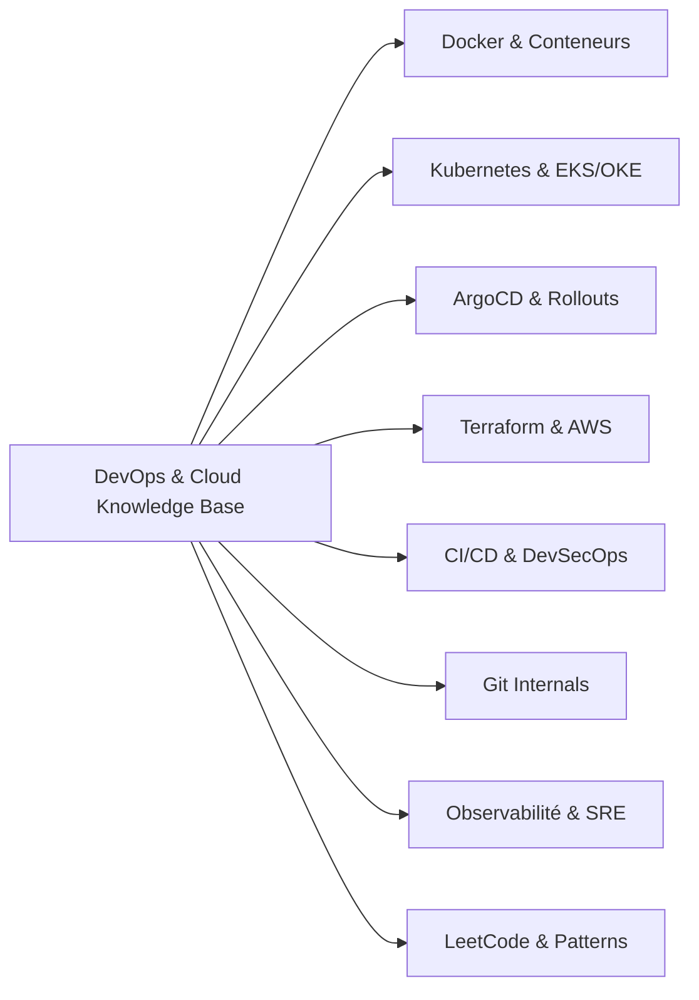

# 🚀 DevOps & Cloud Architecture Interview Knowledge Base

[](https://squidfunk.github.io/mkdocs-material/)
[](https://kubernetes.io/)
[](https://www.docker.com/)
[](https://www.terraform.io/)
[](https://argoproj.github.io/cd/)
[](https://aws.amazon.com/)
[](https://github.com/features/actions)
[](https://prometheus.io/)
[](https://grafana.com/)
[](https://opentelemetry.io/)
[](LICENSE)

**Languages:** [🇫🇷 Français](https://yassinekamouss.github.io/devops_interview_prep/) · [🇬🇧 English](https://yassinekamouss.github.io/devops_interview_prep/en/) — *FR at `/` + `/fr/` alias, EN at `/en/` via `mkdocs-static-i18n` suffix `.en.md`*

> **Base de connaissances exhaustive, fiches d'architecture de production et cheatsheets techniques conçues pour préparer et réussir les entretiens techniques DevOps, SRE, Platform et Cloud Infrastructure (Oracle, GAFAM, Scale-ups et Cloud Providers).**

---

## 📑 Sommaire

- [🎯 Vision & Objectif](#-vision--objectif)
- [✨ Points forts de la documentation](#-points-forts-de-la-documentation)
- [📚 Modules & Thématiques couverts](#-modules--thématiques-couverts)
  - [1. 🐳 Docker & Conteneurs](#1--docker--conteneurs)
  - [2. ☸️ Kubernetes (Architecture & Cloud Managed)](#2-️-kubernetes-architecture--cloud-managed)
  - [3. 🐙 GitOps & Progressive Delivery (ArgoCD & Rollouts)](#3--gitops--progressive-delivery-argocd--rollouts)
  - [4. 🏗️ Terraform & AWS (Infrastructure as Code)](#4-️-terraform--aws-infrastructure-as-code)
  - [5. 🔄 CI/CD & DevSecOps](#5--cicd--devsecops)
  - [6. 🌿 Git Internals & Workflows Avancés](#6--git-internals--workflows-avancés)
  - [7. 🧩 Algorithmique & Patterns LeetCode pour SRE/DevOps](#7--algorithmique--patterns-leetcode-pour-sredevops)
  - [8. 📊 Observabilité & Monitoring (Prometheus, Grafana, OpenTelemetry)](#8--observabilité--monitoring-prometheus-grafana-opentelemetry)
- [💻 Démarrage rapide (Local)](#-démarrage-rapide-local)
- [🌐 Déploiement sur GitHub Pages](#-déploiement-sur-github-pages)
- [🧠 Stratégie de préparation recommandée (Roadmap 4 semaines)](#-stratégie-de-préparation-recommandée-roadmap-4-semaines)
- [🤝 Contribution](#-contribution)
- [📄 Licence](#-licence)

---

## 🎯 Vision & Objectif

Dans un entretien technique DevOps ou SRE de haut niveau, les questions ne portent pas seulement sur des commandes basiques, mais sur :
- **La compréhension en profondeur de l'architecture interne** (ex. namespaces & cgroups dans Linux/Docker, quorum Raft d'etcd dans Kubernetes, state locking dans Terraform).
- **La capacité à concevoir et schématiser une architecture résiliente** sur un tableau blanc (*Whiteboard Interview*).
- **Le troubleshooting méthodique en condition réelle de production** (panne réseau, CrashLoopBackOff, dérive d'état GitOps, split-brain, saturation de ressources).
- **L'analyse des compromis (*Trade-offs*) et bonnes pratiques** de sécurité et de scalabilité.

Ce dépôt centralise l'ensemble de ces connaissances sous la forme d'un site web documentaire structuré, propulsé par **MkDocs Material**, avec des fiches thématiques claires, des diagrammes Mermaid interactifs et des banques de questions d'entretien réelles.

---

## ✨ Points forts de la documentation

- 🎨 **Interface moderne & réactive** : Propulsée par `mkdocs-material` avec bascule automatique Mode Clair / Sombre, typographie optimisée pour le code (`JetBrains Mono` et `Inter`).
- 🔍 **Moteur de recherche instantané** : Recherche plein texte avec surlignage des mots-clés et complétion instantanée.
- 📐 **Diagrammes d'architecture Mermaid** : Schémas visuels clairs des flux réseau, du Control Plane Kubernetes, des pipelines CI/CD et des architectures GitOps.
- ⚠️ **Blocs "Piège d'entretien"** : Alertes ciblées sur les questions à double tranchant et les confusions fréquentes chez les candidats.
- ❓ **Questions / Réponses interactives** : Blocs dépliables permettant de tester ses connaissances avant de révéler l'explication technique détaillée.
- ⚡ **Cheatsheets d'urgence** : Synthèses d'une page pour réviser la veille de vos entretiens techniques.

---

## 📚 Modules & Thématiques couverts



### 1. 🐳 Docker & Conteneurs
*Comprendre ce qu'est réellement un conteneur au niveau du noyau Linux.*
- **Architecture interne** : Client-Server, Docker Daemon, `containerd`, `runc`, Linux cgroups (limitation CPU/RAM), Namespaces (PID, NET, IPC, MNT, UTS, USER) et UnionFS (Overlay2).
- **Cycle de vie** : Différence entre image, conteneur et process ; commandes indispensables et gestion fine des signaux (`SIGTERM`, `SIGKILL`).
- **Optimisation Dockerfile** : Multi-stage builds, mise en cache des layers, images minimales (Distroless, Alpine, Scratch), réduction drastique de la surface d'attaque.
- **Réseau & Stockage** : Drivers réseau (bridge, host, overlay, macvlan, none), port mapping, volumes nommés, bind mounts et tmpfs.
- **Sécurité des conteneurs** : Rootless mode, restriction des Linux Capabilities (`--cap-drop`), profils seccomp et AppArmor, scan de vulnérabilités.
- **Questions d'entretien** : Banque complète de questions d'entretiens techniques (dont questions spécifiques Oracle & Cloud Providers).

### 2. ☸️ Kubernetes (Architecture & Cloud Managed)
*Le cœur de cible des entretiens Infrastructure & Cloud Native.*
- **Control Plane & Workers** : Rôle et fonctionnement de `kube-apiserver`, cluster `etcd` (consensus Raft, quorum, backup/restore), `kube-scheduler`, `kube-controller-manager`, `kubelet` et `kube-proxy`.
- **Workloads & Cycle de vie** : Pods, ReplicaSets, Deployments, StatefulSets (ordonnancement, stockage stable), DaemonSets, Jobs/CronJobs, gestion du termination grace period.
- **Réseau avancé (Deep Dive)** : Spécification CNI (Calico, Cilium, Flannel), Service Discovery (CoreDNS), types de Services (ClusterIP, NodePort, LoadBalancer, Headless), Ingress Controllers et NetworkPolicies.
- **Stockage persistant** : PV (Persistent Volumes), PVC, StorageClasses, dynamic provisioning et architecture CSI (Container Storage Interface).
- **Scheduling & Scalabilité** : NodeSelector, Node/Pod Affinity & Anti-affinity, Taints & Tolerations, HPA (Horizontal Pod Autoscaler), VPA et KEDA.
- **Troubleshooting de production** : Diagnostic méthodologique des statuts critiques (`CrashLoopBackOff`, `OOMKilled`, `ImagePullBackOff`, `Pending`, `Evicted`), utilisation de `kubectl debug`, extraction d'événements et analyse de logs.
- **Kubernetes dans le Cloud** : Déploiements managés AWS EKS et Oracle OKE, intégration IAM / IRSA, et cheatsheet d'entretien R&D.

### 3. 🐙 GitOps & Progressive Delivery (ArgoCD & Rollouts)
*La méthodologie moderne de déploiement continu sur Kubernetes.*
- **Principes OpenGitOps** : Déclaration déclarative, état versionné dans Git, réconciliation automatique et détection de dérive (Drift Detection).
- **Architecture interne ArgoCD** : Rôles respectifs de l'API Server, Repository Server, Application Controller, Redis et Dex.
- **CRDs Core & Multi-Cluster** : `Application`, `AppProject`, et `ApplicationSet` (Generators Git, List, Cluster) pour orchestrer des dizaines de clusters.
- **Synchronisation avancée** : Sync Waves, Pre/Post Sync Hooks, Sync Windows, phases de synchronisation et stratégies de retry.
- **Gestion des Secrets** : Intégration GitOps sécurisée avec External Secrets Operator (ESO), HashiCorp Vault, AWS Secrets Manager et Sealed Secrets.
- **Argo Rollouts (Progressive Delivery)** : Stratégies de déploiement Canary et Blue-Green avec `AnalysisTemplate` automatisé connecté à Prometheus.
- **Incident Management & Cheatsheet** : Procédures de Rollback d'urgence, résolution d'applications bloquées en OutOfSync/Degraded.

### 4. 🏗️ Terraform & AWS (Infrastructure as Code)
*Automatiser et fiabiliser la gestion d'infrastructures Cloud à grande échelle.*
- **Syntaxe HCL & Cycle de vie** : `terraform init`, `plan`, `apply`, `destroy`, `fmt`, `validate` et blocs de configuration (`locals`, `variables`, `outputs`).
- **State Management & Remote Backend** : Stockage du `terraform.tfstate` dans Amazon S3 avec chiffrement KMS et verrouillage d'état via DynamoDB (State Locking), isolation par Workspace ou structure de répertoires, commandes `state mv`, `state rm`, `import`.
- **Modules réutilisables** : Conception de modules modulaires, testables et versionnés, gestion des versions de providers.
- **AWS Networking** : Architecture de VPC d'entreprise, Subnets publics et privés, Internet Gateway, NAT Gateway haute disponibilité, Route Tables, Security Groups et Network ACLs.
- **AWS IAM & Sécurité** : Principe du moindre privilège, création de Roles, Policies inline vs managées, Trust Relationships, Instance Profiles.
- **Provisionnement Cloud & CI/CD** : Déploiement d'EKS, RDS, S3, EC2 ; automatisation des plans/applies via CI/CD (GitHub Actions, Atlantis) et cheatsheet d'entretien.

### 5. 🔄 CI/CD & DevSecOps
*Livrer du code rapidement, fréquemment et en toute sécurité.*
- **Conception de pipelines** : Anatomie d'un pipeline moderne (Build -> Test -> Scan -> Package -> Deploy -> Smoke Test).
- **Outils & Comparatifs** : Analyse détaillée de GitHub Actions (Runners, Workflows, Composite Actions, OIDC) vs Jenkins (Jenkinsfile, Master-Agent, Plugins).
- **DevSecOps (Shift-Left)** : Intégration SAST (SonarQube, Semgrep), SCA pour les dépendances (Trivy, Snyk), DAST et Secret Scanning (Gitleaks, Trufflehog).
- **Stratégies de déploiement** : Rolling Update, Recreate, Blue-Green, Canary Releases, A/B Testing et Feature Flags.
- **DORA Metrics** : Mesure et optimisation des 4 métriques clés (Deployment Frequency, Lead Time for Changes, Change Failure Rate, Time to Restore Service).

### 6. 🌿 Git Internals & Workflows Avancés
*Maîtriser les rouages internes de Git pour briller en entretien technique.*
- **Plomberie & Architecture interne** : Modèle d'objets (Blobs, Trees, Commits, Annotated Tags), SHA-1/SHA-256, Directed Acyclic Graph (DAG) et rôle du répertoire `.git/`.
- **Merge vs Rebase** : Fast-Forward, 3-Way Merge, Rebase interactif (`git rebase -i`), squash de commits, préservation d'un historique linéaire propre.
- **Outils de sauvetage** : Utilisation du `git reflog` pour récupérer des commits perdus, `git reset` (soft, mixed, hard), `git revert` et `git commit --amend`.
- **Techniques de Debugging** : `git bisect` (recherche binaire d'un commit régressif), `git blame`, stash avancé.
- **Stratégies de Branches** : Trunk-Based Development vs Gitflow vs GitHub Flow, règles de protection de branches et revues de code.

### 7. 🧩 Algorithmique & Patterns LeetCode pour SRE/DevOps
*Les compétences de programmation et de résolution de problèmes attendues chez les meilleurs ingénieurs d'infrastructure.*
- **24 fiches de patterns incontournables** :
  - *Tableaux & Fenêtres* : Hash Maps & Sets, Two Pointers, Sliding Window, Prefix Sum.
  - *Recherche & Piles* : Binary Search, Fast & Slow Pointers, Stack & Monotonic Stack.
  - *Arbres & Graphes* : Trees (DFS / BFS), Dijkstra (plus court chemin), Minimum Spanning Tree, Union-Find.
  - *Tri topologique* : Indispensable pour la résolution de graphes de dépendances de packages ou d'infrastructures.
  - *Optimisation & Complexité* : Heaps & Priority Queues, Intervals (plages IP / créneaux), Backtracking, Greedy et Dynamic Programming.
- **Cheatsheet d'entretien** : Tableaux récapitulatifs des complexités temporelles ($O(1)$, $O(\log n)$, $O(n)$, $O(n \log n)$) et spatiales.

### 8. 📊 Observabilité & Monitoring (Prometheus, Grafana, OpenTelemetry)
*De la télémétrie bas niveau à la gestion d'incidents critiques en production.*
- **Fondamentaux & Théorie SRE** : Modèle M.E.L.T (Metrics, Events, Logs, Traces), 4 Golden Signals (Latence, Trafic, Erreurs, Saturation), calcul des SLI / SLO / SLA et gestion de l'Error Budget.
- **Méthodes d'Analyse (USE vs RED)** : Framework USE (Utilization, Saturation, Errors) pour l'infrastructure et nœuds vs RED (Rate, Errors, Duration) pour les microservices applicatifs.
- **Prometheus & Architecture TSDB** : Modèle Pull vs Push, Time-Series Database, Service Discovery (K8s API, DNS), compression Gorilla et rétention des données.
- **Métriques & Instrumentation** : Maîtrise des 4 types fondamentaux (Counter, Gauge, Histogram, Summary), gestion des buckets et piège de la haute cardinalité.
- **Requêtage Avancé PromQL** : Calculs instantanés et range vectors, `rate()` vs `irate()`, calcul de percentiles de latence avec `histogram_quantile()`, agrégations multi-labels et alertes prédictives.
- **Alertmanager & Triage de crise** : Grouping, Deduplication, Inhibition rules (éviter les tempêtes d'alertes en cascade), Silences et intégrations multi-canaux (PagerDuty, Slack, Webhooks).
- **Grafana & Dashboards Opérationnels** : Bonnes pratiques d'UX dashboarding, variables dynamiques par tags/namespaces, requêtes optimisées et Alerting Unifié Grafana.
- **Traces Distribuées & OpenTelemetry (OTel)** : Standard OpenTelemetry, architecture de l'OTel Collector (Receivers, Processors, Exporters), traces distribuées, context propagation W3C (`traceparent`), corrélation Traces-Logs-Métriques.
- **AWS CloudWatch & Observabilité Cloud Native** : CloudWatch Metrics, CloudWatch Logs Insights (requêtage structuré JSON), Container Insights pour EKS et alarmes composites.
- **Diagnostics Kubernetes en Direct & Troubleshooting Prod** : Identification et résolution de `CrashLoopBackOff`, `OOMKilled` (Exit Code 137), CPU Throttling (`container_cpu_cfs_throttled_periods_total`), détection des erreurs 502/503/504 et latences P95/P99.
- **Cheatsheet Entretien & Scénarios Incident Response** : Questions pièges éliminatoires et simulation de gestion d'incidents de production en direct.

---

## 💻 Démarrage rapide (Local)

Pour consulter la documentation en local sur votre machine avec rechargement à chaud (*hot-reload*) :

### 1. Prérequis
- **Python 3.10+**
- Gestionnaire de paquets **pip**

### 2. Cloner le projet
```bash
git clone https://github.com/<votre-username>/<nom-du-repo>.git
cd <nom-du-repo>
```

### 3. Créer un environnement virtuel & installer les dépendances
```bash
# Création de l'environnement virtuel
python3 -m venv .venv

# Activation (Linux / macOS)
source .venv/bin/activate

# Activation (Windows PowerShell)
# .venv\Scripts\Activate.ps1

# Installation de MkDocs Material
pip install -r requirements.txt
```

### 4. Lancer le serveur local
```bash
mkdocs serve
```

Ouvrez votre navigateur sur **`http://127.0.0.1:8000`**. Le site se met à jour en temps réel à chaque modification d'un fichier Markdown !

### 5. Compiler le site statique
Pour générer les fichiers HTML de production (dans le dossier `site/`, ignoré par git) :
```bash
mkdocs build
```

---

## 🌐 Déploiement sur GitHub Pages

Vous pouvez héberger cette documentation gratuitement sur **GitHub Pages** en une seule commande :

```bash
mkdocs gh-deploy
```

Ou automatiquement via un workflow GitHub Actions (`.github/workflows/deploy-docs.yml`) :

```yaml
name: Deploy Documentation

on:
  push:
    branches:
      - main

permissions:
  contents: write

jobs:
  deploy:
    runs-on: ubuntu-latest
    steps:
      - uses: actions/checkout@v4
      - uses: actions/setup-python@v5
        with:
          python-version: '3.11'
          cache: 'pip'
      - run: pip install -r requirements.txt
      - run: mkdocs gh-deploy --force
```

---

## 🧠 Stratégie de préparation recommandée (Roadmap 4 semaines)

| Semaine | Focus thématique | Objectif d'entretien |
|---|---|---|
| **Semaine 1** | **Linux, Git & Docker** | Maîtriser le noyau Linux (cgroups, namespaces), le plumbing Git (DAG, reflog, rebase) et l'optimisation des conteneurs en production. |
| **Semaine 2** | **Kubernetes Deep Dive** | Savoir dessiner l'architecture K8s de tête, expliquer chaque composant du Control Plane, le CNI et résoudre les pannes courantes (`CrashLoopBackOff`, `OOMKilled`). |
| **Semaine 3** | **IaC & GitOps (Terraform, AWS, ArgoCD)** | Être capable de concevoir une architecture VPC AWS sécurisée avec Terraform (State, S3, DynamoDB) et déployer en GitOps avec ArgoCD et Argo Rollouts. |
| **Semaine 4** | **Observabilité (SRE), CI/CD & Coding** | Maîtriser la stack d'observabilité (Prometheus, PromQL, Grafana, OpenTelemetry, Alertmanager), les pipelines DevSecOps et s'entraîner sur les patterns LeetCode clés. |

### 💡 3 conseils essentiels pour le jour J :
1. **Pensez à voix haute (Think out loud)** : Les intervieweurs évaluent votre raisonnement, la prise en compte des cas limites et la sécurité autant que la solution finale.
2. **Parlez en termes de compromis (Trade-offs)** : Rien n'est gratuit en ingénierie. Discutez de la cohérence vs disponibilité (CAP Theorem), de la complexité vs coût, de la sécurité vs rapidité de delivery.
3. **Schématisez clairement** : Si l'entretien comporte un tableau blanc virtuel (Excalidraw, Miro) ou physique, entraînez-vous à reproduire les diagrammes de cette documentation avec des flux de données précis.

---

## 🤝 Contribution

Les contributions, retours d'expérience d'entretiens et améliorations sont les bienvenus !

1. **Forkez** le projet.
2. Créez votre branche thématique : `git checkout -b feature/nouvelle-question-k8s`.
3. Commitez vos modifications avec un message clair : `git commit -m 'feat: ajout questions réseau CNI Cilium'`.
4. Pushez vers votre fork : `git push origin feature/nouvelle-question-k8s`.
5. Ouvrez une **Pull Request**.

---

## 📄 Licence

Ce projet est distribué sous licence MIT. Vous êtes libre de l'utiliser, de le modifier et de le partager pour vous entraîner ou former d'autres ingénieurs.

---

<p align="center">
  <b>Bonnes révisions et plein succès dans vos entretiens DevOps ! 🎯</b>
</p>
