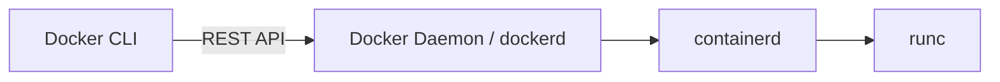
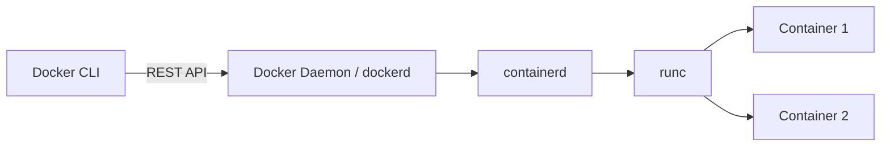

# Translation Guidelines — FR → EN (Suffix `.en.md`)

These rules enforce the two hard constraints: **FR immutable** + **code/manifest verbatim** (mermaid human labels exempt).

## 0. File Contract

- FR source: `docs/**/*.md` — never edit.
- EN target: `docs/**/*.en.md` sibling (e.g. `docs/docker/02-architecture.md` → `docs/docker/02-architecture.en.md`, `docs/index.md` → `docs/index.en.md`).
- Create EN scaffolds via `python scripts/mirror_to_en.py` (copies FR byte-identical), then translate prose only.
- Validate before commit: `python scripts/check_code_blocks_parity.py && mkdocs build --strict`.

## 1. What TO Translate

- Headings (`#`, `##`), paragraphs, lists, tables prose, `nav` titles via `mkdocs.yml` `nav_translations` (already wired).
- Admonitions: `!!! danger "Piège d'entretien"` → `!!! danger "Interview Trap"`, `!!! note`, `??? question "Q: ..."` titles.
- Mermaid **human labels** inside `[...]`, `(...)`, `"..."` — keep syntax, translate labels. See §3.
- Captions, alt text, `site_name`/`site_description` per-language overrides if needed.

## 2. What NOT to Translate — Byte-Identical

The parity script fails the build if these diverge:

- Fenced code blocks: `yaml`, `bash`, `sh`, `dockerfile`, `hcl`, `terraform`, `python`, `console`, `json`, `ini`. Example keep identical (from `docs/gitops/03-manifestes-core.md:11-39`):

```yaml
apiVersion: argoproj.io/v1alpha1
kind: Application
metadata:
  name: mon-api-backend
  namespace: argocd
spec:
  project: default
  source:
    repoURL: 'https://github.com/mon-organisation/mon-repo-gitops.git'
    targetRevision: main
    path: overlays/production
```

- Inline code: `` `kubectl apply` ``, `` `terraform.tfstate` ``, file paths `docs/docker/02-architecture.md`, CLI flags `--cpus`, `--cap-drop`.
- YAML keys, K8s CRD kinds (`Application`, `ApplicationSet`, `AppProject`), annotation keys, label keys.
- `mkdocs.yml` nav paths (`docker/01-introduction.md` stays, plugin resolves `.en.md` automatically).
- URLs, `site_url`, `repo_url`, image asset paths.

## 3. Mermaid Exception — The ONLY Code Block You Translate Labels In

Keep mermaid **syntax** identical; translate **human labels** only.

FR scaffold (`docs/docker/02-architecture.md:7-16`):



EN translation: syntax `graph LR`, `-->`, `-->|REST API|`, `subgraph`, `end`, `class`, `:::`, `---` stay. Labels `Docker CLI`, `Container 1` etc may be translated if FR had French labels like `Conteneur 1` → `Container 1`, `Dépôt` → `Registry`.



Parity script masks `[...]` labels for mermaid before comparison, so this passes.

**Do not** translate mermaid keywords (`graph`, `flowchart`, `sequenceDiagram`, `gantt`).

## 4. Workflow (Incremental, Subagent per Batch)

1. `python scripts/mirror_to_en.py --section <name>` (if missing)
2. Translate prose + admonitions + mermaid labels in `.en.md`
3. `python scripts/check_code_blocks_parity.py` — must print `Parity OK`
4. `mkdocs build --strict` — must produce `site/` + `site/en/` with no warnings (besides `superpowers/` not-in-nav which is ignored)
5. Commit: `feat(i18n): translate <section> EN`

Pilot already scaffolded: `docs/index.en.md` + `docs/docker/*.en.md` (20 files). Remaining batches: `kubernetes`, `gitops`, `terraform-aws`, `ci-cd`, `git`, `observabilite`, `leetcode` — one subagent per batch per plan Task 6.

## 5. Language Switcher & URLs

- FR canonical: `/` (and alias `/fr/` via `extra.alternate` post-build copy if needed for strict `/fr/`+`/en/` expectation; plugin default is `FR at /`, `EN at /en/`).
- EN: `/en/` (e.g. `/en/docker/02-architecture/`).
- Missing EN page: `fallback_to_default: true` renders FR with `mkdocs-static-i18n` banner — intentional for incremental rollout.
- Search: split `lang: [fr, en]` per `mkdocs.yml:67-70`.

## 6. Common Pitfalls

- Translating `apiVersion: argoproj.io/v1alpha1` value → breaks manifest parity.
- Translating `docker run --cpus="1.5"` flag → breaks runnable commands.
- Renaming nav path to `docker/01-introduction.en.md` explicitly → don't, nav stays FR path.
- Editing FR file instead of EN sibling → violates `FR_IMMUTABLE`.
- Forgetting `mkdocs build --strict` — catches broken `nav_translations` keys (must match exact FR nav titles, incl. trailing spaces — see `mkdocs.yml:105-114` quoted keys).

## 7. Verification Checklist per PR

- [ ] `python scripts/check_code_blocks_parity.py` passes
- [ ] `mkdocs build --strict` produces `site/index.html` + `site/en/index.html`
- [ ] `grep -r "Piège" docs/**/*.en.md` = 0 (FR leakage), `grep -r "Interview Trap"` style present where FR had `Piège`
- [ ] `ls docs/<section>/*.en.md` count matches `docs/<section>/*.md` minus `*.en.md`

