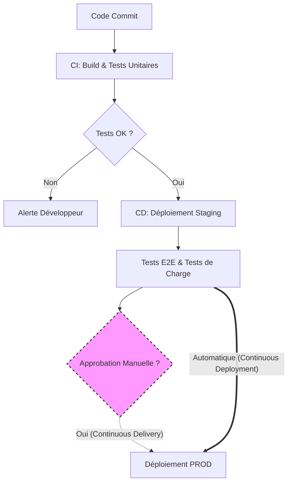

# 01 - Fundamentals: CI, CD and Continuous Deployment

In an interview, it is crucial to master the exact distinction between Continuous Integration (CI), Continuous Delivery and Continuous Deployment.

## 1. Continuous Integration (CI)

CI is the practice of merging code changes from all developers into a central repository (e.g., the `main` branch) regularly — ideally several times a day. Each *push* or *Pull Request* triggers an automated pipeline.

**Main objective:** Ensure that new code does not break the existing application and meets quality standards.

**Typical CI pipeline steps:**
1. **Checkout:** Fetching the source code.
2. **Linting & SAST (Static Application Security Testing):** Static code analysis (quality, formatting) and scanning for known vulnerabilities.
3. **Build:** Compiling code and building artifacts or container images.
4. **Unit Tests:** Running tests with code coverage measurement.

> **Interview mindset:** A good CI must be fast. A feedback loop exceeding 10–15 minutes slows developers down. If CI is too slow, consider parallelizing jobs or caching dependencies.

## 2. Continuous Delivery (CD)

Continuous Delivery takes over after CI. It ensures that integrated code is **always in a deployable state** to production.

In Continuous Delivery, **deployment to the final production environment requires a human action** (clicking an "Approve" button, managerial sign-off, etc.).

**Typical Delivery pipeline steps:**

1. **Provisioning:** Preparing the target environment (often via Infrastructure as Code).
2. **Deployment to Staging/Pre-prod:** Delivering the artifact to an environment identical to production.
3. **Integration / E2E (End-to-End) Tests:** Validating overall system behavior (database, API, interfaces).
4. **Waiting for manual approval:** A gatekeeper approves promotion to production.

## 3. Continuous Deployment (CD)

Continuous Deployment pushes automation to its peak. **There is no human intervention.** If a commit passes all CI and integration test stages successfully, it is automatically deployed to production.

**Strict prerequisites (what recruiters look for):**

- A fully reliable automated test suite (unit, E2E, performance).
- An architecture enabling zero-downtime deployments.
- Automated rollback mechanisms and real-time monitoring to immediately detect and fix regressions.

## Visual Summary

