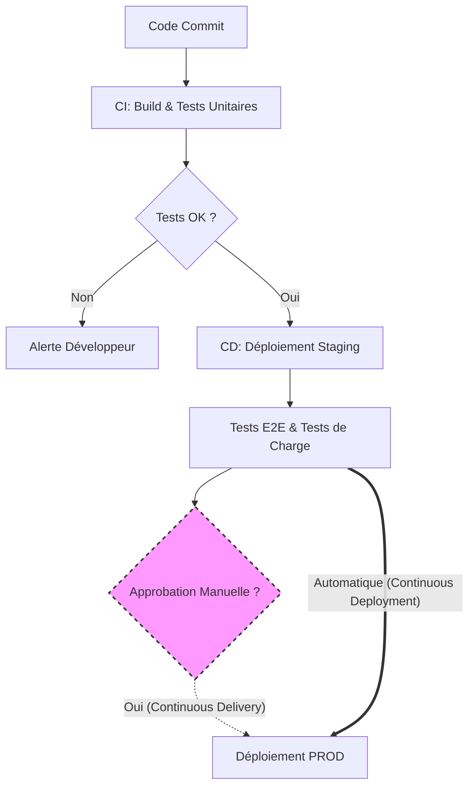

# 01 - Fondamentaux : CI, CD et Déploiement Continu

Lors d'un entretien, il est crucial de maîtriser la distinction exacte entre l'Intégration Continue (CI), la Livraison Continue (Continuous Delivery) et le Déploiement Continu (Continuous Deployment). 

## 1. L'Intégration Continue (CI - Continuous Integration)
La CI est la pratique consistant à fusionner régulièrement (idéalement plusieurs fois par jour) les modifications de code de tous les développeurs dans un dépôt central (ex: branche `main`). Chaque *push* ou *Pull Request* déclenche un pipeline automatisé.

**Objectif principal :** S'assurer que le nouveau code ne casse pas l'application existante et respecte les standards de qualité.

**Étapes typiques d'un pipeline CI :**
1. **Checkout :** Récupération du code source.
2. **Linting & SAST (Static Application Security Testing) :** Analyse statique du code (qualité, formatage) et recherche de vulnérabilités connues.
3. **Build :** Compilation du code et construction des artefacts ou des images de conteneurs.
4. **Tests Unitaires :** Exécution des tests avec mesure de la couverture de code.

> **Mindset d'entretien :** Une bonne CI doit être rapide. Une boucle de feedback qui dépasse 10 à 15 minutes ralentit les développeurs. Si la CI est trop longue, il faut envisager la parallélisation des jobs ou le caching des dépendances.

## 2. La Livraison Continue (CD - Continuous Delivery)
La Livraison Continue prend le relais de la CI. Elle s'assure que le code intégré est **toujours dans un état déployable** en production. 

Dans la Livraison Continue, **le déploiement vers l'environnement de production final nécessite une action humaine** (un clic sur un bouton "Approuver", une validation managériale, etc.).

**Étapes typiques d'un pipeline de Livraison :**

1. **Provisionnement :** Préparation de l'environnement cible (souvent via de l'Infrastructure as Code).
2. **Déploiement en Staging/Pre-prod :** Mise à disposition de l'artefact sur un environnement isométrique à la production.
3. **Tests d'Intégration / E2E (End-to-End) :** Validation du comportement global du système (base de données, API, interfaces).
4. **Attente d'approbation manuelle :** Un gatekeeper valide le passage en production.

## 3. Le Déploiement Continu (CD - Continuous Deployment)
Le Déploiement Continu pousse l'automatisation à son paroxysme. **Il n'y a aucune intervention humaine.** Si un commit passe toutes les étapes de CI et de tests d'intégration avec succès, il est automatiquement déployé en production.

**Prérequis stricts (ce que recherchent les recruteurs) :**

- Une suite de tests automatisés d'une fiabilité absolue (unitaires, E2E, performance).
- Une architecture permettant des déploiements sans interruption de service (*Zero-downtime deployment*).
- Des mécanismes de rollback automatisés et un monitoring en temps réel pour détecter et corriger immédiatement les régressions.

## Résumé Visuel

