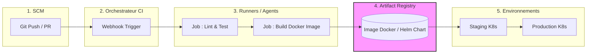

# 02 - Pipeline Architecture and Components

To design a robust CI/CD pipeline, writing a script is not enough. You must understand the underlying architecture and how the different components interact. In enterprise environments (like Oracle), scalability and security of this architecture are paramount.

## 1. The 5 Pillars of a CI/CD Architecture

A complete pipeline rests on five fundamental components:

1. **Source Control Management (SCM):** The trigger (GitHub, GitLab, Bitbucket).
2. **CI Server / Orchestrator:** The brain that manages the workflow (Jenkins Controller, GitHub Actions SaaS).
3. **Runners / Agents / Workers:** The physical machines, VMs or containers that actually execute tasks (build, tests).
4. **Artifact Registry:** The vault to store generated deliverables (Docker Hub, AWS ECR, Nexus, JFrog).
5. **Target Environments:** Where the code is deployed (Kubernetes cluster such as AWS EKS, EC2 servers, Serverless).

!!! info "Interview Tip"
    When asked to draw a CI/CD architecture, never forget the **Artifact Registry**. You **never** redeploy by recompiling code on the production server. You build *once*, store the artifact, and deploy that same artifact across all environments (Dev -> Staging -> Prod).

## 2. Architectural Representation

## 3. The "Runner" Concept (Execution Agent)

The orchestrator (e.g., the Jenkins Master node) must **never** execute jobs itself for performance and security reasons. It delegates that to **Agents** (or Runners).

!!! abstract "Runner Types"
    - **Static Runners:** Pre-configured VMs. (Drawback: wasted resources when idle).
    - **Ephemeral Runners (Containerized):** Kubernetes pods (e.g., via Kubernetes plugin) that spin up on demand for a job, then are destroyed. This is the modern standard for scalability.

!!! warning "Classic Trap (Stateful vs Stateless)"
    **Never rely on a runner's local state.** Each pipeline run must be idempotent and isolated. If your job 2 depends on a file created by job 1 on the agent's local disk, your pipeline will break as soon as jobs run on different agents. Use shared *Workspaces* or formally pass artifacts between jobs.

## 4. Infrastructure as Code (IaC) in the Pipeline

Today, the pipeline deploys not only application code, but also infrastructure.
Tools like **Terraform** or **Ansible** are often invoked from runners to provision or configure target environments before the application deployment (via Helm, for example).
