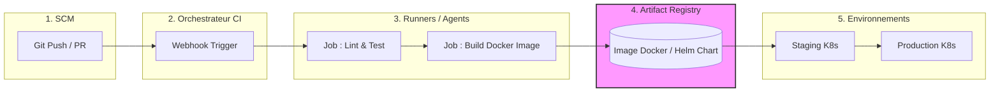

# 02 - Architecture et composants d'un pipeline

Pour concevoir un pipeline CI/CD robuste, il ne suffit pas d'écrire un script. Il faut comprendre l'architecture sous-jacente et la manière dont les différents composants interagissent. Dans des environnements de type entreprise (comme Oracle), la scalabilité et la sécurité de cette architecture sont primordiales.

## 1. Les 5 Piliers d'une Architecture CI/CD

Un pipeline complet repose sur cinq composants fondamentaux :

1. **Source Control Management (SCM) :** Le déclencheur (GitHub, GitLab, Bitbucket).
2. **Serveur CI / Orchestrateur :** Le cerveau qui gère le workflow (Jenkins Controller, GitHub Actions SaaS).
3. **Runners / Agents / Workers :** Les machines physiques, VMs ou conteneurs qui exécutent réellement les tâches (build, tests).
4. **Artifact Registry :** Le coffre-fort pour stocker les livrables générés (Docker Hub, AWS ECR, Nexus, JFrog).
5. **Environnements Cibles :** Là où le code est déployé (Cluster Kubernetes comme AWS EKS, serveurs EC2, Serverless).

!!! info "Astuce Entretien"
    Lorsqu'on vous demande de dessiner une architecture CI/CD, n'oubliez jamais l'**Artifact Registry**. On ne déploie **jamais** en recompilant le code sur le serveur de production. On build *une fois*, on stocke l'artefact, et on déploie ce même artefact sur tous les environnements (Dev -> Staging -> Prod).

## 2. Représentation Architecturale

## 3. Le concept de "Runner" (Agent d'exécution)

L'orchestrateur (ex: le nœud Master Jenkins) ne doit **jamais** exécuter les jobs lui-même pour des raisons de performance et de sécurité. Il délègue cela à des **Agents** (ou Runners).

!!! abstract "Typologie des Runners"
    - **Runners Statiques :** Des VMs pré-configurées. (Inconvénient : gaspillage de ressources quand inactifs).
    - **Runners Éphémères (Conteneurisés) :** Des pods Kubernetes (ex: via Kubernetes plugin) qui popent à la demande pour un job, puis sont détruits. C'est le standard moderne pour la scalabilité.

!!! warning "Piège Classique (Stateful vs Stateless)"
    **Ne comptez jamais sur l'état local d'un runner.** Chaque exécution de pipeline doit être idempotente et isolée. Si votre job 2 dépend d'un fichier créé par le job 1 sur le disque local de l'agent, votre pipeline cassera dès que les jobs s'exécuteront sur des agents différents. Utilisez des *Workspaces* partagés ou passez les artefacts formellement entre les jobs.

## 4. Infrastructure as Code (IaC) dans le pipeline

Aujourd'hui, le pipeline déploie non seulement le code applicatif, mais aussi l'infrastructure.
Des outils comme **Terraform** ou **Ansible** sont souvent appelés depuis les runners pour provisionner ou configurer les environnements cibles avant le déploiement applicatif (via Helm, par exemple).