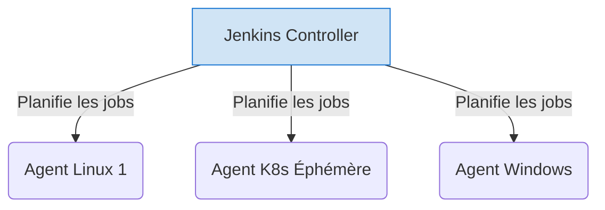

# 03 - Tool Focus: Jenkins & GitHub Actions

For a DevOps engineer, mastering Jenkins (the robust veteran) and GitHub Actions (the modern cloud-native standard) covers 95% of enterprise needs.

## 1. Jenkins: The Highly Customizable Veteran

Jenkins is an open-source, self-hosted, Java-based tool. Its architecture is **Controller-Agent** (historically Master-Slave).

!!! success "Strengths"
    - **Absolute extensibility:** Thousands of existing plugins.
    - **Full infrastructure control:** Ideal for on-premise enterprises with strict network rules or specific hardware (e.g., physical macOS build servers).
    - **Jenkinsfile:** Pipeline as Code (Declarative or Scripted in Groovy).

!!! danger "Jenkins Pitfalls (Anti-patterns)"
    - **The "Frankenstein" syndrome:** Too many installed plugins = instability during upgrades, security flaws.
    - **UI Configuration ("ClickOps"):** Configuring jobs via the web UI is forbidden. Everything must be in a `Jenkinsfile` (Pipeline as Code).
    - **Single Point of Failure (SPOF):** If the Jenkins Controller goes down and was not backed up (Configuration as Code), the company is paralyzed.

**Jenkins Architecture:**

## 2. GitHub Actions: Event-Driven Cloud-Native

GitHub Actions is deeply integrated with the code repository. It is a managed platform (SaaS), which removes the burden of maintaining the orchestrator.

!!! success "Strengths"
    - **Zero maintenance (SaaS):** No master node to manage or patch.
    - **Rich Marketplace:** *Actions* (reusable building blocks) let you do in 3 lines of YAML what takes 50 lines of Groovy.
    - **Fine-grained triggers:** Triggering on specific GitHub events (`on: pull_request`, `on: issue_comment`, `on: release`).

!!! abstract "GitHub Runner Hosting"
    - **GitHub-hosted runners:** Virtual machines managed by GitHub (Ubuntu, Windows, macOS). You pay per minute.
    - **Self-hosted runners:** You can attach your own machines or Kubernetes clusters (via ARC - Actions Runner Controller) to GitHub. Ideal for accessing private resources (VPC) or saving costs.

## 3. Quick Comparison (Interview Format)

| Feature | Jenkins | GitHub Actions |
| :--- | :--- | :--- |
| **Management model** | Self-hosted (On-Premise / Cloud IaaS) | Managed SaaS (Runners can be self-hosted) |
| **Configuration** | `Jenkinsfile` (Groovy - DSL) | YAML files in `.github/workflows/` |
| **Learning curve** | Steep (Groovy, Java administration) | Fast (YAML, developer-oriented) |
| **Ideal use case** | Legacy projects, complex/custom needs, total isolation. | Modern projects, native code integration, Serverless CI. |

!!! question "Typical interview question: “Which one would you choose?”"
    **The right answer:** "It depends on the company context. If I start from scratch for a startup or a greenfield project with code already on GitHub, I choose **GitHub Actions** for Time-to-Market and no CI infra maintenance. Conversely, if I join a large bank or government institution with strong security constraints preventing SaaS, or with complex legacy workflows, I will deploy **Jenkins** with a containerized Controller/Agents architecture on a Kubernetes cluster."
