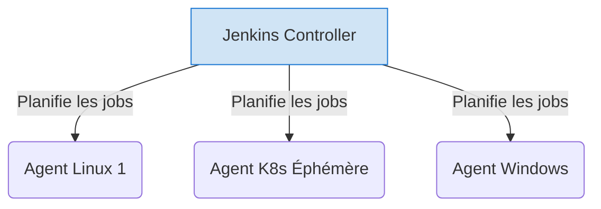

# 03 - Focus Outils : Jenkins & GitHub Actions

Pour un ingénieur DevOps, maîtriser Jenkins (le dinosaure robuste) et GitHub Actions (le standard cloud-native moderne) permet de couvrir 95% des besoins d'entreprise.

## 1. Jenkins : Le Vétéran Hautement Personnalisable

Jenkins est un outil open-source, auto-hébergé, basé sur Java. Son architecture est de type **Controller-Agent** (historiquement Master-Slave).

!!! success "Points Forts"
    - **Extensibilité absolue :** Des milliers de plugins existants.
    - **Contrôle total de l'infrastructure :** Idéal pour les entreprises on-premise, avec des règles réseau strictes ou du matériel spécifique (ex: serveurs de build macOS physiques).
    - **Jenkinsfile :** Pipeline as Code (Déclaratif ou Scripté en Groovy).

!!! danger "Les Pièges de Jenkins (Anti-patterns)"
    - **Le syndrome du "Frankenstein" :** Trop de plugins installés = instabilité lors des mises à jour, failles de sécurité.
    - **Configuration UI ("ClickOps") :** Configurer les jobs via l'interface web est banni. Tout doit être dans un `Jenkinsfile` (Pipeline as Code).
    - **Le Single Point of Failure (SPOF) :** Si le Jenkins Controller tombe en panne et n'a pas été sauvegardé (Configuration as Code), l'entreprise est paralysée.

**Architecture Jenkins :**

## 2. GitHub Actions : Le Cloud-Native Orienté Événement

GitHub Actions est profondément intégré au dépôt de code. C'est une plateforme managée (SaaS), ce qui enlève le fardeau de la maintenance de l'orchestrateur.

!!! success "Points Forts"
    - **Zero maintenance (SaaS) :** Pas de master node à gérer ou à patcher.
    - **Marketplace riche :** Les *Actions* (briques réutilisables) permettent de faire en 3 lignes de YAML ce qui prend 50 lignes de Groovy.
    - **Déclencheurs fins :** Déclenchement sur des événements GitHub spécifiques (`on: pull_request`, `on: issue_comment`, `on: release`).

!!! abstract "Hébergement des Runners GitHub"
    - **GitHub-hosted runners :** Machines virtuelles gérées par GitHub (Ubuntu, Windows, macOS). Vous payez à la minute.
    - **Self-hosted runners :** Vous pouvez rattacher vos propres machines ou vos clusters Kubernetes (via ARC - Actions Runner Controller) à GitHub. Idéal pour accéder à des ressources privées (VPC) ou économiser des coûts.

## 3. Comparatif Rapide (Format Entretien)

| Caractéristique | Jenkins | GitHub Actions |
| :--- | :--- | :--- |
| **Modèle de gestion** | Auto-hébergé (On-Premise / Cloud IaaS) | SaaS managé (Runners peuvent être self-hosted) |
| **Configuration** | `Jenkinsfile` (Groovy - DSL) | Fichiers YAML dans `.github/workflows/` |
| **Apprentissage** | Courbe raide (Groovy, administration Java) | Rapide (YAML, orienté développeur) |
| **Cas d'usage idéal** | Projets legacy, besoins complexes/sur-mesure, isolement total. | Projets modernes, intégration native avec le code, Serverless CI. |

!!! question "Question typique d'entretien : « Lequel choisiriez-vous ? »"
    **La bonne réponse :** "Cela dépend du contexte de l'entreprise. Si je pars de zéro pour une startup ou un projet greenfield avec le code déjà sur GitHub, je choisis **GitHub Actions** pour le Time-to-Market et l'absence de maintenance de l'infra CI. En revanche, si j'intègre une grande banque ou une institution gouvernementale avec des contraintes de sécurité fortes empêchant l'usage du SaaS, ou des workflows legacy complexes, je déploierai **Jenkins** avec une architecture Controller/Agents conteneurisée sur un cluster Kubernetes."