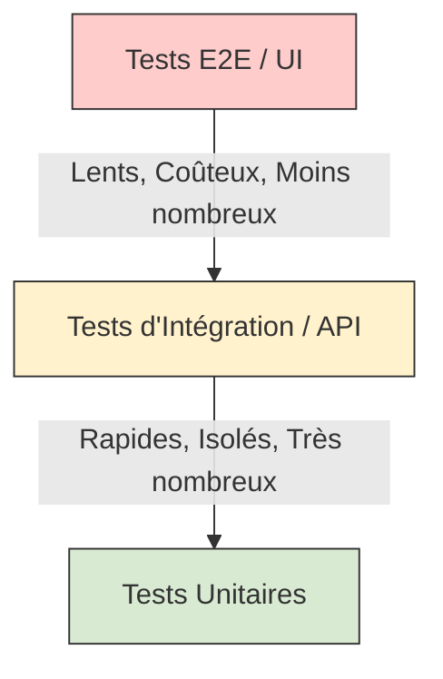
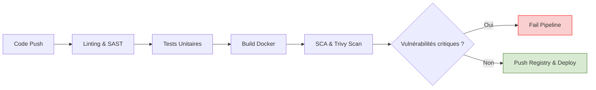

# 04 - Code Quality, Testing and DevSecOps Introduction

Automation is useless if it deploys buggy or vulnerable code. The **DevSecOps** concept integrates security and quality seamlessly throughout the CI/CD pipeline, following the **Shift-Left** principle (moving security checks as early as possible in the development lifecycle).

## 1. The Test Pyramid

A CI pipeline must validate code at different levels. The higher you go in the pyramid, the slower and more expensive tests are to maintain.

!!! info "Interview Tip"
    In an interview, mention the importance of **Test Coverage** (often measured via tools like SonarQube). However, point out that 100% coverage is often a "vanity metric"; what matters is testing the critical business paths.

## 2. The DevSecOps Pipeline (Security Scans)

Integrating security means adding automated *gates*. Here are the 4 essential analysis types:

1. **SCA (Software Composition Analysis):** Analysis of third-party dependencies (e.g., npm, pip libraries) to find CVEs (Common Vulnerabilities and Exposures). *Tools: Snyk, OWASP Dependency-Check.*
2. **SAST (Static Application Security Testing):** Analysis of source code *without* executing it to find flaws (SQL injections, hardcoded passwords). *Tools: SonarQube, Checkmarx.*
3. **Container & IaC Scanning:** Scanning Docker images and infrastructure manifests (Terraform, Kubernetes) to check for misconfigurations (e.g., root container). *Tools: Trivy, Checkov, KICS.*
4. **DAST (Dynamic Application Security Testing):** Analysis of the running application (black box) to simulate attacks. Often done in the CD phase (Staging). *Tools: OWASP ZAP.*

!!! warning "Classic Trap: False Positives"
    Implementing security in CI can generate a lot of "false positives". If your pipeline blocks every PR for minor alerts, developers will end up disabling the tools. **Best practice:** Block the build only for "High" and "Critical" vulnerabilities.

## 3. Typical DevSecOps Pipeline Workflow

