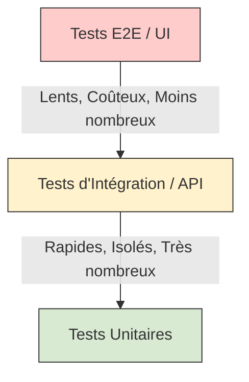
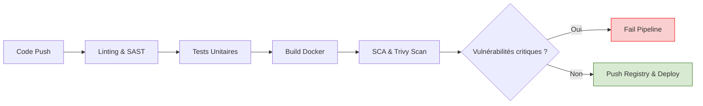

# 04 - Qualité de code, tests et introduction DevSecOps

L'automatisation ne sert à rien si elle déploie du code buggé ou vulnérable. Le concept de **DevSecOps** intègre la sécurité et la qualité de manière transparente tout au long du pipeline CI/CD, selon le principe du **Shift-Left** (déplacer les contrôles de sécurité le plus tôt possible dans le cycle de vie du développement).

## 1. La Pyramide des Tests

Un pipeline CI doit valider le code à différents niveaux. Plus on monte dans la pyramide, plus les tests sont lents et coûteux à maintenir.

!!! info "Astuce Entretien"
    Lors d'un entretien, mentionnez l'importance du **Test Coverage** (couverture de code, souvent mesurée via des outils comme SonarQube). Toutefois, précisez qu'une couverture à 100% est souvent une "vanity metric" ; l'important est de tester les chemins critiques métier.

## 2. Le Pipeline DevSecOps (Les Scans de Sécurité)

Intégrer la sécurité signifie ajouter des *gates* (barrières) automatisées. Voici les 4 types d'analyses incontournables :

1. **SCA (Software Composition Analysis) :** Analyse des dépendances tierces (ex: librairies npm, pip) pour trouver des CVE (Common Vulnerabilities and Exposures). *Outils : Snyk, OWASP Dependency-Check.*
2. **SAST (Static Application Security Testing) :** Analyse du code source *sans* l'exécuter pour trouver des failles (injections SQL, mots de passe en dur). *Outils : SonarQube, Checkmarx.*
3. **Container & IaC Scanning :** Analyse des images Docker et des manifests d'infrastructure (Terraform, Kubernetes) pour vérifier les mauvaises configurations (ex: conteneur root). *Outils : Trivy, Checkov, KICS.*
4. **DAST (Dynamic Application Security Testing) :** Analyse de l'application en cours d'exécution (boîte noire) pour simuler des attaques. Souvent fait en phase de CD (Staging). *Outils : OWASP ZAP.*

!!! warning "Piège Classique : Les Faux Positifs"
    L'implémentation de la sécurité dans la CI peut générer énormément de "faux positifs". Si votre pipeline bloque chaque PR pour des alertes mineures, les développeurs finiront par désactiver les outils. **Bonne pratique :** Bloquez le build uniquement pour les vulnérabilités "High" et "Critical".

## 3. Workflow d'un Pipeline DevSecOps typique

