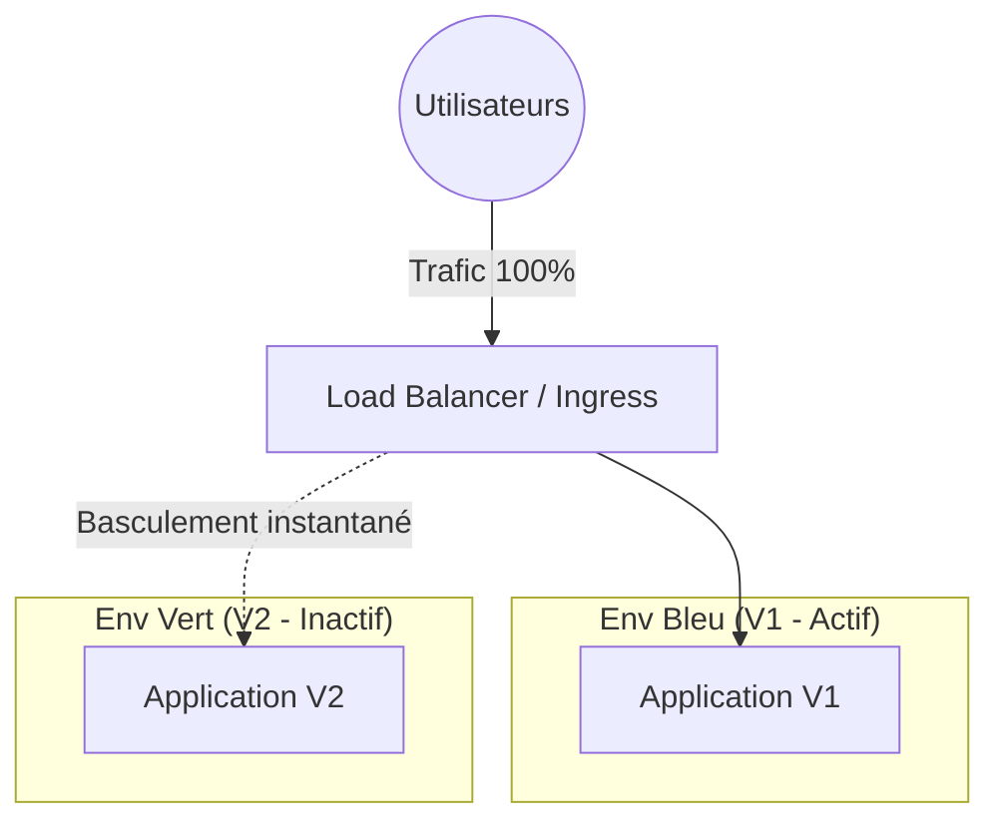
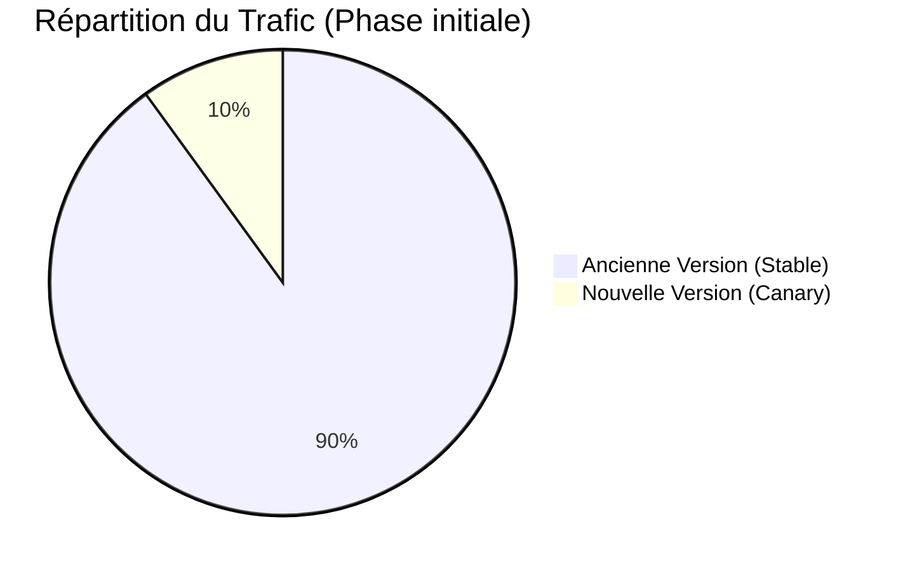

# 05 - Deployment Strategies (Blue-Green, Canary, Rolling)

Deploying to production should not mean downtime. Modern cloud-native architectures, especially with orchestrators like Kubernetes (AWS EKS, etc.), enable zero-downtime updates.

## 1. Rolling Update

This is Kubernetes' default strategy. Old application instances are replaced with new ones progressively (one by one, or in small batches).

!!! success "Pros & Cons"
    - **+** No downtime.
    - **+** Does not require double infrastructure resources.
    - **-** Rollback can be slow (requires a rolling update in reverse).
    - **-** During deployment, users may be routed to the old or new version randomly.

## 2. Blue-Green Deployment

You maintain two identical production environments: **Blue** (current active version) and **Green** (new inactive version). You deploy the new version to Green, run final tests, then instantly switch traffic (via a Load Balancer or Ingress) from Blue to Green.

!!! info "Interview Tip: Why Blue-Green?"
    The #1 argument for Blue-Green is **instant rollback**. If V2 (Green) crashes after the switch, just reconfigure the Load Balancer to point back to V1 (Blue) which is still running.

!!! danger "Ultimate Trap: The Database"
    In an interview, you will often be asked: *"What about the database during a Blue-Green deployment?"*
    **Expected answer:** Code must always be **backward-compatible** with the database schema. DB migrations (adding columns) must be separated from the application deployment and applied *before*. Never abruptly delete or rename columns.

## 3. Canary Release

You deploy the new version (Canary) to a very small subset of users (e.g., 5% of traffic). If no errors (logs, CPU, 500 errors) are detected, you gradually increase traffic to the new version (10%, 25%, 50%, 100%).

!!! success "Canary Benefits"
    - Allows testing in production with real traffic without impacting all users (Risk Mitigation).
    - Often coupled with observability tools (Prometheus, Grafana) to automate release promotion or rollback (concept covered later with tools like Argo Rollouts).

## 4. Summary Table

| Strategy | Infra Cost | Rollback Time | User Impact on Error |
| :--- | :---: | :---: | :---: |
| **Rolling** | Low | Slow | Medium (a few requests fail) |
| **Blue-Green** | Very High (x2) | Instant | None (if caught in testing) |
| **Canary** | Low / Medium | Fast | Low (only X% impacted) |
