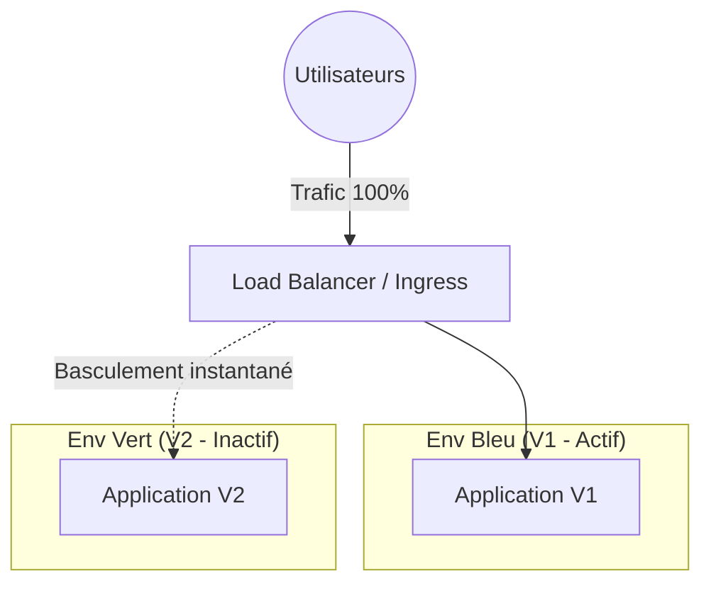
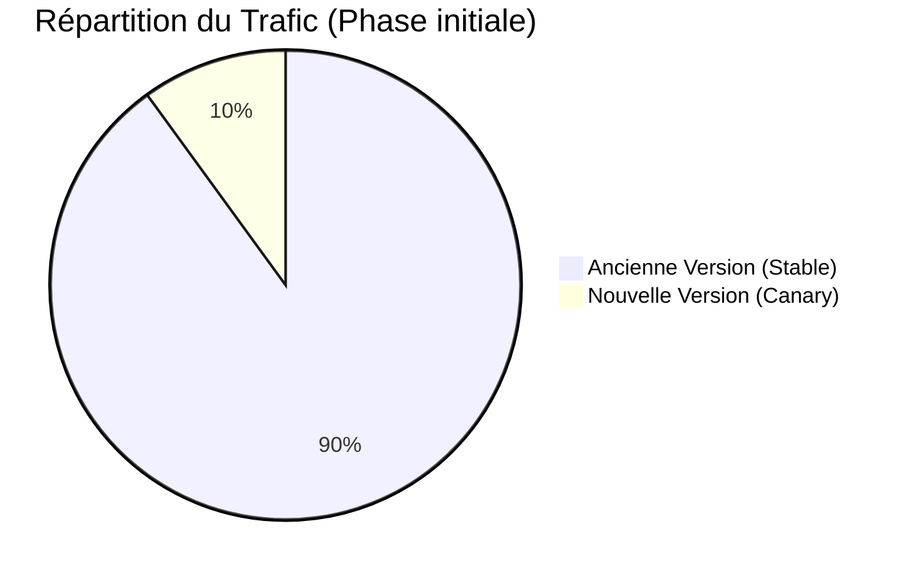

# 05 - Stratégies de déploiement (Blue-Green, Canary, Rolling)

Déployer en production ne doit pas signifier "coupure de service". Les architectures cloud-natives modernes, notamment grâce à des orchestrateurs comme Kubernetes (AWS EKS, etc.), permettent des mises à jour sans interruption (Zero-Downtime Deployments).

## 1. Rolling Update (Mise à jour continue)

C'est la stratégie par défaut de Kubernetes. On remplace les anciennes instances de l'application par les nouvelles de manière progressive (une par une, ou par petits lots).

!!! success "Avantages & Inconvénients"
    - **+** Pas d'interruption de service.
    - **+** Ne nécessite pas le double de ressources d'infrastructure.
    - **-** Le rollback peut être lent (il faut refaire un rolling update en sens inverse).
    - **-** Pendant le déploiement, les utilisateurs peuvent être dirigés vers l'ancienne ou la nouvelle version aléatoirement.

## 2. Blue-Green Deployment

On maintient deux environnements de production identiques : le **Bleu** (version actuelle active) et le **Vert** (nouvelle version inactive). On déploie la nouvelle version sur le Vert, on effectue des tests finaux, puis on bascule instantanément le trafic (via un Load Balancer ou un Ingress) du Bleu vers le Vert.

!!! info "Astuce Entretien : Pourquoi Blue-Green ?"
    L'argument numéro 1 du Blue-Green est le **Rollback instantané**. Si la V2 (Vert) crashe après le basculement, il suffit de reconfigurer le Load Balancer pour pointer vers la V1 (Bleu) qui tourne toujours. 

!!! danger "Le Piège Ultime : La Base de Données"
    En entretien, on vous demandera souvent : *"Que se passe-t-il avec la base de données pendant un Blue-Green ?"* 
    **La réponse attendue :** Le code doit toujours être **rétrocompatible** avec le schéma de la base de données. Les migrations de DB (ajouts de colonnes) doivent être séparées du déploiement applicatif et appliquées *avant*. On ne supprime ou ne renomme jamais de colonnes de manière abrupte.

## 3. Canary Release (Déploiement Canari)

On déploie la nouvelle version (Canary) pour un très petit sous-ensemble d'utilisateurs (ex: 5% du trafic). Si aucune erreur (logs, CPU, erreurs 500) n'est détectée, on augmente progressivement le trafic vers la nouvelle version (10%, 25%, 50%, 100%).

!!! success "Avantages du Canary"
    - Permet de tester en production avec du trafic réel sans impacter tous les utilisateurs (Risk Mitigation).
    - Souvent couplé à des outils d'observabilité (Prometheus, Grafana) pour automatiser la promotion ou le rollback de la release (concept abordé plus tard avec des outils comme Argo Rollouts).

## 4. Tableau Récapitulatif 

| Stratégie | Coût Infra | Temps de Rollback | Impact Utilisateur en cas d'erreur |
| :--- | :---: | :---: | :---: |
| **Rolling** | Bas | Lent | Moyen (quelques requêtes échouent) |
| **Blue-Green** | Très Haut (x2) | Instantané | Aucun (si catché au test) |
| **Canary** | Bas / Moyen | Rapide | Faible (seuls X% sont impactés) |