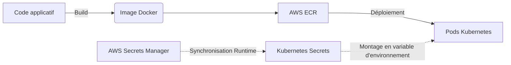

# 06 - Artifact and Secret Management

In a professional CI/CD pipeline, how you store build outputs (artifacts) and how you protect sensitive data (secrets) separates a junior profile from a senior or architect profile.

## 1. Artifact Management

An artifact is the immutable deliverable generated by your CI (e.g., a Docker image, a `.jar` package, a Helm Chart).

!!! info "Golden Rule of Immutability (Build Once, Deploy Anywhere)"
    In an interview, always stress this point: **Never rebuild code between two environments.**
    The Docker image tested in Staging MUST be the same physical image (identified by its SHA256 hash or tag) deployed to Production. The only thing that changes between environments is configuration (environment variables).

**Registry tools:**

- Managed tools: AWS ECR (Elastic Container Registry), GitHub Packages.
- On-premise / enterprise tools: JFrog Artifactory, Sonatype Nexus, Harbor.

## 2. Secret Management (The Critical Challenge)

A pipeline needs permissions to run (e.g., pushing an image to AWS ECR, deploying to Kubernetes, or querying a database for E2E tests).

!!! danger "Absolute Anti-pattern: Secrets in Code"
    **NEVER** commit passwords, tokens or private keys to Git, even on a private branch, even base64-encoded. Recruiters often ask about leaked AWS keys on GitHub: bots scan public repos and exploit keys within seconds to mine cryptocurrency.

**Best Practices for pipelines:**

1. **Use the CI's Secret Managers:** GitHub Actions Secrets or Jenkins Credentials Provider. The tool automatically masks the secret value in console logs (shown as `***`).
2. **Use an External Vault:** For advanced architectures, the pipeline temporarily authenticates to an external manager (e.g., **HashiCorp Vault**, AWS Secrets Manager) to retrieve short-lived credentials via IAM roles or OIDC authentication.

**Runtime Injection:**
During deployment (e.g., on Kubernetes), the application must not contain secrets in its Docker image. Secrets must be injected at runtime, for example via the `External Secrets Operator` which synchronizes AWS Secrets Manager to Kubernetes Secrets.

