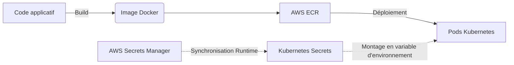

# 06 - Gestion des artefacts et des secrets

Dans un pipeline CI/CD professionnel, la manière dont vous stockez le résultat de vos builds (artefacts) et la façon dont vous protégez vos données sensibles (secrets) différencient un profil junior d'un profil senior ou architecte.

## 1. La Gestion des Artefacts

Un artefact est le livrable immuable généré par votre CI (ex: une image Docker, un package `.jar`, un Chart Helm).

!!! info "La Règle d'Or de l'Immuabilité (Build Once, Deploy Anywhere)"
    En entretien, insistez toujours sur ce point : **On ne re-build jamais le code entre deux environnements.** 
    L'image Docker qui a été testée en Staging DOIT être la même image physique (identifiée par son hash SHA256 ou son tag) déployée en Production. La seule chose qui change entre les environnements, c'est la configuration (variables d'environnement).

**Outils de Registry (Registre d'artefacts) :**

- Outils managés : AWS ECR (Elastic Container Registry), GitHub Packages.
- Outils on-premise / d'entreprise : JFrog Artifactory, Sonatype Nexus, Harbor.

## 2. La Gestion des Secrets (L'enjeu critique)

Un pipeline a besoin de droits pour s'exécuter (ex: pousser une image sur AWS ECR, déployer sur Kubernetes, ou interroger une base de données pour des tests E2E). 

!!! danger "L'Anti-pattern absolu : Les secrets dans le code"
    Ne commitez **JAMAIS** de mots de passe, tokens ou clés privées dans Git, même sur une branche privée, même chiffrés en base64. Les recruteurs posent souvent la question des fuites de clés AWS sur GitHub : des bots scannent les dépôts publics et exploitent les clés en quelques secondes pour miner de la cryptomonnaie.

**Les Bonnes Pratiques pour les pipelines :**

1. **Utiliser les Secret Managers de la CI :** GitHub Actions Secrets ou Jenkins Credentials Provider. L'outil masque automatiquement (masking) la valeur du secret dans les logs de la console (il s'affiche `***`).
2. **Utiliser un Vault Externe :** Pour des architectures avancées, le pipeline s'authentifie temporairement auprès d'un gestionnaire externe (ex: **HashiCorp Vault**, AWS Secrets Manager) pour récupérer des credentials à durée de vie courte (Short-lived credentials) via des rôles IAM ou l'authentification OIDC.

**Injection en Runtime :**
Lors du déploiement (ex: sur Kubernetes), l'application ne doit pas contenir les secrets dans son image Docker. Les secrets doivent être injectés à l'exécution, par exemple via le `External Secrets Operator` qui synchronise AWS Secrets Manager vers des Kubernetes Secrets.

