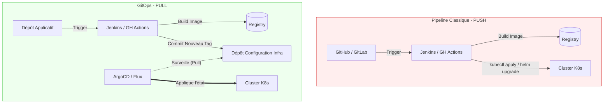

# 07 - Introduction to GitOps (Push vs Pull)

GitOps is the natural evolution of CD (Continuous Delivery) for Kubernetes architectures (like AWS EKS). It is an essential topic in any modern Cloud/DevOps interview. The core principle is that **Git becomes the single source of truth** for the desired state of your infrastructure and applications.

## 1. The Traditional Approach: The "Push" Model

In a classic CI/CD pipeline (Push), it is your CI server (Jenkins, GitHub Actions) that executes the deployment command (e.g., `kubectl apply` or `helm upgrade`) to the target environment.

!!! danger "Limits of the Push Model"
    - **Security:** The CI server must hold administrator credentials to your production cluster. If the CI server is compromised, prod is compromised too.
    - **Configuration Drift:** If an administrator modifies a resource directly on the cluster (via CLI), the CI orchestrator does not know. The cluster's actual state no longer matches what is in Git.

## 2. The Modern Standard: The "Pull" Model (GitOps)

With GitOps, the CI server no longer deploys anything. It just builds the Docker image, pushes it to the Registry, and updates the new image tag in a Git repository (the configuration repo).

A **GitOps Operator** (an agent installed *inside* the Kubernetes cluster) watches this Git repo. If it detects a change, it **pulls** the configuration and applies it to the cluster to reconcile the actual state with the desired state.

**Leading market tools:** ArgoCD, FluxCD.

!!! success "Why Companies Love GitOps?"
    - **Enhanced security:** The cluster opens no inbound port to receive a deployment. The ArgoCD agent makes outbound requests to Git. The CI no longer needs production keys.
    - **Auditability and native rollback:** Git history (`git log`) becomes infrastructure history. A rollback is simply a `git revert` of the last configuration commit.
    - **Auto-healing:** If someone manually modifies the cluster, the agent detects drift and overwrites the manual change to return to the Git-defined state.

## 3. Visual Comparison: Push vs Pull

> **Revision note:** This chapter serves only as an introduction to understand GitOps' place in a global CI/CD flow. Advanced ArgoCD concepts and declarative architectures will be deepened in the dedicated Kubernetes and GitOps module.
