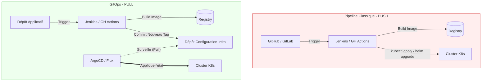

# 07 - Introduction à GitOps (Push vs Pull)

GitOps est l'évolution naturelle du CD (Continuous Delivery) pour les architectures Kubernetes (comme AWS EKS). C'est un sujet incontournable lors d'un entretien Cloud/DevOps moderne. Le principe fondamental est que **Git devient la seule et unique source de vérité** pour l'état désiré de votre infrastructure et de vos applications.

## 1. L'approche traditionnelle : Le modèle "Push"

Dans un pipeline CI/CD classique (Push), c'est votre serveur CI (Jenkins, GitHub Actions) qui exécute la commande de déploiement (ex: `kubectl apply` ou `helm upgrade`) vers l'environnement cible.

!!! danger "Les limites du modèle Push"
    - **Sécurité :** Le serveur CI doit posséder les accès administrateurs (credentials) à votre cluster de production. Si le serveur CI est compromis, la prod l'est aussi.
    - **Dérive de configuration (Configuration Drift) :** Si un administrateur modifie une ressource directement sur le cluster (via CLI), l'orchestrateur CI ne le sait pas. L'état réel du cluster ne correspond plus à ce qui est dans Git.

## 2. Le standard moderne : Le modèle "Pull" (GitOps)

Avec GitOps, le serveur CI ne déploie plus rien. Il se contente de construire l'image Docker, de la pousser sur la Registry, et de mettre à jour le tag de la nouvelle image dans un dépôt Git (le dépôt de configuration).

Un **Opérateur GitOps** (un agent installé *à l'intérieur* du cluster Kubernetes) observe ce dépôt Git. S'il détecte un changement, c'est lui qui **tire (pull)** la configuration et l'applique au cluster pour réconcilier l'état réel avec l'état désiré.

**Outils phares du marché :** ArgoCD, FluxCD.

!!! success "Pourquoi les entreprises adorent GitOps ?"
    - **Sécurité renforcée :** Le cluster n'ouvre aucun port vers l'extérieur pour recevoir un déploiement. L'agent ArgoCD fait des requêtes sortantes vers Git. Le CI n'a plus besoin des clés de production.
    - **Auditabilité et Rollback natif :** L'historique Git (`git log`) devient l'historique de l'infrastructure. Un rollback consiste simplement à faire un `git revert` du dernier commit de configuration.
    - **Auto-healing :** Si quelqu'un modifie manuellement le cluster, l'agent détecte la dérive et écrase la modification manuelle pour revenir à l'état défini dans Git.

## 3. Comparatif Visuel : Push vs Pull

> **Note de révision :** Ce chapitre sert uniquement d'introduction pour comprendre la place de GitOps dans un flux CI/CD global. Les concepts avancés d'ArgoCD et d'architectures déclaratives seront approfondis dans le module dédié à Kubernetes et GitOps.