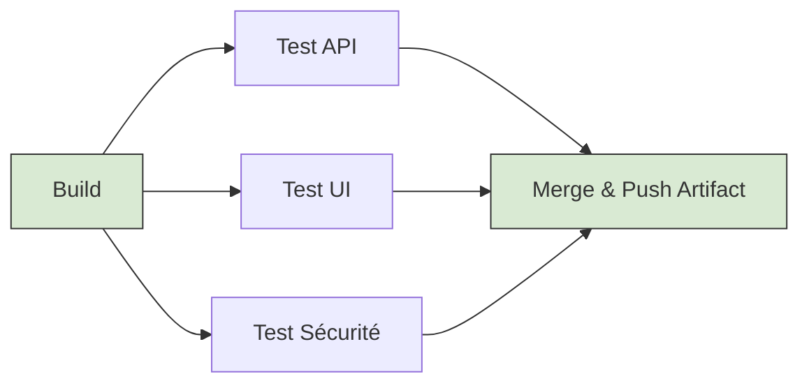

# 08 - Best Practices, Anti-patterns and Optimization

In a demanding enterprise environment (like Oracle or other Cloud providers), a pipeline that "works" is not enough. It must be fast, maintainable, predictable and resilient. This chapter covers concepts that separate an amateur pipeline from a production-grade one.

## 1. Speed Optimization (Beating Slowness)

A slow pipeline destroys productivity. The feedback loop (time between `git push` and test results) should ideally stay under 5–10 minutes.

!!! success "Optimization Techniques"
    - **Caching:** Cache downloaded dependencies (`.m2` directories, `node_modules`, `pip cache`) between runs.
    - **Docker Layer Caching:** Structure your `Dockerfile` so that rarely-changing layers (OS packages installation, dependencies) come first, and source code last.
    - **Fail-Fast:** Run the fastest and most likely-to-fail jobs (Linting, SAST, Unit Tests) first. Do not start a 10-minute Docker build if the code does not compile.

**Parallel Execution (Fan-Out / Fan-In):**
Do not run your tests sequentially if you can parallelize them.

## 2. Anti-patterns (Pitfalls to Avoid)

In an interview, identifying anti-patterns shows you have experience and have already "suffered" from bad practices.

!!! danger "Major Anti-patterns"
    - **ClickOps (Manual Configuration):** Configuring pipelines via the tool's web UI. **Fix:** Everything must be *Pipeline as Code* (Jenkinsfile, YAML) versioned in Git.
    - **"Flaky Tests" (Unstable Tests):** A test that sometimes passes and sometimes fails without code change. They destroy trust in CI. **Fix:** Isolate, fix or delete the test. Never add a "Re-run on failure" step.
    - **"Pets" Runners:** Using shared, non-isolated build agents that are manually updated. **Fix:** Adopt the *Cattle* paradigm with ephemeral agents (Kubernetes Pods) created for one job and destroyed afterwards.
    - **Monolithic Pipeline:** A single huge 2000-line YAML file. **Fix:** Modularize with templates, shared libraries (Jenkins Shared Libraries) or reusable Actions (GitHub Actions).

## 3. Resilience and Idempotence

A pipeline must be **idempotent**. If you run it 5 times in a row on the same commit, it must produce exactly the same artifact (with the same hash) and leave the system in the same state.

!!! info "Architecture Tip"
    Handle **Timeouts**. If a step tries to connect to an unavailable external database, the job must not run indefinitely. Set strict limits (e.g., `timeout: 10m`) to free resources (and save money on Cloud).
