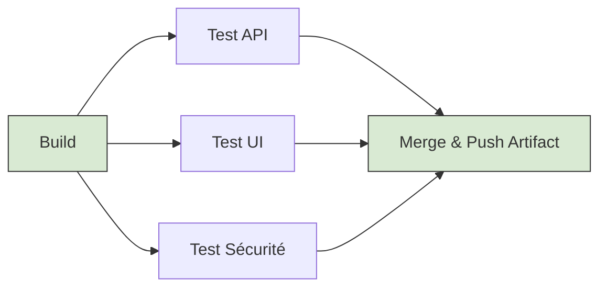

# 08 - Bonnes pratiques, anti-patterns et optimisation

Dans un environnement d'entreprise exigeant (comme Oracle ou d'autres fournisseurs Cloud), un pipeline qui "fonctionne" ne suffit pas. Il doit être rapide, maintenable, prédictible et résilient. Ce chapitre couvre les concepts qui séparent un pipeline amateur d'un pipeline de niveau production.

## 1. Optimisation de la vitesse (Vaincre la lenteur)

Un pipeline lent détruit la productivité. La boucle de feedback (le temps entre le `git push` et le résultat des tests) doit idéalement rester sous les 5 à 10 minutes.

!!! success "Techniques d'optimisation"
    - **Caching (Mise en cache) :** Mettre en cache les dépendances téléchargées (répertoires `.m2`, `node_modules`, `pip cache`) entre les exécutions.
    - **Docker Layer Caching :** Structurer ses `Dockerfile` pour que les couches qui changent rarement (installation des OS packages, dépendances) soient au début, et le code source à la fin.
    - **Fail-Fast :** Exécuter les jobs les plus rapides et les plus susceptibles d'échouer (Linting, SAST, Tests Unitaires) en premier. Ne lancez pas un build Docker de 10 minutes si le code ne compile pas.

**Exécution Parallèle (Fan-Out / Fan-In) :**
Ne lancez pas vos tests séquentiellement si vous pouvez les paralléliser.

## 2. Anti-patterns (Les pièges à éviter)

En entretien, identifier les anti-patterns montre que vous avez de l'expérience et que vous avez déjà "souffert" des mauvaises pratiques.

!!! danger "Les Anti-patterns majeurs"
    - **Le ClickOps (Configuration manuelle) :** Configurer les pipelines via l'interface web (UI) de l'outil. **Correction :** Tout doit être en *Pipeline as Code* (Jenkinsfile, YAML) et versionné dans Git.
    - **Les "Flaky Tests" (Tests instables) :** Un test qui passe parfois et échoue parfois sans changement de code. Ils détruisent la confiance en la CI. **Correction :** Isoler, corriger ou supprimer le test. Ne jamais ajouter d'étape "Re-run si échec".
    - **Les Runners "Pets" (Animaux de compagnie) :** Utiliser des agents de build partagés, non isolés, dont on fait les mises à jour à la main. **Correction :** Adopter le paradigme *Cattle* (Bétail) avec des agents éphémères (Pods Kubernetes) créés pour un job et détruits ensuite.
    - **Le pipeline Monolithique :** Un seul énorme fichier YAML de 2000 lignes. **Correction :** Modulariser avec des templates, des librairies partagées (Shared Libraries Jenkins) ou des Actions réutilisables (GitHub Actions).

## 3. Résilience et Idempotence

Un pipeline doit être **idempotent**. Si vous l'exécutez 5 fois de suite sur le même commit, il doit produire exactement le même artefact (avec le même hash) et laisser le système dans le même état.

!!! info "Astuce Architecture"
    Gérez les **Timeouts**. Si une étape tente de se connecter à une base de données externe indisponible, le job ne doit pas tourner indéfiniment. Fixez des limites strictes (ex: `timeout: 10m`) pour libérer les ressources (et économiser de l'argent sur le Cloud).