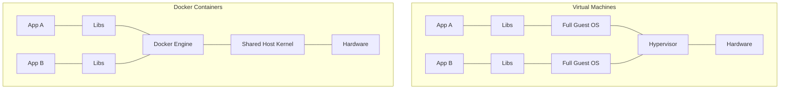

# Part I — Introduction to Docker

## Chapter 1: Why Does Docker Exist?

### History Before Docker

Before 2013 (Docker's public release by dotCloud), application deployment relied on:

- dedicated physical servers for a single application,
- virtual machines (VMware, Xen, KVM) to share hardware,
- manual or semi-automated installation scripts (Puppet, Chef, early Ansible).

Docker did not invent containerization (LXC, cgroups and namespaces already existed in the Linux kernel since the mid-2000s), but it made it **accessible** through a simple API, a standardized image format and an ecosystem (Docker Hub).

### Problems with Traditional Deployment

#### "It works on my machine"

The most emblematic problem: an application works locally but fails in production or on a colleague's machine, due to environment differences:

- language version (Python 3.8 vs 3.11),
- system library versions,
- missing environment variables,
- different OS configuration (Windows/Mac/Linux).

Docker solves this problem by **packaging the application with all its dependencies** into an immutable image, executed identically wherever a Docker engine is present.

#### Dependencies

Each application has a dependency tree (libraries, runtime, system tools). Managing these dependencies manually on each server is error-prone and not reproducible.

#### Version Conflicts

Two applications on the same server may require incompatible versions of the same runtime (e.g. Node 14 for one, Node 20 for the other). Without isolation, this forces compromise choices or expensive dedicated servers.

#### Development Environments

Without containerization, keeping **dev / staging / production** environments in sync is difficult: each stage can drift slightly from the previous one ("configuration drift").

### Why Virtual Machines Are Not Enough

VMs isolate well, but:

- each VM carries a **complete OS** (kernel + user space), which consumes GBs of RAM and disk,
- boot time takes tens of seconds to minutes,
- density (number of VMs per physical server) remains limited.

!!! danger "Interview Trap"
    Never say that "Docker replaces VMs". In production, both are often combined: VMs for strong isolation at the infrastructure level (multi-tenant, security), and containers inside for application density.

### The Arrival of Containerization

Containerization takes a different approach: instead of virtualizing hardware, it **isolates processes on the same kernel** thanks to two Linux kernel mechanisms:

- **Namespaces**: isolation of the view (processes, network, mount points...),
- **Control groups (cgroups)**: limitation and accounting of resources (CPU, RAM, I/O).

Docker adds on top: a layered image format (layers), a daemon with a REST API, and a registry to distribute images (Docker Hub).

---

## Chapter 2: Understanding Virtualization

### Physical Server

A physical server (bare metal) runs a single operating system directly on the hardware. All resources (CPU, RAM, disk) belong to it.

### Hypervisor

The hypervisor is the software layer that allows multiple guest OSes to run on the same physical hardware, allocating virtualized resources to them.

#### Type 1 vs Type 2 Hypervisor

| | Type 1 (bare metal) | Type 2 (hosted) |
|---|---|---|
| Execution | Directly on hardware | On top of a host OS |
| Examples | VMware ESXi, Xen, Hyper-V | VirtualBox, VMware Workstation |
| Performance | Better (direct hardware access) | Additional overhead (host OS) |
| Typical usage | Datacenters, cloud | Developer workstations |

### Virtual Machine

#### VM Architecture

```
┌─────────────────────────────────────┐
│           Application                │
├─────────────────────────────────────┤
│         Bibliothèques (Libs)         │
├─────────────────────────────────────┤
│      OS invité (noyau complet)       │
├─────────────────────────────────────┤
│            Hyperviseur                │
├─────────────────────────────────────┤
│         Matériel physique             │
└─────────────────────────────────────┘
```

Each VM carries its **own kernel**, fully isolated from the others.

#### Advantages

- Strong isolation (separate kernel) — ideal for multi-tenant security.
- Can run different OSes (Windows on a Linux host, for example).
- Mature snapshots and live migration (vMotion).

#### Disadvantages

- Heavy (GBs of disk/RAM per VM).
- Slow boot (full OS boot).
- Less dense: fewer VMs than containers on the same server.

### Why Docker Is Lighter



Containers share the **host kernel**: no second OS to boot, no hardware virtualization. Result: startup in milliseconds, disk footprint in MB (not GB), much higher density.

---

## Chapter 3: Containers

### Definition

A container is a process (or group of processes) isolated from the rest of the system through Linux kernel namespaces and cgroups, packaged with its filesystem derived from an image.

!!! note
    A container **is not a lightweight VM**. It is a normal process from the host kernel's point of view — it appears in `ps aux` on the host, with a visible host PID (unless the PID namespace hides it inside the container).

### How a Container Works

#### Isolation

Each container gets its own view of:

- the file tree (mount namespace),
- network interfaces (network namespace),
- the process list (PID namespace),
- users (user namespace, optional),
- the hostname (UTS namespace),
- IPC queues (IPC namespace).

#### Shared Kernel

Unlike a VM, **all containers on the same host share the same kernel**. This implies:

- a Linux container cannot run a Windows kernel (and vice versa),
- a flaw in the host kernel can potentially impact all containers (shared attack surface — see Part XII Security).

### Why a Container Starts in Milliseconds

There is **no OS boot**: the container is simply a new process launched by the Docker Engine with dedicated namespaces. "Startup" consists of:

1. creating the namespaces,
2. mounting the filesystem (read-only layers + a writable layer),
3. executing the entry point (`ENTRYPOINT`/`CMD`) as the container's process 1 (PID 1).

### VM vs Container Comparison

| Criterion | Virtual Machine | Docker Container |
|---|---|---|
| Isolation | Dedicated kernel (strong) | Shared kernel (logical isolation) |
| Weight | GB | MB |
| Startup | Seconds to minutes | Milliseconds |
| Density per host | Low/medium | High |
| Portability | Depends on hypervisor | Depends on engine (Docker/containerd) |
| Different guest OS | Yes | No (same kernel family) |
| Use case | Strong isolation, multi-OS | Microservices, CI/CD, scalability |

### Use Cases

- **Microservices**: each service in its own container, deployed and scaled independently.
- **CI/CD**: reproducible and disposable build/test environments.
- **Local development**: reproduce the production environment without "polluting" the workstation.
- **Legacy application modernization** ("lift and shift" containerized).
- **Edge computing**: small footprint suitable for constrained devices.

??? question "Interview Question: Why can't you run a Windows container on a Linux host?"
    Because containers share the host kernel: a Windows container needs Windows kernel system calls (syscalls), which are absent on a Linux host. Only a VM (or a compatibility layer like WSL2, which runs a real Linux kernel inside a lightweight VM) can work around this.

??? question "Interview Question: Can a container have more resources than the host machine?"
    No for actual allocation — but without defined cgroup limits, a container can consume up to 100% of the host's available resources, to the detriment of other containers. Hence the importance of always defining CPU/RAM limits in production (see Part V, Chapter 15).
