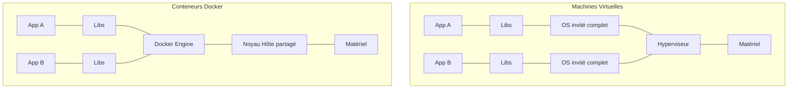

# Partie I — Introduction à Docker

## Chapitre 1 : Pourquoi Docker existe ?

### L'histoire avant Docker

Avant 2013 (date de sortie publique de Docker par dotCloud), le déploiement d'applications reposait sur :

- des serveurs physiques dédiés à une seule application,
- des machines virtuelles (VMware, Xen, KVM) pour mutualiser le matériel,
- des scripts d'installation manuels ou semi-automatisés (Puppet, Chef, Ansible naissant).

Docker n'a pas inventé la conteneurisation (LXC, cgroups et namespaces existaient déjà dans le noyau Linux depuis le milieu des années 2000), mais il l'a **rendue accessible** via une API simple, un format d'image standardisé et un écosystème (Docker Hub).

### Les problèmes du déploiement traditionnel

#### "It works on my machine"

Le problème le plus emblématique : une application fonctionne en local mais échoue en production ou chez un collègue, à cause de différences d'environnement :

- version du langage (Python 3.8 vs 3.11),
- version des librairies système,
- variables d'environnement manquantes,
- configuration OS différente (Windows/Mac/Linux).

Docker résout ce problème en **empaquetant l'application avec toutes ses dépendances** dans une image immuable, exécutée de façon identique partout où un moteur Docker est présent.

#### Les dépendances

Chaque application a un arbre de dépendances (librairies, runtime, outils système). Gérer ces dépendances manuellement sur chaque serveur est source d'erreurs et non reproductible.

#### Les conflits de versions

Deux applications sur le même serveur peuvent nécessiter des versions incompatibles d'un même runtime (ex. Node 14 pour l'une, Node 20 pour l'autre). Sans isolation, cela impose des choix de compromis ou des serveurs dédiés coûteux.

#### Les environnements de développement

Sans conteneurisation, faire correspondre les environnements **dev / staging / production** est difficile : chaque étape peut dériver légèrement de la précédente ("configuration drift").

### Pourquoi les machines virtuelles ne suffisent pas

Les VM isolent bien, mais :

- chaque VM embarque un **OS complet** (noyau + espace utilisateur), ce qui consomme des Go de RAM et de disque,
- le démarrage prend des dizaines de secondes à quelques minutes,
- la densité (nombre de VM par serveur physique) reste limitée.

!!! danger "Piège d'entretien"
    Ne dites jamais que "Docker remplace les VM". En production, on combine souvent les deux : des VM pour l'isolation forte au niveau infrastructure (multi-tenant, sécurité), et des conteneurs à l'intérieur pour la densité applicative.

### L'arrivée de la conteneurisation

La conteneurisation part d'un principe différent : au lieu de virtualiser le matériel, on **isole des processus sur un même noyau** grâce à deux mécanismes du noyau Linux :

- **Namespaces** : isolation de la vue (processus, réseau, points de montage...),
- **Control groups (cgroups)** : limitation et comptabilisation des ressources (CPU, RAM, I/O).

Docker ajoute par-dessus : un format d'image en couches (layers), un daemon avec API REST, et un registre pour distribuer les images (Docker Hub).

---

## Chapitre 2 : Comprendre la virtualisation

### Serveur physique

Un serveur physique (bare metal) exécute un seul système d'exploitation directement sur le matériel. Toutes les ressources (CPU, RAM, disque) lui appartiennent.

### Hyperviseur

L'hyperviseur est la couche logicielle qui permet de faire tourner plusieurs OS invités sur un même matériel physique, en leur allouant des ressources virtualisées.

#### Type 1 vs Type 2 Hypervisor

| | Type 1 (bare metal) | Type 2 (hébergé) |
|---|---|---|
| Exécution | Directement sur le matériel | Au-dessus d'un OS hôte |
| Exemples | VMware ESXi, Xen, Hyper-V | VirtualBox, VMware Workstation |
| Performance | Meilleure (accès direct au matériel) | Overhead supplémentaire (OS hôte) |
| Usage typique | Datacenters, cloud | Postes de développement |

### Machine virtuelle

#### Architecture d'une VM

```
┌─────────────────────────────────────┐
│           Application                │
├─────────────────────────────────────┤
│         Bibliothèques (Libs)         │
├─────────────────────────────────────┤
│      OS invité (noyau complet)       │
├─────────────────────────────────────┤
│            Hyperviseur                │
├─────────────────────────────────────┤
│         Matériel physique             │
└─────────────────────────────────────┘
```

Chaque VM embarque son **propre noyau**, totalement isolé des autres.

#### Avantages

- Isolation forte (kernel séparé) — idéal pour la sécurité multi-tenant.
- Peut faire tourner des OS différents (Windows sur hôte Linux, par exemple).
- Snapshots et migration à chaud (vMotion) matures.

#### Inconvénients

- Poids (Go de disque/RAM par VM).
- Démarrage lent (boot complet d'un OS).
- Moins dense : moins de VM que de conteneurs sur un même serveur.

### Pourquoi Docker est plus léger



Les conteneurs partagent le **noyau de l'hôte** : pas de second OS à démarrer, pas de virtualisation matérielle. Résultat : démarrage en millisecondes, empreinte disque en Mo (et non Go), densité bien supérieure.

---

## Chapitre 3 : Les conteneurs

### Définition

Un conteneur est un processus (ou groupe de processus) isolé du reste du système grâce aux namespaces et cgroups du noyau Linux, empaqueté avec son système de fichiers (filesystem) issu d'une image.

!!! note
    Un conteneur **n'est pas une VM légère**. C'est un processus normal du point de vue du noyau hôte — il apparaît dans `ps aux` sur l'hôte, avec un PID hôte visible (sauf si le PID namespace le masque côté conteneur).

### Comment fonctionne un conteneur

#### Isolation

Chaque conteneur obtient sa propre vue de :

- l'arborescence de fichiers (mount namespace),
- les interfaces réseau (network namespace),
- la liste des processus (PID namespace),
- les utilisateurs (user namespace, optionnel),
- le hostname (UTS namespace),
- les files IPC (IPC namespace).

#### Kernel partagé

Contrairement à la VM, **tous les conteneurs d'un même hôte partagent le même noyau**. Cela implique :

- un conteneur Linux ne peut pas faire tourner un noyau Windows (et vice versa),
- une faille dans le noyau hôte peut potentiellement impacter tous les conteneurs (surface d'attaque partagée — voir Partie XII Sécurité).

### Pourquoi un conteneur démarre en quelques millisecondes

Il n'y a **pas de boot d'OS** : le conteneur est simplement un nouveau processus lancé par le Docker Engine avec des namespaces dédiés. Le "démarrage" consiste à :

1. créer les namespaces,
2. monter le filesystem (couches en lecture seule + une couche en écriture),
3. exécuter le point d'entrée (`ENTRYPOINT`/`CMD`) comme process 1 (PID 1) du conteneur.

### Comparaison VM vs Container

| Critère | Machine Virtuelle | Conteneur Docker |
|---|---|---|
| Isolation | Noyau dédié (forte) | Noyau partagé (isolation logique) |
| Poids | Go | Mo |
| Démarrage | Secondes à minutes | Millisecondes |
| Densité par hôte | Faible/moyenne | Élevée |
| Portabilité | Dépend de l'hyperviseur | Dépend du moteur (Docker/containerd) |
| OS invité différent | Oui | Non (même famille de noyau) |
| Cas d'usage | Isolation forte, multi-OS | Microservices, CI/CD, scalabilité |

### Cas d'utilisation

- **Microservices** : chaque service dans son propre conteneur, déployé et scalé indépendamment.
- **CI/CD** : environnements de build/test reproductibles et jetables.
- **Développement local** : reproduire l'environnement de production sans "pollution" du poste.
- **Modernisation d'applications legacy** ("lift and shift" containerisé).
- **Edge computing** : empreinte faible adaptée aux appareils contraints.

??? question "Question d'entretien : Pourquoi ne peut-on pas faire tourner un conteneur Windows sur un hôte Linux ?"
    Parce que les conteneurs partagent le noyau de l'hôte : un conteneur Windows a besoin des appels système (syscalls) du noyau Windows, absents sur un hôte Linux. Seule une VM (ou une couche de compatibilité comme WSL2, qui fait tourner un vrai noyau Linux dans une VM légère) permet de contourner cela.

??? question "Question d'entretien : Un conteneur peut-il avoir plus de ressources que la machine hôte ?"
    Non côté allocation réelle — mais sans limites cgroups définies, un conteneur peut consommer jusqu'à 100% des ressources disponibles de l'hôte, au détriment des autres conteneurs. D'où l'importance de toujours définir des limites CPU/RAM en production (voir Partie V, Chapitre 15).