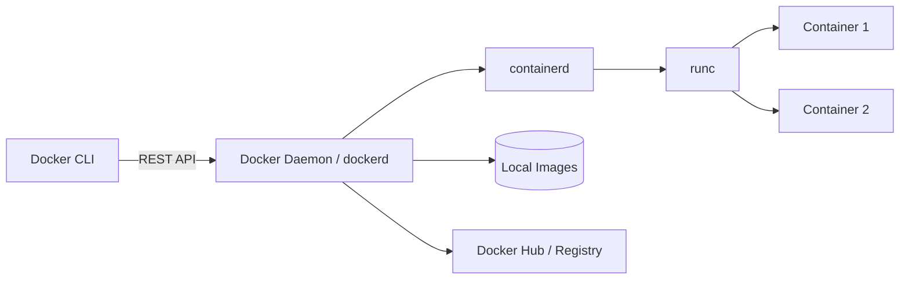
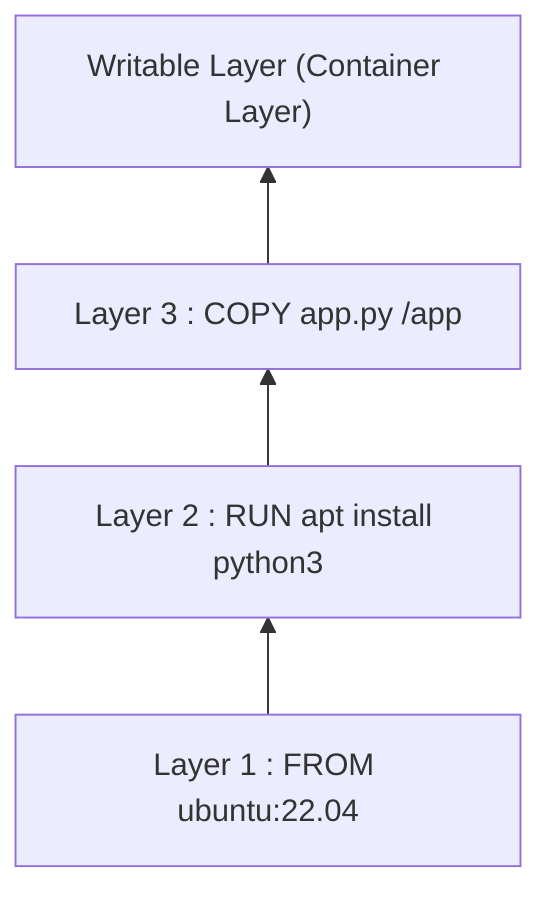

# Part II — Docker Internal Architecture

## Chapter 4: Docker Architecture

### Overview



### Docker Client

#### Docker CLI

The command-line interface (`docker run`, `docker build`, etc.) that the user interacts with. The CLI **does nothing by itself**: it translates each command into a REST API call to the daemon.

### Docker Engine

The term "Docker Engine" refers to the whole set: client + API + daemon + runtime components (containerd, runc).

#### Docker Daemon

`dockerd` is the process running in the background on the host. It:

- manages images (pull, build, storage),
- manages containers (lifecycle),
- manages networks and volumes,
- delegates actual container execution to **containerd**, which in turn delegates to **runc** (OCI spec compliant).

#### Docker REST API

All interaction with the daemon goes through a REST API exposed on a Unix socket (`/var/run/docker.sock`) by default, or on a TCP port if configured (beware of security if exposed).

### Docker Host

The (physical or virtual) machine on which the Docker daemon and containers run.

### Docker Desktop

#### Docker Engine on Linux

On Linux, the daemon runs **natively** on the host kernel: no intermediate VM.

#### Docker Desktop on Windows/Mac

Windows and macOS do not have a Linux kernel. Docker Desktop therefore runs a **lightweight Linux VM** in the background (via Hyper-V, WSL2 on Windows, or HyperKit/Virtualization.framework on Mac) in which the real Linux daemon executes.

!!! danger "Interview Trap"
    Many candidates think Docker runs natively on Windows/Mac. That's false: there is always a hidden Linux VM. That's why I/O performance of bind mounts can be worse on Mac/Windows than on native Linux.

---

## Chapter 5: Internals — Linux Namespaces

Namespaces limit **what a process can see**.

| Namespace | Isolates | Concrete example |
|---|---|---|
| PID | Process tree | The container sees its own PID 1 |
| Network | Interfaces, routes, ports | The container has its own IP and routing table |
| Mount | Mount points | `/` inside the container ≠ `/` on the host |
| IPC | Shared memory, semaphores | Two containers do not share their IPC by default |
| User | UID/GID mapping | root inside the container ≠ root on the host (rootless) |
| UTS | Hostname, domainname | Each container has its own hostname |

### PID Namespace

The first process launched in a container becomes its **PID 1** (even though it has a different, high PID on the host side). This has an important consequence: PID 1 must correctly handle signals (SIGTERM) and reap zombie processes — hence the frequent use of a lightweight init like `tini` (`docker run --init`).

### Network Namespace

Each container gets its own network stack: virtual interfaces (veth), IP address, routing table, iptables rules. This namespace allows two containers to listen on port 80 each without conflict.

### Mount Namespace

Isolates the view of the file tree. The container sees a `/` that comes from the image (UnionFS layers), fully separate from the host's `/`, except for explicitly mounted points (volumes, bind mounts).

### IPC Namespace

Isolates System V inter-process communication mechanisms (shared memory, semaphores, message queues). Useful to prevent a container from interfering with another container's shared memory.

### User Namespace

Allows mapping `root` (UID 0) **inside** the container to an **unprivileged** UID on the host. This is the basis of "rootless" mode (see Part XII, Security): even if an attacker gains root privileges inside the container, they do not have root privileges on the host.

### UTS Namespace

Isolates the hostname and domainname: each container can have its own hostname, independent of the host's.

??? question "Interview Question: What happens if your main process (PID 1) does not handle SIGTERM?"
    `docker stop` sends SIGTERM then waits for a grace period (10s by default) before sending SIGKILL. If PID 1 ignores SIGTERM (default behavior of many shells/scripts), the container only stops cleanly after the timeout and a brutal SIGKILL — risk of data corruption or loss of in-flight requests.

---

## Chapter 6: Control Groups (cgroups)

Control groups **limit and account for** resource usage per group of processes. This is the mechanism that prevents a container from monopolizing all host resources.

### CPU Limitation

```bash
docker run --cpus="1.5" --cpu-shares=512 mon-image
```

- `--cpus`: maximum number of CPU cores (can be fractional).
- `--cpu-shares`: relative weight under contention (default value 1024).

### RAM Limitation

```bash
docker run --memory="512m" --memory-swap="1g" mon-image
```

If a container exceeds its memory limit, the kernel triggers the **OOM Killer** (see Part V, Chapter 15) which kills the offending process.

### I/O Limitation

```bash
docker run --device-read-bps /dev/sda:10mb --device-write-bps /dev/sda:10mb mon-image
```

Allows capping read/write throughput on a given block device.

### Priorities

`--cpu-shares` and `--blkio-weight` define **relative** priorities, applied only under contention (competition for the resource) — without contention, a container can use all available resources.

### QoS

Combining CPU/RAM/I/O limits allows defining Quality of Service (QoS) classes: critical containers with high priority vs background containers (batch, logs) with reduced priority.

!!! danger "Interview Trap"
    A common mistake: confusing `--cpu-shares` (relative priority, active only under contention) and `--cpus` (absolute ceiling, always active). They are two complementary mechanisms, not interchangeable.

---

## Chapter 7: Union File System

### Layered Filesystem

A Docker image consists of **stacked layers**, each representing a diff from the previous one (result of a Dockerfile instruction: `RUN`, `COPY`, etc.). Layers are **read-only** and shared between multiple images/containers.



### OverlayFS

`overlay2` is the default storage driver on Linux. It combines multiple directories (lowerdir read-only = image layers, upperdir writable = container layer) into a single unified view (merged).

### Copy-on-Write

When a container modifies a file belonging to a read-only layer, OverlayFS **first copies** that file into the writable layer before modifying it (Copy-on-Write). The original file in the image remains intact.

### Why Docker Is Fast

#### Layer Reuse

If several images share the same base (`FROM ubuntu:22.04`), this layer is **downloaded and stored only once** on disk, and shared read-only by all containers depending on it. This explains:

- fast `docker pull` when base layers are already present,
- a disk footprint much smaller than the sum of individual image sizes,
- a build cache mechanism (see Part VI, Chapter 16): if a layer has not changed, Docker reuses the cache instead of rebuilding it.

??? question "Interview Question: What happens to a container's writable layer when it is removed?"
    It is destroyed with the container (`docker rm`). That's why data must be persisted via **volumes** or **bind mounts** (Part VIII) if it needs to survive container removal — never in the writable layer itself.
