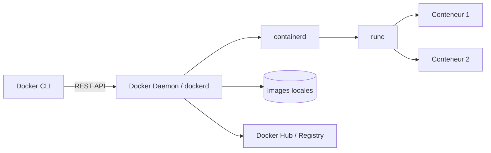
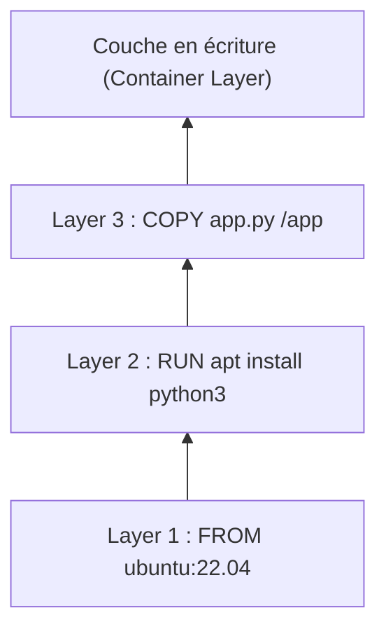

# Partie II — Architecture interne de Docker

## Chapitre 4 : Architecture Docker

### Vue d'ensemble



### Docker Client

#### Docker CLI

L'interface en ligne de commande (`docker run`, `docker build`, etc.) que l'utilisateur utilise. Le CLI **ne fait rien lui-même** : il traduit chaque commande en appel à l'API REST du daemon.

### Docker Engine

Le terme "Docker Engine" désigne l'ensemble client + API + daemon + composants d'exécution (containerd, runc).

#### Docker Daemon

`dockerd` est le processus qui tourne en arrière-plan sur l'hôte. Il :

- gère les images (pull, build, stockage),
- gère les conteneurs (cycle de vie),
- gère les réseaux et volumes,
- délègue l'exécution réelle des conteneurs à **containerd**, qui délègue à son tour à **runc** (conforme à la spec OCI).

#### Docker REST API

Toute interaction avec le daemon passe par une API REST exposée sur un socket Unix (`/var/run/docker.sock`) par défaut, ou sur un port TCP si configuré (attention à la sécurité si exposé).

### Docker Host

La machine (physique ou virtuelle) sur laquelle tourne le daemon Docker et les conteneurs.

### Docker Desktop

#### Docker Engine sous Linux

Sous Linux, le daemon tourne **nativement** sur le noyau de l'hôte : pas de VM intermédiaire.

#### Docker Desktop sous Windows/Mac

Windows et macOS n'ont pas de noyau Linux. Docker Desktop fait donc tourner une **VM Linux légère** en arrière-plan (via Hyper-V, WSL2 sur Windows, ou HyperKit/Virtualization.framework sur Mac) dans laquelle le vrai daemon Linux s'exécute.

!!! danger "Piège d'entretien"
    Beaucoup de candidats pensent que Docker tourne nativement sous Windows/Mac. C'est faux : il y a toujours une VM Linux cachée. C'est pourquoi les performances I/O de bind mounts peuvent être moins bonnes sous Mac/Windows que sous Linux natif.

---

## Chapitre 5 : Fonctionnement interne — Les Namespaces Linux

Les namespaces limitent **ce qu'un processus peut voir**.

| Namespace | Isole | Exemple concret |
|---|---|---|
| PID | Arbre des processus | Le conteneur voit son propre PID 1 |
| Network | Interfaces, routes, ports | Le conteneur a sa propre IP et table de routage |
| Mount | Points de montage | `/` du conteneur ≠ `/` de l'hôte |
| IPC | Mémoire partagée, sémaphores | Deux conteneurs ne partagent pas leur IPC par défaut |
| User | Mapping UID/GID | root dans le conteneur ≠ root sur l'hôte (rootless) |
| UTS | Hostname, domainname | Chaque conteneur a son propre hostname |

### PID Namespace

Le premier processus lancé dans un conteneur devient son **PID 1** (même s'il a un PID différent, élevé, côté hôte). Cela a une conséquence importante : PID 1 doit correctement gérer les signaux (SIGTERM) et "reaper" les processus zombies — d'où l'usage fréquent d'un init léger comme `tini` (`docker run --init`).

### Network Namespace

Chaque conteneur obtient sa propre pile réseau : interfaces virtuelles (veth), adresse IP, table de routage, règles iptables. C'est ce namespace qui permet à deux conteneurs d'écouter sur le port 80 chacun sans conflit.

### Mount Namespace

Isole la vue de l'arborescence de fichiers. Le conteneur voit un `/` qui provient de l'image (couches UnionFS), totalement séparé du `/` de l'hôte, sauf pour les points explicitement montés (volumes, bind mounts).

### IPC Namespace

Isole les mécanismes de communication inter-processus System V (mémoire partagée, sémaphores, files de messages). Utile pour éviter qu'un conteneur interfère avec la mémoire partagée d'un autre.

### User Namespace

Permet de mapper le `root` (UID 0) **à l'intérieur** du conteneur vers un UID **non privilégié** côté hôte. C'est la base du mode "rootless" (voir Partie XII, Sécurité) : même si un attaquant obtient les privilèges root dans le conteneur, il n'a pas les privilèges root sur l'hôte.

### UTS Namespace

Isole le hostname et le domainname : chaque conteneur peut avoir son propre hostname, indépendant de celui de l'hôte.

??? question "Question d'entretien : Que se passe-t-il si votre process principal (PID 1) ne gère pas SIGTERM ?"
    `docker stop` envoie SIGTERM puis attend un délai de grâce (10s par défaut) avant d'envoyer SIGKILL. Si PID 1 ignore SIGTERM (comportement par défaut de nombreux shells/scripts), le conteneur ne s'arrête proprement qu'après le timeout et un SIGKILL brutal — risque de corruption de données ou de perte de requêtes en cours.

---

## Chapitre 6 : Les Control Groups (cgroups)

Les cgroups (control groups) **limitent et comptabilisent** l'usage des ressources par groupe de processus. C'est le mécanisme qui empêche un conteneur de monopoliser toutes les ressources de l'hôte.

### Limitation CPU

```bash
docker run --cpus="1.5" --cpu-shares=512 mon-image
```

- `--cpus` : nombre de cœurs CPU max (peut être fractionnaire).
- `--cpu-shares` : poids relatif en cas de contention (valeur par défaut 1024).

### Limitation RAM

```bash
docker run --memory="512m" --memory-swap="1g" mon-image
```

Si un conteneur dépasse sa limite mémoire, le kernel déclenche l'**OOM Killer** (voir Partie V, Chapitre 15) qui tue le processus fautif.

### Limitation I/O

```bash
docker run --device-read-bps /dev/sda:10mb --device-write-bps /dev/sda:10mb mon-image
```

Permet de plafonner le débit lecture/écriture sur un périphérique bloc donné.

### Priorités

Les `--cpu-shares` et `--blkio-weight` définissent des priorités **relatives**, appliquées uniquement en cas de contention (compétition pour la ressource) — sans contention, un conteneur peut utiliser toute la ressource disponible.

### QoS

La combinaison de limites CPU/RAM/I/O permet de définir des classes de qualité de service (QoS) : conteneurs critiques prioritaires vs conteneurs de fond (batch, logs) à priorité réduite.

!!! danger "Piège d'entretien"
    Une erreur fréquente : confondre `--cpu-shares` (priorité relative, actif seulement en cas de contention) et `--cpus` (plafond absolu, actif tout le temps). Ce sont deux mécanismes complémentaires, pas interchangeables.

---

## Chapitre 7 : Union File System

### Layered Filesystem

Une image Docker est constituée de **couches (layers) empilées**, chacune représentant un diff par rapport à la précédente (résultat d'une instruction du Dockerfile : `RUN`, `COPY`, etc.). Les couches sont **en lecture seule** et partagées entre plusieurs images/conteneurs.



### OverlayFS

`overlay2` est le pilote de stockage par défaut sur Linux. Il combine plusieurs répertoires (lowerdir en lecture seule = couches de l'image, upperdir en écriture = couche du conteneur) en une seule vue unifiée (merged).

### Copy-on-Write

Quand un conteneur modifie un fichier appartenant à une couche en lecture seule, OverlayFS **copie d'abord** ce fichier dans la couche en écriture avant de le modifier (Copy-on-Write). Le fichier original de l'image reste intact.

### Pourquoi Docker est rapide

#### Réutilisation des couches

Si plusieurs images partagent la même base (`FROM ubuntu:22.04`), cette couche n'est **téléchargée et stockée qu'une seule fois** sur le disque, et partagée en lecture seule par tous les conteneurs qui en dépendent. Cela explique :

- des `docker pull` rapides quand les couches de base sont déjà présentes,
- une empreinte disque bien inférieure à la somme des tailles individuelles des images,
- un mécanisme de cache de build (voir Partie VI, Chapitre 16) : si une couche n'a pas changé, Docker réutilise le cache au lieu de la reconstruire.

??? question "Question d'entretien : Que devient la couche en écriture d'un conteneur quand celui-ci est supprimé ?"
    Elle est détruite avec le conteneur (`docker rm`). C'est pourquoi les données doivent être persistées via des **volumes** ou **bind mounts** (Partie VIII) si elles doivent survivre à la suppression du conteneur — jamais dans la couche en écriture elle-même.