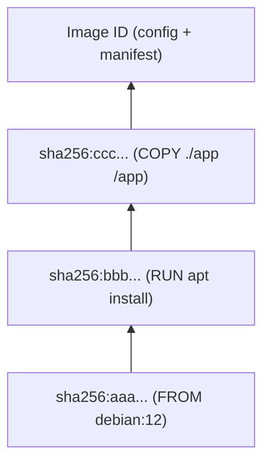

# Part IV — Docker Images

## Chapter 10: Images

### What Is an Image?

A Docker image is a **read-only template** containing everything needed to run an application: base filesystem, binaries, libraries, environment variables, entry point. A container is a **running instance** of an image (image = class, container = object, to use the object-oriented analogy).

### Architecture

#### Layers

An image is composed of several **stacked layers** (see Part II, Chapter 7), each identified by a SHA256 hash, generated by a Dockerfile instruction (`FROM`, `RUN`, `COPY`, etc.). These layers are assembled via OverlayFS to form the container's final filesystem.



#### Immutable Image

Once built, an image **never changes**: its layers are read-only. To "modify" an image, you must rebuild a new one (new tag, new digest). This immutability guarantees reproducibility: the same image always produces the same behavior, wherever it runs.

### Creation

```bash
# À partir d'un Dockerfile
docker build -t mon-app:1.0 .

# À partir d'un conteneur modifié (déconseillé en production, utile pour du debug ponctuel)
docker commit mon-conteneur mon-app:debug
```

!!! danger "Interview Trap"
    `docker commit` is rarely a good practice in production: it does not document how the image was built (no versioned Dockerfile = no reproducibility, no code review possible). Always prefer a Dockerfile versioned in Git.

### Removal

```bash
docker rmi mon-app:1.0          # supprime une image (si aucun conteneur ne l'utilise)
docker rmi -f mon-app:1.0       # force la suppression
docker image prune              # supprime les images "dangling" (sans tag)
docker image prune -a           # supprime aussi les images non utilisées par un conteneur
```

---

## Chapter 11: Docker Hub

### Registry

A **registry** is a server that stores and distributes Docker images (organized into repositories). Docker Hub is the default public registry, but you can host your own private registry (Harbor, GitLab Container Registry, Oracle Container Registry — see Part XI).

### Repository

A **repository** groups all versions (tags) of the same image, e.g. `nginx` groups `nginx:1.25`, `nginx:alpine`, `nginx:latest`, etc.

### Tags

A tag identifies a specific version of an image within a repository:

```bash
docker pull nginx:1.25.3
docker pull nginx:1.25.3-alpine
```

#### latest

`latest` is the tag applied **by default** if no tag is specified — it is **not** automatically the most recent version semantically, it is just a convention that maintainers may or may not apply.

!!! danger "Classic Interview Trap"
    Never use `latest` in production. Problems: (1) non-reproducibility — `latest` points to a different digest depending on the pull date; (2) `docker pull` can silently change the version between two deployments; (3) misconfigured `imagePullPolicy` in Kubernetes with `latest` can re-pull the image on every pod restart. Always pin a precise version (ideally the SHA256 digest for total immutability guarantee).

### Pull

```bash
docker pull ubuntu:22.04
docker pull ubuntu@sha256:abcdef...   # par digest, garantie d'immuabilité
```

### Push

```bash
docker login
docker tag mon-app:1.0 monutilisateur/mon-app:1.0
docker push monutilisateur/mon-app:1.0
```

### Private Images

A private repository requires authentication (`docker login`) for push/pull. In enterprise environments, authentication is typically configured via a **secret** (Kubernetes `imagePullSecrets`, or CI/CD credentials).

### Public Images

**Official images** (`nginx`, `python`, `postgres`, without user namespace) are maintained by Docker Inc. in partnership with upstream projects, with regular security scans — prefer them over unverified third-party images.

---

## Chapter 12: Image Management

| Command | Role |
|---|---|
| `docker images` | Lists locally stored images |
| `docker pull <image>` | Downloads an image from a registry |
| `docker push <image>` | Pushes an image to a registry |
| `docker rmi <image>` | Removes a local image |
| `docker save` | Exports one or more image(s) as a `.tar` archive (with metadata, layers) |
| `docker load` | Imports an image from a `.tar` archive (created by `save`) |
| `docker export` | Exports the **filesystem of a container** as `.tar` (without layer history) |
| `docker import` | Creates an image from a `.tar` archive (created by `export`) |
| `docker history` | Shows the layers of an image and the command that generated each |
| `docker inspect` | Shows complete metadata in JSON (config, mounts, network, env...) |

### Key Difference: save/load vs export/import

```bash
# save/load : conserve les layers et l'historique (idéal pour transférer une image entre hôtes sans registre)
docker save -o mon-app.tar mon-app:1.0
docker load -i mon-app.tar

# export/import : aplati le filesystem d'un conteneur en une seule couche (perd l'historique du Dockerfile)
docker export mon-conteneur > rootfs.tar
docker import rootfs.tar mon-app:from-container
```

!!! danger "Interview Trap"
    `docker save` operates on an **image**, `docker export` operates on a **container**. This is a very common confusion. Remember: *save/load = image ↔ image (with layers)*, *export/import = container → image (without layers, flattened filesystem)*.

### docker history

```bash
docker history nginx:latest
```

Useful to understand why an image is large (identify the responsible layer) — first step of image optimization (see Part VI, Chapter 18).

### docker inspect

```bash
docker inspect nginx:latest
docker inspect --format='{{.Config.Env}}' mon-conteneur
```

The `--format` flag (Go template syntax) allows extracting a specific field from the JSON — heavily used in scripting/CI to automate checks (e.g. retrieving a container's IP, its health status, etc.).

??? question "Interview Question: How to reduce an image size without changing its application content?"
    Several levers independent of the code: (1) choose a lighter base image (`alpine`, `distroless`); (2) merge `RUN` instructions to reduce the number of layers and clean the package cache in the same layer (`apt-get clean && rm -rf /var/lib/apt/lists/*`); (3) use a **multi-stage build** to keep in the final image only the artifacts needed at runtime, not the build tools. Detailed in Part VI, Chapter 18.

??? question "Interview Question: Can two different images (different tags) share identical layers on disk?"
    Yes — this is even one of the main benefits of the layer system. If `mon-app:1.0` and `mon-app:2.0` share the same base (`FROM python:3.11-slim`) and the same first instructions, these layers are stored **only once** on disk and referenced by both images.
