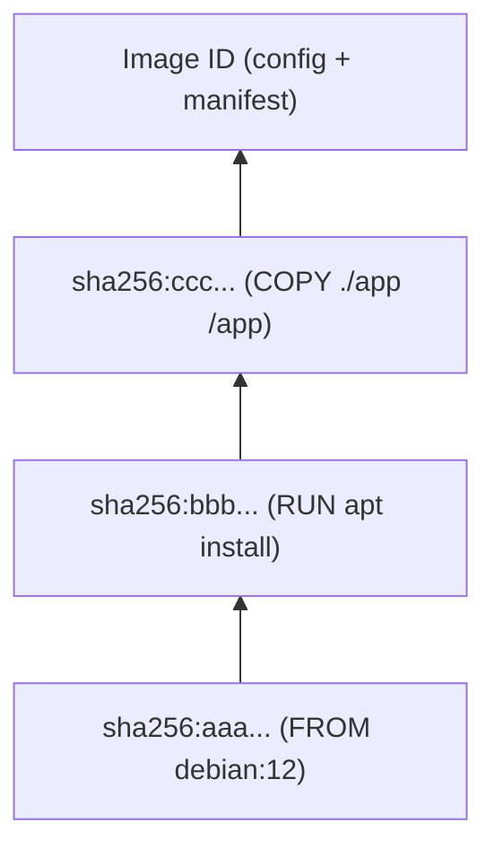

# Partie IV — Les Images Docker

## Chapitre 10 : Les Images

### Qu'est-ce qu'une image ?

Une image Docker est un **modèle en lecture seule** contenant tout ce qu'il faut pour exécuter une application : filesystem de base, binaires, librairies, variables d'environnement, point d'entrée. Un conteneur est une **instance en exécution** d'une image (image = classe, conteneur = objet, pour reprendre l'analogie orientée objet).

### Architecture

#### Layers

Une image est composée de plusieurs **couches empilées** (voir Partie II, Chapitre 7), chacune identifiée par un hash SHA256, générée par une instruction du Dockerfile (`FROM`, `RUN`, `COPY`, etc.). Ces couches sont assemblées via OverlayFS pour former le filesystem final du conteneur.



#### Image immutable

Une fois construite, une image **ne change jamais** : ses couches sont en lecture seule. Pour "modifier" une image, il faut en reconstruire une nouvelle (nouveau tag, nouveau digest). Cette immuabilité garantit la reproductibilité : la même image produit toujours le même comportement, peu importe où elle s'exécute.

### Création

```bash
# À partir d'un Dockerfile
docker build -t mon-app:1.0 .

# À partir d'un conteneur modifié (déconseillé en production, utile pour du debug ponctuel)
docker commit mon-conteneur mon-app:debug
```

!!! danger "Piège d'entretien"
    `docker commit` est rarement une bonne pratique en production : elle ne documente pas comment l'image a été construite (pas de Dockerfile versionné = pas de reproductibilité, pas de revue de code possible). Toujours privilégier un Dockerfile versionné dans Git.

### Suppression

```bash
docker rmi mon-app:1.0          # supprime une image (si aucun conteneur ne l'utilise)
docker rmi -f mon-app:1.0       # force la suppression
docker image prune              # supprime les images "dangling" (sans tag)
docker image prune -a           # supprime aussi les images non utilisées par un conteneur
```

---

## Chapitre 11 : Docker Hub

### Registry

Un **registry** est un serveur qui stocke et distribue des images Docker (organisées en repositories). Docker Hub est le registre public par défaut, mais on peut héberger son propre registre privé (Harbor, GitLab Container Registry, Oracle Container Registry — voir Partie XI).

### Repository

Un **repository** regroupe toutes les versions (tags) d'une même image, ex. `nginx` regroupe `nginx:1.25`, `nginx:alpine`, `nginx:latest`, etc.

### Tags

Un tag identifie une version précise d'une image au sein d'un repository :

```bash
docker pull nginx:1.25.3
docker pull nginx:1.25.3-alpine
```

#### latest

`latest` est le tag appliqué **par défaut** si aucun tag n'est précisé — ce n'est **pas** automatiquement la version la plus récente au sens sémantique, c'est juste une convention que les mainteneurs choisissent (ou non) d'appliquer.

!!! danger "Piège d'entretien classique"
    Ne jamais utiliser `latest` en production. Problèmes : (1) non-reproductibilité — `latest` pointe vers un digest différent selon la date du pull ; (2) `docker pull` peut silencieusement changer de version entre deux déploiements ; (3) `imagePullPolicy` mal configuré en Kubernetes avec `latest` peut re-tirer l'image à chaque redémarrage de pod. Toujours épingler une version précise (idéalement le digest SHA256 pour une garantie d'immuabilité totale).

### Pull

```bash
docker pull ubuntu:22.04
docker pull ubuntu@sha256:abcdef...   # par digest, garantie d'immuabilité
```

### Push

```bash
docker login
docker tag mon-app:1.0 monutilisateur/mon-app:1.0
docker push monutilisateur/mon-app:1.0
```

### Images privées

Un repository privé nécessite une authentification (`docker login`) pour push/pull. En entreprise, on configure généralement l'authentification via un **secret** (Kubernetes `imagePullSecrets`, ou credentials CI/CD).

### Images publiques

Les **images officielles** (`nginx`, `python`, `postgres`, sans namespace utilisateur) sont maintenues par Docker Inc. en partenariat avec les projets upstream, avec des scans de sécurité réguliers — à préférer aux images tierces non vérifiées.

---

## Chapitre 12 : Gestion des images

| Commande | Rôle |
|---|---|
| `docker images` | Liste les images stockées localement |
| `docker pull <image>` | Télécharge une image depuis un registre |
| `docker push <image>` | Envoie une image vers un registre |
| `docker rmi <image>` | Supprime une image locale |
| `docker save` | Exporte une/des image(s) en archive `.tar` (avec métadonnées, layers) |
| `docker load` | Importe une image depuis une archive `.tar` (créée par `save`) |
| `docker export` | Exporte le **filesystem d'un conteneur** en `.tar` (sans historique de layers) |
| `docker import` | Crée une image à partir d'une archive `.tar` (créée par `export`) |
| `docker history` | Affiche les couches d'une image et la commande ayant généré chacune |
| `docker inspect` | Affiche les métadonnées complètes en JSON (config, mounts, réseau, env...) |

### Différence clé : save/load vs export/import

```bash
# save/load : conserve les layers et l'historique (idéal pour transférer une image entre hôtes sans registre)
docker save -o mon-app.tar mon-app:1.0
docker load -i mon-app.tar

# export/import : aplati le filesystem d'un conteneur en une seule couche (perd l'historique du Dockerfile)
docker export mon-conteneur > rootfs.tar
docker import rootfs.tar mon-app:from-container
```

!!! danger "Piège d'entretien"
    `docker save` opère sur une **image**, `docker export` opère sur un **conteneur**. C'est une confusion très fréquente. Retenez : *save/load = image ↔ image (avec layers)*, *export/import = conteneur → image (sans layers, filesystem aplati)*.

### docker history

```bash
docker history nginx:latest
```

Utile pour comprendre pourquoi une image est volumineuse (identifier la couche responsable) — première étape de l'optimisation d'image (voir Partie VI, Chapitre 18).

### docker inspect

```bash
docker inspect nginx:latest
docker inspect --format='{{.Config.Env}}' mon-conteneur
```

Le flag `--format` (syntaxe Go template) permet d'extraire un champ précis du JSON — très utilisé en scripting/CI pour automatiser des vérifications (ex. récupérer l'IP d'un conteneur, son état de santé, etc.).

??? question "Question d'entretien : Comment réduire la taille d'une image sans changer son contenu applicatif ?"
    Plusieurs leviers indépendants du code : (1) choisir une image de base plus légère (`alpine`, `distroless`) ; (2) fusionner les instructions `RUN` pour réduire le nombre de couches et nettoyer le cache de paquets dans la même couche (`apt-get clean && rm -rf /var/lib/apt/lists/*`) ; (3) utiliser un **multi-stage build** pour ne garder dans l'image finale que les artefacts nécessaires à l'exécution, pas les outils de build. Détaillé en Partie VI, Chapitre 18.

??? question "Question d'entretien : Deux images différentes (tags différents) peuvent-elles partager des couches identiques sur disque ?"
    Oui — c'est même l'un des principaux bénéfices du système de couches. Si `mon-app:1.0` et `mon-app:2.0` partagent la même base (`FROM python:3.11-slim`) et les mêmes premières instructions, ces couches ne sont stockées **qu'une seule fois** sur le disque et référencées par les deux images.