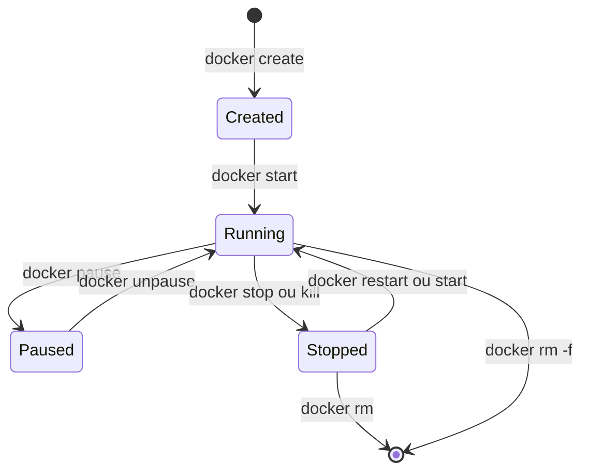

# Part V — Containers

## Chapter 13: Lifecycle



### Create

```bash
docker create --name mon-app nginx:1.25
```

Creates the container (namespaces allocation, filesystem ready) **without starting it**. Rarely used alone in practice.

### Start

```bash
docker start mon-app
```

Starts an existing container (created or previously stopped).

### Run

```bash
docker run nginx:1.25
```

`docker run` = `docker create` + `docker start` in a single command. It is the most used command day-to-day.

### Stop

```bash
docker stop mon-app          # SIGTERM, puis SIGKILL après 10s (délai par défaut)
docker stop -t 30 mon-app    # délai de grâce personnalisé
```

### Restart

```bash
docker restart mon-app
```

Equivalent to `stop` + `start`. Useful after an external configuration change (mounting a new config file via volume, for example).

### Pause

```bash
docker pause mon-app
```

Suspends **all processes** in the container via `cgroup freezer` (the container stays in memory but no longer consumes CPU). Different from `stop`: no signal is sent to processes.

### Resume

```bash
docker unpause mon-app
```

### Kill

```bash
docker kill mon-app                # SIGKILL immédiat, pas de délai de grâce
docker kill -s SIGUSR1 mon-app     # envoi d'un signal spécifique
```

### Remove

```bash
docker rm mon-app         # échoue si le conteneur tourne
docker rm -f mon-app      # force (kill + remove)
docker rm -v mon-app      # supprime aussi les volumes anonymes associés
```

!!! danger "Interview Trap"
    `docker stop` then `docker rm` **does not remove** associated named volumes (intentional behavior: volumes are designed to survive the container). Only **anonymous** volumes are removed with `docker rm -v`. To remove a named volume, you must explicitly run `docker volume rm`.

---

## Chapter 14: Docker Commands

| Command | Role |
|---|---|
| `docker run` | Creates and starts a container |
| `docker ps` | Lists containers (active by default, `-a` for all) |
| `docker logs` | Shows stdout/stderr logs of a container |
| `docker exec` | Executes a command inside an already running container |
| `docker attach` | Attaches to the main process (stdin/stdout) of a container |
| `docker cp` | Copies files between host and container |
| `docker top` | Lists processes of a container (host-side view) |
| `docker stats` | Real-time statistics (CPU, RAM, network, I/O) |
| `docker inspect` | Complete metadata in JSON |
| `docker diff` | Lists files modified/added/deleted compared to the base image |

### docker run — Essential Options

```bash
docker run -d \                     # détaché (arrière-plan)
  --name mon-app \                  # nom explicite
  -p 8080:80 \                      # port hôte:conteneur
  -e ENV=production \               # variable d'environnement
  -v mon-volume:/data \             # volume nommé
  --restart unless-stopped \        # politique de redémarrage
  --network mon-reseau \            # réseau personnalisé
  nginx:1.25
```

### docker exec vs docker attach

!!! danger "Frequent Interview Trap"
    `docker attach` connects to the **PID 1 process** of the container (the main process): if you type `Ctrl+C`, you risk stopping that process (and thus the container). `docker exec` launches a **new process** in the container's namespaces (e.g. `docker exec -it mon-app bash`): exiting it does not affect the main process. In practice, you almost always use `docker exec -it` for interactive debugging.

```bash
docker exec -it mon-app bash
docker exec mon-app cat /etc/hostname
```

### docker cp

```bash
docker cp mon-app:/app/logs/error.log ./error.log   # conteneur -> hôte
docker cp ./config.yaml mon-app:/app/config.yaml    # hôte -> conteneur
```

### docker diff

```bash
docker diff mon-app
# A /app/uploads         (Added)
# C /etc/hosts           (Changed)
# D /tmp/cache.tmp       (Deleted)
```

Shows writes made in the container's writable layer (Copy-on-Write) since it started — useful to audit what a container actually modifies.

---

## Chapter 15: Resources

### CPU

```bash
docker run --cpus="2" --cpu-shares=1024 mon-app
```

### RAM

```bash
docker run --memory="1g" --memory-reservation="768m" mon-app
```

- `--memory`: hard limit (hard limit).
- `--memory-reservation`: "soft" threshold (soft limit), used by the kernel to arbitrate under global memory pressure.

### Swap

```bash
docker run --memory="512m" --memory-swap="1g" mon-app
```

`--memory-swap` defines the total memory + swap allowed. If equal to `--memory`, swap is disabled for this container. If not specified, the container can use up to 2× the memory limit in swap by default.

### OOM Killer

When a container exceeds its `--memory` limit, the Linux kernel triggers the **OOM Killer** (Out-Of-Memory Killer), which kills the most memory-consuming process to free memory. The container then shows `OOMKilled: true` in `docker inspect`.

```bash
docker inspect mon-app --format='{{.State.OOMKilled}}'
```

!!! danger "Interview Trap"
    An `OOMKilled` is **not always** an application memory leak — it may simply mean the defined `--memory` limit is too low for a legitimate load spike. Always cross-check with `docker stats` / monitoring metrics before concluding there is a bug.

### Restart Policy

```bash
docker run --restart=no mon-app                  # défaut, jamais de redémarrage auto
docker run --restart=on-failure:5 mon-app        # redémarre si code de sortie ≠ 0, max 5 fois
docker run --restart=always mon-app              # redémarre toujours (y compris après reboot du daemon)
docker run --restart=unless-stopped mon-app      # comme "always", sauf si arrêté manuellement
```

### Healthcheck

```dockerfile
HEALTHCHECK --interval=30s --timeout=5s --start-period=10s --retries=3 \
  CMD curl -f http://localhost/health || exit 1
```

Or via CLI:
```bash
docker run --health-cmd="curl -f http://localhost/health || exit 1" \
  --health-interval=30s mon-app
```

The status appears in `docker ps` (`healthy`/`unhealthy`/`starting`) and is used by orchestrators (Swarm, Compose `depends_on: condition: service_healthy`) to decide if a container is truly ready to receive traffic — unlike the `running` state, which only indicates the process has not crashed.

??? question "Interview Question: What is the difference between a `running` and a `healthy` container?"
    `running` means the PID 1 process is active — it guarantees nothing about the application state (the app may be blocked, in an infinite loop, or unable to respond to requests). `healthy` is a state computed by the `HEALTHCHECK` defined, which actually tests the application's ability to respond correctly. A container can be `running` but `unhealthy`.

??? question "Interview Question: Why should you systematically define CPU/RAM limits in production?"
    Without limits, a container can consume all available host resources ("noisy neighbor"), causing instability or crash of other co-located containers. Defining limits guarantees performance isolation (QoS) and allows predictable capacity planning for the cluster.
