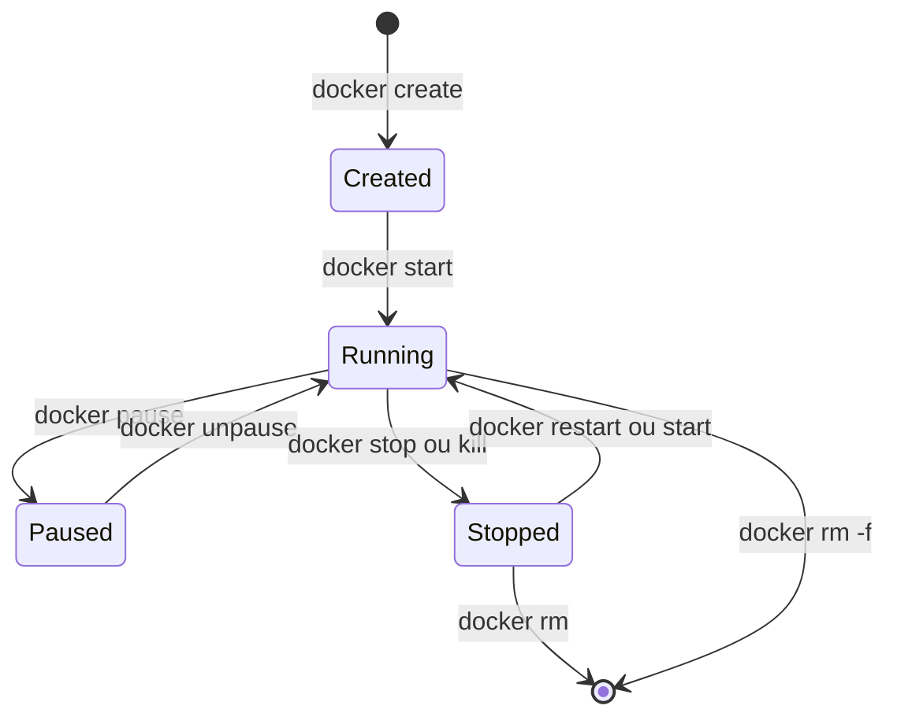

# Partie V — Les Conteneurs

## Chapitre 13 : Cycle de vie



### Create

```bash
docker create --name mon-app nginx:1.25
```

Crée le conteneur (allocation des namespaces, filesystem prêt) **sans le démarrer**. Rarement utilisé seul en pratique.

### Start

```bash
docker start mon-app
```

Démarre un conteneur existant (créé ou précédemment arrêté).

### Run

```bash
docker run nginx:1.25
```

`docker run` = `docker create` + `docker start` en une seule commande. C'est la commande la plus utilisée au quotidien.

### Stop

```bash
docker stop mon-app          # SIGTERM, puis SIGKILL après 10s (délai par défaut)
docker stop -t 30 mon-app    # délai de grâce personnalisé
```

### Restart

```bash
docker restart mon-app
```

Équivaut à `stop` + `start`. Utile après une modification de configuration externe (montée d'un nouveau fichier de config via volume, par exemple).

### Pause

```bash
docker pause mon-app
```

Suspend **tous les processus** du conteneur via `cgroup freezer` (le conteneur reste en mémoire mais ne consomme plus de CPU). Différent de `stop` : aucun signal n'est envoyé aux processus.

### Resume

```bash
docker unpause mon-app
```

### Kill

```bash
docker kill mon-app                # SIGKILL immédiat, pas de délai de grâce
docker kill -s SIGUSR1 mon-app     # envoi d'un signal spécifique
```

### Remove

```bash
docker rm mon-app         # échoue si le conteneur tourne
docker rm -f mon-app      # force (kill + remove)
docker rm -v mon-app      # supprime aussi les volumes anonymes associés
```

!!! danger "Piège d'entretien"
    `docker stop` puis `docker rm` **ne supprime pas** les volumes nommés associés (comportement volontaire : les volumes sont conçus pour survivre au conteneur). Seuls les volumes **anonymes** sont supprimés avec `docker rm -v`. Pour supprimer un volume nommé, il faut explicitement `docker volume rm`.

---

## Chapitre 14 : Les commandes Docker

| Commande | Rôle |
|---|---|
| `docker run` | Crée et démarre un conteneur |
| `docker ps` | Liste les conteneurs (actifs par défaut, `-a` pour tous) |
| `docker logs` | Affiche les logs stdout/stderr d'un conteneur |
| `docker exec` | Exécute une commande dans un conteneur déjà lancé |
| `docker attach` | Se rattache au processus principal (stdin/stdout) d'un conteneur |
| `docker cp` | Copie des fichiers entre hôte et conteneur |
| `docker top` | Liste les processus d'un conteneur (vue côté hôte) |
| `docker stats` | Statistiques temps réel (CPU, RAM, réseau, I/O) |
| `docker inspect` | Métadonnées complètes en JSON |
| `docker diff` | Liste les fichiers modifiés/ajoutés/supprimés par rapport à l'image de base |

### docker run — options essentielles

```bash
docker run -d \                     # détaché (arrière-plan)
  --name mon-app \                  # nom explicite
  -p 8080:80 \                      # port hôte:conteneur
  -e ENV=production \               # variable d'environnement
  -v mon-volume:/data \             # volume nommé
  --restart unless-stopped \        # politique de redémarrage
  --network mon-reseau \            # réseau personnalisé
  nginx:1.25
```

### docker exec vs docker attach

!!! danger "Piège d'entretien fréquent"
    `docker attach` se connecte au **processus PID 1** du conteneur (le processus principal) : si vous tapez `Ctrl+C`, vous risquez d'arrêter ce processus (et donc le conteneur). `docker exec` lance un **nouveau processus** dans les namespaces du conteneur (ex. `docker exec -it mon-app bash`) : le quitter ne touche pas au processus principal. En pratique, on utilise presque toujours `docker exec -it` pour du débogage interactif.

```bash
docker exec -it mon-app bash
docker exec mon-app cat /etc/hostname
```

### docker cp

```bash
docker cp mon-app:/app/logs/error.log ./error.log   # conteneur -> hôte
docker cp ./config.yaml mon-app:/app/config.yaml    # hôte -> conteneur
```

### docker diff

```bash
docker diff mon-app
# A /app/uploads         (Added)
# C /etc/hosts           (Changed)
# D /tmp/cache.tmp       (Deleted)
```

Montre les écritures effectuées dans la couche en écriture du conteneur (Copy-on-Write) depuis son démarrage — utile pour auditer ce qu'un conteneur modifie réellement.

---

## Chapitre 15 : Les ressources

### CPU

```bash
docker run --cpus="2" --cpu-shares=1024 mon-app
```

### RAM

```bash
docker run --memory="1g" --memory-reservation="768m" mon-app
```

- `--memory` : plafond dur (hard limit).
- `--memory-reservation` : seuil "souple" (soft limit), utilisé par le noyau pour arbitrer en cas de pression mémoire globale.

### Swap

```bash
docker run --memory="512m" --memory-swap="1g" mon-app
```

`--memory-swap` définit le total mémoire + swap autorisé. Si égal à `--memory`, le swap est désactivé pour ce conteneur. Si non spécifié, le conteneur peut utiliser jusqu'à 2× la limite mémoire en swap par défaut.

### OOM Killer

Quand un conteneur dépasse sa limite `--memory`, le noyau Linux déclenche l'**OOM Killer** (Out-Of-Memory Killer), qui tue le processus le plus consommateur pour libérer de la mémoire. Le conteneur affiche alors `OOMKilled: true` dans `docker inspect`.

```bash
docker inspect mon-app --format='{{.State.OOMKilled}}'
```

!!! danger "Piège d'entretien"
    Un `OOMKilled` n'est **pas toujours** une fuite mémoire applicative — cela peut simplement signifier que la limite `--memory` définie est trop basse pour un pic légitime de charge. Toujours croiser avec `docker stats` / les métriques de monitoring avant de conclure à un bug.

### Restart Policy

```bash
docker run --restart=no mon-app                  # défaut, jamais de redémarrage auto
docker run --restart=on-failure:5 mon-app        # redémarre si code de sortie ≠ 0, max 5 fois
docker run --restart=always mon-app              # redémarre toujours (y compris après reboot du daemon)
docker run --restart=unless-stopped mon-app      # comme "always", sauf si arrêté manuellement
```

### Healthcheck

```dockerfile
HEALTHCHECK --interval=30s --timeout=5s --start-period=10s --retries=3 \
  CMD curl -f http://localhost/health || exit 1
```

Ou en CLI :
```bash
docker run --health-cmd="curl -f http://localhost/health || exit 1" \
  --health-interval=30s mon-app
```

Le statut apparaît dans `docker ps` (`healthy`/`unhealthy`/`starting`) et est utilisé par des orchestrateurs (Swarm, Compose `depends_on: condition: service_healthy`) pour décider si un conteneur est réellement prêt à recevoir du trafic — contrairement à l'état `running`, qui indique seulement que le processus n'a pas crashé.

??? question "Question d'entretien : Quelle est la différence entre un conteneur `running` et `healthy` ?"
    `running` signifie que le processus PID 1 est actif — cela ne garantit rien sur l'état applicatif (l'app peut être bloquée, en boucle infinie, ou incapable de répondre aux requêtes). `healthy` est un état calculé par le `HEALTHCHECK` défini, qui teste réellement la capacité de l'application à répondre correctement. Un conteneur peut être `running` mais `unhealthy`.

??? question "Question d'entretien : Pourquoi définir systématiquement des limites CPU/RAM en production ?"
    Sans limites, un conteneur peut consommer toutes les ressources disponibles de l'hôte ("noisy neighbor"), provoquant l'instabilité ou le crash d'autres conteneurs colocalisés. Définir des limites garantit l'isolation des performances (QoS) et permet un dimensionnement capacitaire prévisible du cluster.