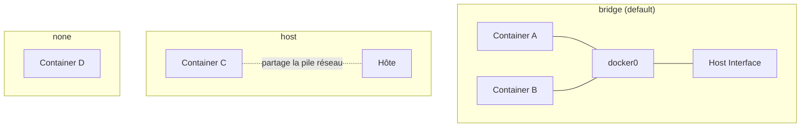

# Part VII — Docker Networking

## Chapter 19: Networking

Docker provides several **network drivers**, each suited to a different use case.



### Bridge

**Default** driver for a standalone container. Docker creates a virtual bridge (`docker0` by default, or a custom bridge) to which each container connects via a pair of virtual interfaces (`veth`). Each container receives a private IP on this bridge, and outgoing traffic goes through NAT (see Chapter 21).

```bash
docker run -d --network bridge nginx
```

### Host

The container **directly shares** the host's network stack: no network isolation, no NAT, no port mapping needed (the container listens directly on the host's ports).

```bash
docker run -d --network host nginx
```

!!! danger "Interview Trap"
    `host` mode removes network isolation: two containers in `host` mode cannot listen on the same port (direct conflict, like two native processes on the host). It brings a performance gain (no NAT, no veth overhead) but at the cost of security and flexibility — reserve it for cases where network latency is critical.

### None

No network interface (except `lo`, loopback) is configured. Useful for strictly batch/compute containers with no network needs, or for maximum network isolation managed manually afterwards.

```bash
docker run -d --network none mon-batch
```

### Overlay

Allows communication between containers located on **different physical hosts**, via a virtual overlay network (VXLAN encapsulation). Used by Docker Swarm and conceptually close to Kubernetes pod networks (CNI).

```bash
docker network create -d overlay --attachable mon-overlay
```

### Macvlan

Assigns each container its own **MAC and IP address**, directly visible on the host's physical network, as if it were a separate physical machine. Useful for legacy applications requiring a dedicated IP on the LAN.

```bash
docker network create -d macvlan \
  --subnet=192.168.1.0/24 \
  --gateway=192.168.1.1 \
  -o parent=eth0 mon-macvlan
```

---

## Chapter 20: Custom Networks

### docker network

```bash
docker network create mon-reseau
docker network ls
docker network inspect mon-reseau
docker network connect mon-reseau mon-conteneur
docker network disconnect mon-reseau mon-conteneur
docker network rm mon-reseau
```

### Internal DNS

On a **custom** network (created by the user, not the default `bridge`), Docker provides automatic DNS resolution: each container can reach another container on the same network **by its name** (`--name`), without knowing its IP.

```bash
docker network create mon-reseau
docker run -d --name db --network mon-reseau postgres
docker run -d --name app --network mon-reseau mon-app
# depuis "app", `ping db` fonctionne directement
```

!!! danger "Interview Trap"
    The default `bridge` network (the one created automatically, not a custom network) **does not provide** internal DNS by container name — only `--link` (deprecated) historically allowed that. This is one of the main reasons to always create a custom network rather than using the default bridge.

### Inter-Container Communication

Two containers on the **same network** communicate freely on all ports (except explicit rules). Two containers on **different** networks cannot see each other, unless one of them is connected to both networks (`docker network connect`).

### Isolation

Each custom Docker network constitutes an **isolated broadcast and DNS resolution domain** — a good security practice is to separate networks by function (e.g. `frontend` network exposed, `backend` network isolated containing the database, with an "API" container bridging both).

---

## Chapter 21: Port Publishing

### NAT

In `bridge` mode, incoming traffic on a published host port is redirected (Network Address Translation) via `iptables` rules automatically generated by Docker to the container's internal IP on the `docker0` network.

### Port Mapping

```bash
docker run -d -p 8080:80 nginx          # hôte:8080 -> conteneur:80
docker run -d -p 127.0.0.1:8080:80 nginx  # n'écoute que sur l'interface loopback de l'hôte
docker run -d -p 8080:80/udp nginx      # protocole UDP explicite
docker run -d -P nginx                  # publie tous les ports EXPOSE sur des ports hôte aléatoires
```

### localhost

From the **host**, `localhost:8080` works thanks to port mapping. From **another container**, `localhost` refers to the container itself (its own network namespace), **not** the host nor other containers — a very common debugging pitfall.

!!! danger "Frequent Interview Trap"
    Container A can **never** reach a service in container B via `localhost:PORT` — each container has its own network namespace, therefore its own `localhost`. To communicate between containers, you must either be on the same Docker network and use the **container name** (internal DNS resolution, see Chapter 20), or go through the host IP if one of them is in `host` mode.

### 0.0.0.0

By default, `-p 8080:80` publishes the port on **all network interfaces** of the host (`0.0.0.0`), making it potentially accessible from the outside if the host is not behind a firewall. Restricting to `127.0.0.1:8080:80` limits access to local traffic only.

### Security

!!! danger "Security Interview Trap"
    A classic mistake in production: publishing database ports directly (`-p 5432:5432` for PostgreSQL) on `0.0.0.0` without firewall or IP restriction. Best practices: (1) only publish strictly necessary ports on the front (reverse proxy); (2) restrict the bind IP (`127.0.0.1:...`) when only the host should access it; (3) place internal services (DB, cache) on an isolated Docker network, without `-p` at all, accessible only via the internal network by containers that need them.

??? question "Interview Question: Does `EXPOSE 80` in a Dockerfile actually open port 80?"
    No. `EXPOSE` is purely **documentary** (and serves as default value for `docker run -P`). It does not open, publish or restrict any port by itself. Only `-p`/`-P` at `docker run` time actually publishes a port to the host.

??? question "Interview Question: How to debug 'Connection refused' between two containers on the same Docker network?"
    Check in order: (1) both containers are indeed on the **same** custom network (`docker network inspect`) — not just both on the default `bridge`, which has no internal DNS; (2) the application in the target container listens on `0.0.0.0` and not `127.0.0.1` internally (otherwise it refuses connections coming from another interface, even within its own network namespace); (3) that no application firewall rule (e.g. `ufw`, custom iptables rules) blocks inter-container traffic.
