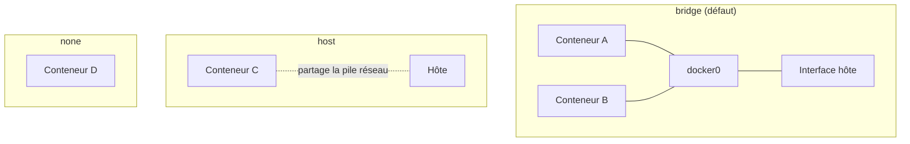

# Partie VII — Réseau Docker

## Chapitre 19 : Networking

Docker fournit plusieurs **drivers réseau**, chacun adapté à un cas d'usage différent.



### Bridge

Driver **par défaut** pour un conteneur standalone. Docker crée un pont virtuel (`docker0` par défaut, ou un pont personnalisé) auquel chaque conteneur se connecte via une paire d'interfaces virtuelles (`veth`). Chaque conteneur reçoit une IP privée sur ce pont, et le trafic sortant passe par NAT (voir Chapitre 21).

```bash
docker run -d --network bridge nginx
```

### Host

Le conteneur **partage directement** la pile réseau de l'hôte : pas d'isolation réseau, pas de NAT, pas de mapping de port nécessaire (le conteneur écoute directement sur les ports de l'hôte).

```bash
docker run -d --network host nginx
```

!!! danger "Piège d'entretien"
    Le mode `host` supprime l'isolation réseau : deux conteneurs en mode `host` ne peuvent pas écouter sur le même port (conflit direct, comme deux processus natifs sur l'hôte). Il apporte un gain de performance (pas de NAT, pas d'overhead veth) mais au prix de la sécurité et de la flexibilité — à réserver aux cas où la latence réseau est critique.

### None

Aucune interface réseau (hormis `lo`, loopback) n'est configurée. Utile pour des conteneurs strictement batch/calcul sans besoin réseau, ou pour une isolation réseau maximale gérée manuellement ensuite.

```bash
docker run -d --network none mon-batch
```

### Overlay

Permet la communication entre conteneurs situés sur **des hôtes physiques différents**, via un réseau virtuel superposé (encapsulation VXLAN). Utilisé par Docker Swarm et conceptuellement proche des réseaux de pods Kubernetes (CNI).

```bash
docker network create -d overlay --attachable mon-overlay
```

### Macvlan

Attribue à chaque conteneur une **adresse MAC et IP propre**, directement visible sur le réseau physique de l'hôte, comme s'il s'agissait d'une machine physique distincte. Utile pour des applications legacy nécessitant une IP dédiée sur le LAN.

```bash
docker network create -d macvlan \
  --subnet=192.168.1.0/24 \
  --gateway=192.168.1.1 \
  -o parent=eth0 mon-macvlan
```

---

## Chapitre 20 : Les réseaux personnalisés

### docker network

```bash
docker network create mon-reseau
docker network ls
docker network inspect mon-reseau
docker network connect mon-reseau mon-conteneur
docker network disconnect mon-reseau mon-conteneur
docker network rm mon-reseau
```

### DNS interne

Sur un réseau **personnalisé** (créé par l'utilisateur, pas le `bridge` par défaut), Docker fournit une résolution DNS automatique : chaque conteneur peut joindre un autre conteneur du même réseau **par son nom** (`--name`), sans connaître son IP.

```bash
docker network create mon-reseau
docker run -d --name db --network mon-reseau postgres
docker run -d --name app --network mon-reseau mon-app
# depuis "app", `ping db` fonctionne directement
```

!!! danger "Piège d'entretien"
    Le réseau `bridge` par défaut (celui créé automatiquement, pas un réseau personnalisé) **ne fournit pas** de DNS interne par nom de conteneur — seul `--link` (obsolète) permettait cela historiquement. C'est l'une des raisons principales de toujours créer un réseau personnalisé plutôt que d'utiliser le bridge par défaut.

### Communication entre conteneurs

Deux conteneurs sur le **même réseau** communiquent librement sur tous les ports (sauf règles explicites). Deux conteneurs sur des réseaux **différents** ne se voient pas, sauf si l'un des deux est connecté aux deux réseaux (`docker network connect`).

### Isolation

Chaque réseau Docker personnalisé constitue un **domaine de broadcast et de résolution DNS isolé** — une bonne pratique de sécurité consiste à séparer les réseaux par fonction (ex. réseau `frontend` exposé, réseau `backend` isolé contenant la base de données, un conteneur "API" pontant les deux).

---

## Chapitre 21 : Publication des ports

### NAT

En mode `bridge`, le trafic entrant sur un port publié de l'hôte est redirigé (Network Address Translation) via des règles `iptables` générées automatiquement par Docker vers l'IP interne du conteneur sur le réseau `docker0`.

### Port Mapping

```bash
docker run -d -p 8080:80 nginx          # hôte:8080 -> conteneur:80
docker run -d -p 127.0.0.1:8080:80 nginx  # n'écoute que sur l'interface loopback de l'hôte
docker run -d -p 8080:80/udp nginx      # protocole UDP explicite
docker run -d -P nginx                  # publie tous les ports EXPOSE sur des ports hôte aléatoires
```

### localhost

Depuis l'**hôte**, `localhost:8080` fonctionne grâce au mapping de port. Depuis **un autre conteneur**, `localhost` référence le conteneur lui-même (son propre network namespace), **pas** l'hôte ni les autres conteneurs — piège très fréquent en debug.

!!! danger "Piège d'entretien fréquent"
    Un conteneur A ne peut **jamais** joindre un service d'un conteneur B via `localhost:PORT` — chaque conteneur a son propre network namespace, donc son propre `localhost`. Pour communiquer entre conteneurs, il faut soit être sur le même réseau Docker et utiliser le **nom du conteneur** (résolution DNS interne, voir Chapitre 20), soit passer par l'IP de l'hôte si l'un des deux est en mode `host`.

### 0.0.0.0

Par défaut, `-p 8080:80` publie le port sur **toutes les interfaces réseau** de l'hôte (`0.0.0.0`), le rendant potentiellement accessible depuis l'extérieur si l'hôte n'est pas derrière un pare-feu. Restreindre à `127.0.0.1:8080:80` limite l'accès au trafic local uniquement.

### Sécurité

!!! danger "Piège d'entretien sécurité"
    Une erreur classique en production : publier directement des ports de bases de données (`-p 5432:5432` pour PostgreSQL) sur `0.0.0.0` sans pare-feu ni restriction d'IP. Bonnes pratiques : (1) ne publier que les ports strictement nécessaires en façade (reverse proxy) ; (2) restreindre l'IP de bind (`127.0.0.1:...`) quand seul l'hôte doit y accéder ; (3) placer les services internes (DB, cache) sur un réseau Docker isolé, sans `-p` du tout, accessible uniquement via le réseau interne par les conteneurs qui en ont besoin.

??? question "Question d'entretien : `EXPOSE 80` dans un Dockerfile ouvre-t-il réellement le port 80 ?"
    Non. `EXPOSE` est purement **documentaire** (et sert de valeur par défaut pour `docker run -P`). Il n'ouvre, ne publie et ne restreint aucun port en lui-même. Seul `-p`/`-P` au moment du `docker run` publie réellement un port vers l'hôte.

??? question "Question d'entretien : Comment déboguer 'Connection refused' entre deux conteneurs sur le même réseau Docker ?"
    Vérifier dans l'ordre : (1) les deux conteneurs sont bien sur le **même** réseau personnalisé (`docker network inspect`) — pas seulement tous les deux sur `bridge` par défaut, qui n'a pas de DNS interne ; (2) l'application dans le conteneur cible écoute bien sur `0.0.0.0` et non `127.0.0.1` en interne (sinon elle refuse les connexions venant d'une autre interface, même dans son propre namespace réseau) ; (3) qu'aucune règle de pare-feu applicative (ex. `ufw`, règles iptables custom) ne bloque le trafic inter-conteneurs.