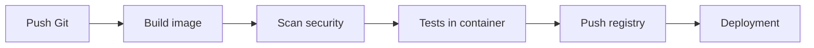
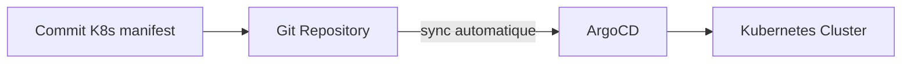

# Part XV — Docker and DevOps

## Chapter 33

### Docker + Git

The Dockerfile and `compose.yaml` are versioned in the same Git repository as the application code (minimal "infrastructure as code") — ensures that each commit corresponds to a reproducible and traceable execution environment.

### Docker + CI/CD

Typical containerized pipeline diagram:



Each step uses the image built in the previous step (never rebuilt) — guarantees that the tested artifact is **exactly** the one deployed (image immutability principle, Part IV).

### Docker + Jenkins

```groovy
pipeline {
  agent any
  stages {
    stage('Build') {
      steps { sh 'docker build -t mon-app:${BUILD_NUMBER} .' }
    }
    stage('Test') {
      steps { sh 'docker run --rm mon-app:${BUILD_NUMBER} pytest' }
    }
    stage('Push') {
      steps { sh 'docker push registry.exemple.com/mon-app:${BUILD_NUMBER}' }
    }
  }
}
```

Jenkins can run build agents **themselves inside containers** (ephemeral agent per job), ensuring a clean and reproducible build environment for each execution.

### Docker + GitHub Actions

```yaml
name: build-and-push
on: [push]
jobs:
  docker:
    runs-on: ubuntu-latest
    steps:
      - uses: actions/checkout@v4
      - uses: docker/login-action@v3
        with:
          registry: ghcr.io
          username: ${{ github.actor }}
          password: ${{ secrets.GITHUB_TOKEN }}
      - uses: docker/build-push-action@v5
        with:
          push: true
          tags: ghcr.io/${{ github.repository }}:${{ github.sha }}
```

Best practice: tag with the commit SHA (`github.sha`) rather than a static tag — exact traceability between source code and deployed image.

### Docker + GitLab CI

```yaml
build:
  image: docker:24
  services:
    - docker:24-dind   # Docker-in-Docker
  script:
    - docker build -t $CI_REGISTRY_IMAGE:$CI_COMMIT_SHA .
    - docker push $CI_REGISTRY_IMAGE:$CI_COMMIT_SHA
```

!!! danger "Interview Trap: Docker-in-Docker (dind)"
    `dind` runs a complete Docker daemon **inside** a CI container, requiring `--privileged` — notable security risk in a shared CI environment (potential escape). A more widely adopted safer alternative: mounting the host socket (`-v /var/run/docker.sock:/var/run/docker.sock`, "Docker-outside-of-Docker") to reuse the host CI daemon without a nested privileged container — with its own trade-offs (the build container then has access to the entire host daemon).

### Docker + ArgoCD

ArgoCD implements **GitOps**: the desired state of deployments (Kubernetes manifests referencing tagged Docker images) is declared in Git, and ArgoCD continuously synchronizes the real cluster with this declared state — every change goes through a Git commit, never through a manual command on the cluster.



### Docker in Oracle Pipelines

At Oracle, the typical integration combines: image build → push to **OCIR** (Oracle Container Registry, see Part XI) → deployment to **OKE** (Oracle Kubernetes Engine) via OCI DevOps pipelines or a GitOps tool (ArgoCD) pointing to OKE. Points to know for an interview: OCIR authentication via IAM auth token, and native IAM integration between OCIR and OKE within the same tenancy (no manual `imagePullSecrets` secret configuration needed if IAM policies are properly configured).

??? question "Interview Question: Why tag CI images with the commit SHA rather than an incremental build number?"
    The SHA guarantees a unique and unambiguous correspondence between the exact source code and the produced image, independent of the CI tool used — reproducible even if the pipeline is replayed, and easily traceable in Git (`git show <sha>`). An incremental build number depends on the CI tool and says nothing about the actual commit content.

??? question "Interview Question: What is the difference between CI and GitOps (CD) in this context?"
    CI (build, test, scan, push) produces a versioned artifact (the image). GitOps (ArgoCD) handles the **deployment** of this artifact by continuously synchronizing the cluster state with a versioned declaration in Git — thus separating the "build" responsibility from the "deploy" responsibility, and making every deployment auditable via Git history rather than via the logs of a one-time pipeline execution.
