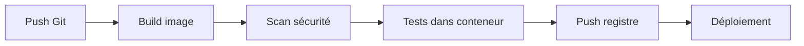
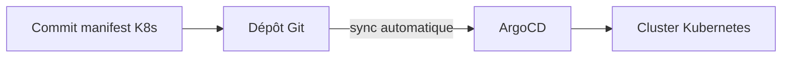

# Partie XV — Docker et DevOps

## Chapitre 33

### Docker + Git

Le Dockerfile et le `compose.yaml` sont versionnés dans le même dépôt Git que le code applicatif ("infrastructure as code" minimale) — garantit que chaque commit correspond à un environnement d'exécution reproductible et traçable.

### Docker + CI/CD

Schéma type d'un pipeline conteneurisé :



Chaque étape utilise l'image construite à l'étape précédente (jamais reconstruite) — garantit que l'artefact testé est **exactement** celui déployé (principe d'immuabilité de l'image, Partie IV).

### Docker + Jenkins

```groovy
pipeline {
  agent any
  stages {
    stage('Build') {
      steps { sh 'docker build -t mon-app:${BUILD_NUMBER} .' }
    }
    stage('Test') {
      steps { sh 'docker run --rm mon-app:${BUILD_NUMBER} pytest' }
    }
    stage('Push') {
      steps { sh 'docker push registry.exemple.com/mon-app:${BUILD_NUMBER}' }
    }
  }
}
```

Jenkins peut exécuter les agents de build **eux-mêmes dans des conteneurs** (agent éphémère par job), garantissant un environnement de build propre et reproductible à chaque exécution.

### Docker + GitHub Actions

```yaml
name: build-and-push
on: [push]
jobs:
  docker:
    runs-on: ubuntu-latest
    steps:
      - uses: actions/checkout@v4
      - uses: docker/login-action@v3
        with:
          registry: ghcr.io
          username: ${{ github.actor }}
          password: ${{ secrets.GITHUB_TOKEN }}
      - uses: docker/build-push-action@v5
        with:
          push: true
          tags: ghcr.io/${{ github.repository }}:${{ github.sha }}
```

Bonne pratique : taguer avec le SHA du commit (`github.sha`) plutôt qu'un tag statique — traçabilité exacte entre code source et image déployée.

### Docker + GitLab CI

```yaml
build:
  image: docker:24
  services:
    - docker:24-dind   # Docker-in-Docker
  script:
    - docker build -t $CI_REGISTRY_IMAGE:$CI_COMMIT_SHA .
    - docker push $CI_REGISTRY_IMAGE:$CI_COMMIT_SHA
```

!!! danger "Piège d'entretien : Docker-in-Docker (dind)"
    `dind` fait tourner un daemon Docker complet **à l'intérieur** d'un conteneur CI, nécessitant `--privileged` — risque de sécurité notable en environnement CI partagé (évasion potentielle). Alternative plus sûre largement adoptée : monter le socket de l'hôte (`-v /var/run/docker.sock:/var/run/docker.sock`, "Docker-outside-of-Docker") pour réutiliser le daemon de l'hôte CI sans conteneur privilégié imbriqué — avec ses propres compromis (le conteneur de build a alors accès à tout le daemon hôte).

### Docker + ArgoCD

ArgoCD implémente le **GitOps** : l'état désiré des déploiements (manifests Kubernetes référençant des images Docker taguées) est déclaré dans Git, et ArgoCD synchronise en continu le cluster réel avec cet état déclaré — tout changement passe par un commit Git, jamais par une commande manuelle sur le cluster.



### Docker dans les pipelines Oracle

Chez Oracle, l'intégration typique combine : build de l'image → push vers **OCIR** (Oracle Container Registry, voir Partie XI) → déploiement sur **OKE** (Oracle Kubernetes Engine) via des pipelines OCI DevOps ou un outil GitOps (ArgoCD) pointant vers OKE. Points à connaître pour un entretien : l'authentification OCIR via auth token IAM, et l'intégration native IAM entre OCIR et OKE dans une même tenancy (pas de configuration de secret `imagePullSecrets` manuelle nécessaire si les policies IAM sont bien configurées).

??? question "Question d'entretien : Pourquoi taguer les images CI avec le SHA du commit plutôt qu'un numéro de build incrémental ?"
    Le SHA garantit une correspondance unique et non ambiguë entre le code source exact et l'image produite, indépendamment de l'outil CI utilisé — reproductible même si le pipeline est rejoué, et facilement traçable dans Git (`git show <sha>`). Un numéro de build incrémental dépend de l'outil CI et ne dit rien sur le contenu réel du commit.

??? question "Question d'entretien : Quelle est la différence entre CI et GitOps (CD) dans ce contexte ?"
    La CI (build, test, scan, push) produit un artefact versionné (l'image). Le GitOps (ArgoCD) gère le **déploiement** de cet artefact en synchronisant en continu l'état du cluster avec une déclaration versionnée dans Git — séparant ainsi la responsabilité "construire" de la responsabilité "déployer", et rendant tout déploiement auditable via l'historique Git plutôt que via les logs d'un pipeline exécuté une seule fois.