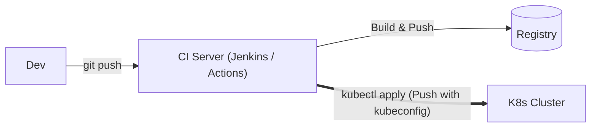
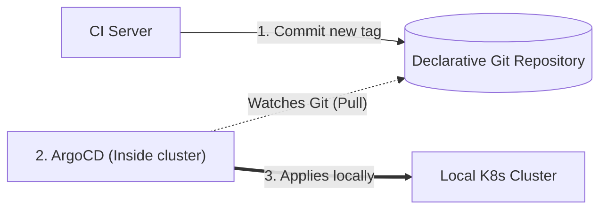
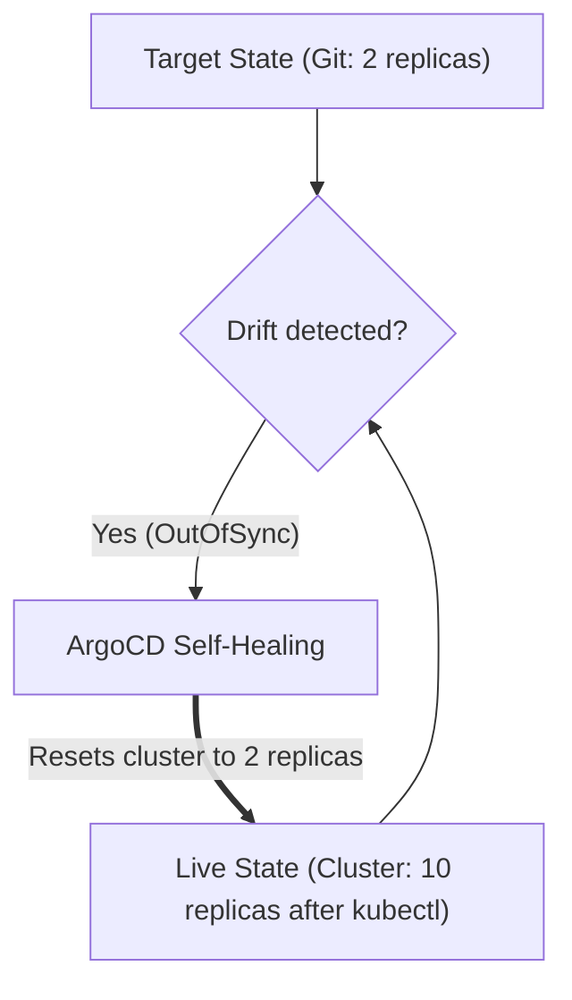

# 01 - GitOps Fundamentals & Principles

In a junior DevOps interview, the number one question on this topic is almost always: *"Can you explain the difference between the Push and Pull (GitOps) models?"* This chapter gives you the exact, simple, and convincing answer.

---

## 1. Push vs Pull Model

### The Traditional Model: "Push"
In a classic CI/CD pipeline:

1. The developer pushes code to Git.
2. The CI server (Jenkins, GitHub Actions, GitLab CI) builds the Docker image.
3. The CI server **connects directly to the Kubernetes cluster** and runs `kubectl apply -f deployment.yaml` or `helm upgrade`.



!!! danger "2 Weaknesses of the Push Model"
    1. **Security:** You must give a `kubeconfig` file (with elevated privileges) to your CI server. If your CI server is compromised, your production cluster is too.
    2. **Undetected drift:** If someone manually modifies a pod with `kubectl edit` on the cluster, the CI server does not know. The cluster and Git are no longer saying the same thing.

---

### The GitOps Model: "Pull"
In the GitOps model:

1. The CI server deploys **nothing at all**. It only builds the Docker image, tests it, and updates the version tag in a Git repository.
2. An agent (**ArgoCD**) runs **inside** the cluster.
3. This agent continuously watches the Git repository. As soon as a new commit appears, it **pulls** the configuration and applies it locally.



!!! success "Why Is the Pull Model Superior in an Interview?"
    - **Zero passwords in CI:** The CI server no longer needs access to the cluster.
    - **Network security:** The cluster opens no inbound ports from the Internet. ArgoCD makes simple outbound requests to GitHub/GitLab.

---

## 2. Configuration Drift & Self-Healing

What happens if a developer or administrator makes a manual change directly on the cluster?

```bash
# Exemple : modification directe sans passer par Git
kubectl scale deployment mon-app --replicas=10 -n prod
```

Without GitOps, this change persists and nobody knows who made it.

With ArgoCD and **Self-Healing** enabled:

1. ArgoCD compares in real time:
   - **Target State (what is in Git):** 2 replicas.
   - **Live State (what is running on the cluster):** 10 replicas.
2. ArgoCD notices the gap (**Configuration Drift**).
3. ArgoCD **immediately overwrites** the manual modification and restores the application to 2 replicas.



---

## 3. Why Separate Application Code and GitOps Configuration?

In enterprise setups, two distinct Git repositories are generally used:

```
DÉPÔT 1 : Code Source Applicatif
├── src/
├── Dockerfile
└── .github/workflows/ci.yml    # Build & test l'application

DÉPÔT 2 : Configuration d'Infrastructure GitOps
├── base/
│   ├── deployment.yaml
│   └── service.yaml
└── overlays/
    ├── dev/
    └── prod/
```

### Why This Separation? (To Explain in an Interview):
1. **Avoid infinite build loops:** If CI modifies the image tag in the same repository as the code, it would trigger a new build, then a new commit, endlessly.
2. **Access control:** All developers can push code to the application repository, but only Tech Leads / DevOps can approve a Pull Request that modifies production in the GitOps repository.
3. **Clean rollback:** Reverting to a previous application version simply requires a `git revert` on the configuration repository, without recompiling all the source code.

---

## 4. Frequent Interview Questions (Entry-Level)

!!! question "Q: Why do we say Git is the 'single source of truth'?"
    Because all desired configuration for production is written in Git. If a resource is not declared in Git, it should not exist on the cluster. If you want to change a production parameter, you must modify Git.

!!! question "Q: What is the difference between Push and Pull mode?"
    In Push mode, the external CI tool pushes manifests to the cluster with a `kubeconfig`. In Pull mode, an agent like ArgoCD resides inside the cluster and pulls the declarative configuration from Git.

!!! question "Q: How do you perform a GitOps rollback when there is a production issue?"
    You do a simple `git revert` of the last commit on the main branch of the GitOps repository. ArgoCD detects the return to the previous version and automatically reapplies the previous stable state within seconds.
