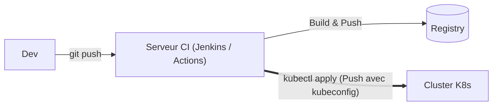
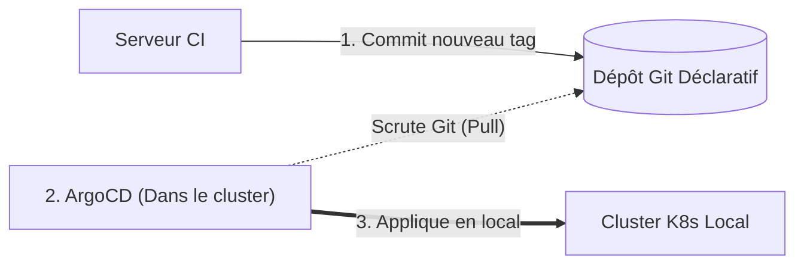
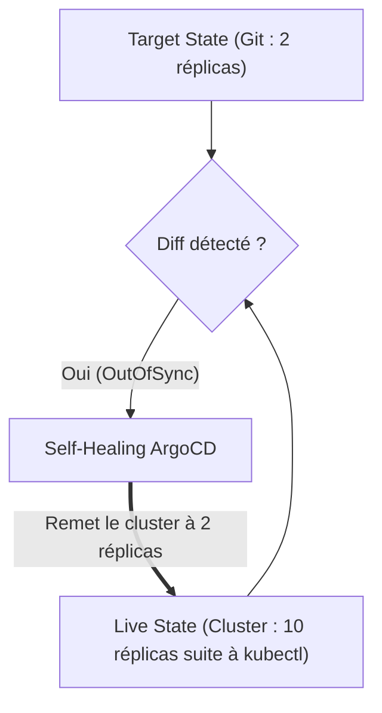

# 01 - Fondamentaux & Principes GitOps

En entretien DevOps junior, la question n°1 sur ce sujet est presque toujours : *"Pouvez-vous m'expliquer la différence entre le modèle Push et le modèle Pull (GitOps) ?"*. Ce chapitre vous donne la réponse exacte, simple et convaincante.

---

## 1. Modèle Push vs Modèle Pull

### Le Modèle Traditionnel : Le "Push"
Dans un pipeline CI/CD classique :

1. Le développeur pousse son code sur Git.
2. Le serveur CI (Jenkins, GitHub Actions, GitLab CI) construit l'image Docker.
3. Le serveur CI **se connecte directement au cluster Kubernetes** et exécute `kubectl apply -f deployment.yaml` ou `helm upgrade`.



!!! danger "Les 2 Faiblesses du Modèle Push"
    1. **Sécurité :** Vous devez donner un fichier `kubeconfig` (avec des droits élevés) à votre serveur CI. Si votre serveur CI est piraté, votre cluster de production l'est aussi.
    2. **Dérive non détectée :** Si quelqu'un modifie manuellement un pod avec `kubectl edit` sur le cluster, le serveur CI ne le sait pas. Le cluster et Git ne disent plus la même chose.

---

### Le Modèle GitOps : Le "Pull"
Dans le modèle GitOps :

1. Le serveur CI ne déploie **rien du tout**. Il se contente de builder l'image Docker, de la tester, et de mettre à jour le tag de version dans un dépôt Git.
2. Un agent (**ArgoCD**) tourne **à l'intérieur** du cluster.
3. Cet agent surveille en continu le dépôt Git. Dès qu'un nouveau commit apparaît, c'est **lui qui tire (pull)** la configuration et l'applique localement.



!!! success "Pourquoi le Modèle Pull est supérieur en entretien ?"
    - **Zéro mot de passe dans le CI :** Le serveur CI n'a plus besoin d'accéder au cluster.
    - **Sécurité réseau :** Le cluster n'ouvre aucun port entrant depuis Internet. ArgoCD fait de simples requêtes sortantes vers GitHub/GitLab.

---

## 2. Dérive de Configuration & Auto-Réparation (Self-Healing)

Que se passe-t-il si un développeur ou un administrateur fait une modification manuelle directement sur le cluster ?

```bash
# Exemple : modification directe sans passer par Git
kubectl scale deployment mon-app --replicas=10 -n prod
```

Sans GitOps, cette modification reste et personne ne sait qui l'a faite.

Avec ArgoCD et le **Self-Healing** activé :

1. ArgoCD compare en temps réel :
   - **Target State (ce qui est dans Git) :** 2 réplicas.
   - **Live State (ce qui tourne sur le cluster) :** 10 réplicas.
2. ArgoCD constate l'écart (**Configuration Drift**).
3. ArgoCD **écrase immédiatement** la modification manuelle et replace l'application à 2 réplicas.



---

## 3. Pourquoi séparer Code Applicatif et Configuration GitOps ?

En entreprise, on utilise généralement deux dépôts Git distincts :

```
DÉPÔT 1 : Code Source Applicatif
├── src/
├── Dockerfile
└── .github/workflows/ci.yml    # Build & test l'application

DÉPÔT 2 : Configuration d'Infrastructure GitOps
├── base/
│   ├── deployment.yaml
│   └── service.yaml
└── overlays/
    ├── dev/
    └── prod/
```

### Pourquoi cette séparation ? (À expliquer en entretien) :
1. **Éviter les boucles de build infinies :** Si le CI modifie le tag de l'image dans le même dépôt que le code, cela déclencherait un nouveau build, puis un nouveau commit, à l'infini.
2. **Gestion des droits :** Tous les développeurs peuvent pousser du code dans le dépôt applicatif, mais seuls les Tech Leads / DevOps peuvent valider une Pull Request qui modifie la production dans le dépôt GitOps.
3. **Rollback propre :** Revenir à l'ancienne version d'une application consiste juste à faire `git revert` sur le dépôt de configuration, sans recompiler tout le code source.

---

## 4. Questions d'Entretien Fréquentes (Niveau Entry-Level)

!!! question "Q: Pourquoi dit-on que Git est 'l'unique source de vérité' ?"
    Parce que toute la configuration souhaitée pour la production est écrite dans Git. Si une ressource n'est pas déclarée dans Git, elle ne doit pas exister sur le cluster. Si on veut changer un paramètre en production, on modifie obligatoirement Git.

!!! question "Q: Quelle est la différence entre le mode Push et le mode Pull ?"
    En mode Push, c'est l'outil de CI externe qui pousse les manifestes vers le cluster avec un `kubeconfig`. En mode Pull, c'est un agent comme ArgoCD qui réside à l'intérieur du cluster et qui tire la configuration déclarative depuis Git.

!!! question "Q: Comment fait-on un rollback avec GitOps en cas de problème en production ?"
    On fait un simple `git revert` du dernier commit sur la branche principale du dépôt GitOps. ArgoCD détecte le retour à l'ancienne version et réapplique automatiquement l'état stable précédent en quelques secondes.
