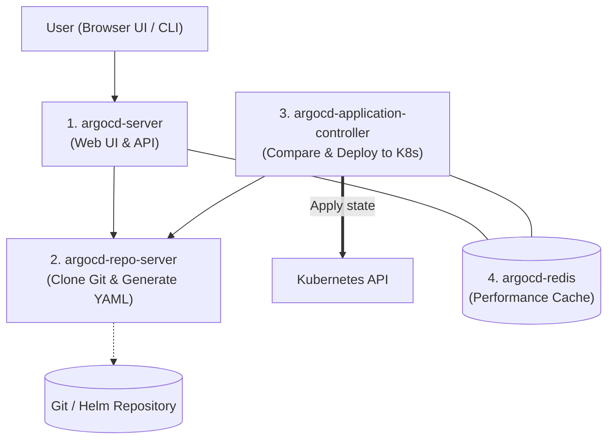
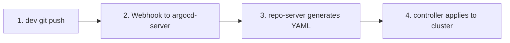

# 02 - ArgoCD Internal Architecture

In a junior interview, you will not be asked to design ArgoCD's internal codebase, but you must know **who does what** among the pods installed in the `argocd` namespace.

---

## 1. The 4 Key ArgoCD Components

ArgoCD is deployed as several Kubernetes pods in the `argocd` namespace. Here are the four main ones to remember:

### 1. `argocd-server` (Interface and API)
- It is the web server that hosts ArgoCD's beautiful **graphical interface (UI)** and the gRPC API consumed by the `argocd` CLI.
- It handles user authentication (login, password, SSO).

### 2. `argocd-repo-server` (Manifest Compiler)
- It clones the Git repository locally.
- If you use plain YAML, **Helm**, or **Kustomize**, it runs the rendering command (e.g., `helm template` or `kustomize build`) to produce the final Kubernetes YAML.
- It does **not** communicate with the cluster; it only deals with files.

### 3. `argocd-application-controller` (The Brain)
- This is the most important component: the Kubernetes operator.
- It continuously compares:
  - What the `repo-server` read from Git (**Target State**).
  - What is currently running on the cluster (**Live State**).
- If there is a difference, it sends update requests to the Kubernetes API Server.

### 4. `argocd-redis` (Cache Memory)
- It simply serves as fast memory to avoid cloning Git or flooding the Kubernetes API with requests every second.

---

## 2. How Does a Deployment Happen? (Simple Flow)

To explain the lifecycle to a recruiter:

1. **Commit:** The developer or CI updates the image version in Git.
2. **Detection:**
   - By default, ArgoCD checks Git every **3 minutes** (polling).
   - In production, a **GitHub/GitLab Webhook** is configured so ArgoCD is notified in less than a second.
3. **Generation:** The `repo-server` compiles the manifests.
4. **Application:** The `controller` applies changes to Kubernetes and the application turns green (`Synced & Healthy`).

---

## 3. Frequent Interview Questions (Entry-Level)

!!! question "Q: Which ArgoCD component is responsible for applying changes to Kubernetes?"
    It is the **`argocd-application-controller`**. It watches cluster resources and performs synchronizations so the cluster matches Git.

!!! question "Q: What is `argocd-repo-server` used for?"
    It is responsible for fetching code from Git repositories or Helm registries, and compiling templates (via Helm or Kustomize) to generate the final YAML files consumable by Kubernetes.

!!! question "Q: Why use a Webhook instead of letting ArgoCD poll Git periodically?"
    By default, ArgoCD checks Git every 3 minutes. Configuring a Webhook on GitHub or GitLab lets ArgoCD be notified instantly on a `git push`, reducing deployment time to seconds while avoiding Git API quota overload.
