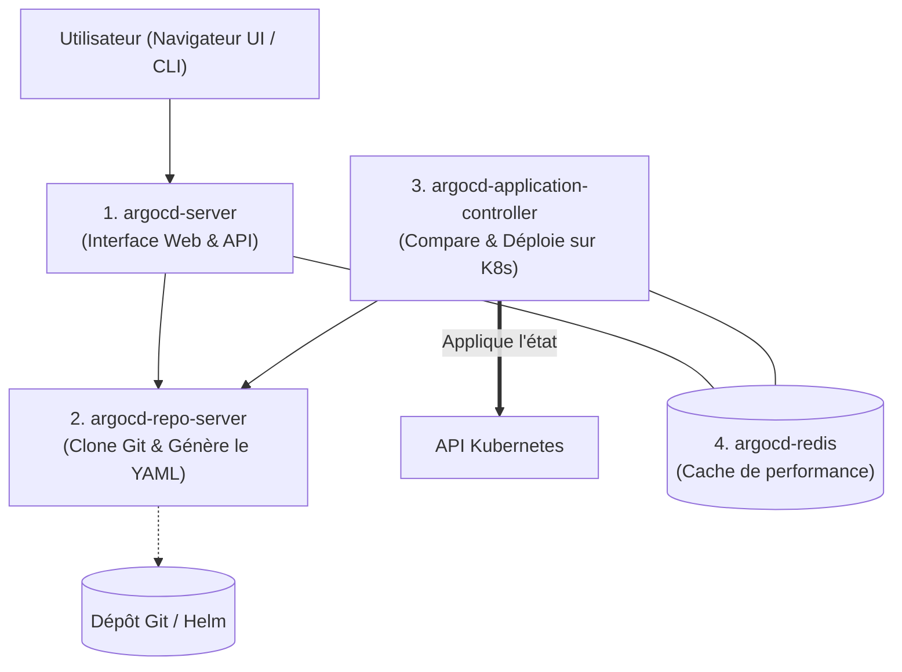
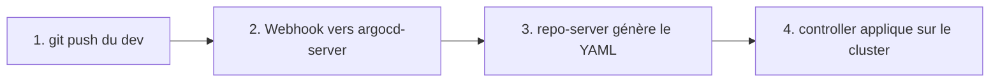

# 02 - Architecture Interne d'ArgoCD

En entretien junior, on ne vous demandera pas de concevoir le code interne d'ArgoCD, mais vous devez savoir **qui fait quoi** parmi les pods installés dans le namespace `argocd`.

---

## 1. Les 4 Composants Clés d'ArgoCD

ArgoCD est déployé sous forme de plusieurs pods Kubernetes dans le namespace `argocd`. Voici les quatre principaux à retenir :

### 1. `argocd-server` (L'Interface et l'API)
- C'est le serveur web qui héberge la belle **interface graphique (UI)** d'ArgoCD et l'API gRPC consommée par la commande `argocd` en terminal.
- Il gère l'authentification des utilisateurs (login, mot de passe, SSO).

### 2. `argocd-repo-server` (Le compilateur de manifestes)
- Il clone le dépôt Git en local.
- Si vous utilisez du YAML pur, **Helm**, ou **Kustomize**, c'est lui qui exécute la commande de rendu (ex: `helm template` ou `kustomize build`) pour produire le YAML final Kubernetes.
- Il ne communique **pas** avec le cluster, il s'occupe uniquement des fichiers.

### 3. `argocd-application-controller` (Le Cerveau)
- C'est le composant le plus important : l'opérateur Kubernetes.
- Il compare en continu :
  - Ce que le `repo-server` a lu dans Git (**Target State**).
  - Ce qui tourne actuellement sur le cluster (**Live State**).
- S'il y a une différence, c'est lui qui envoie les requêtes de mise à jour à l'API Server de Kubernetes.

### 4. `argocd-redis` (La mémoire cache)
- Il sert simplement de mémoire rapide pour éviter d'aller cloner Git ou d'inonder l'API Kubernetes de requêtes à chaque seconde.

---

## 2. Comment se passe un déploiement ? (Le flux simple)

Pour expliquer le cycle de vie à un recruteur :

1. **Commit :** Le développeur ou la CI met à jour la version de l'image dans Git.
2. **Détection :** 
   - Par défaut, ArgoCD vérifie Git toutes les **3 minutes** (polling).
   - En production, on configure un **Webhook GitHub/GitLab** pour qu'ArgoCD soit prévenu en moins d'une seconde.
3. **Génération :** Le `repo-server` compile les manifestes.
4. **Application :** Le `controller` applique les changements sur Kubernetes et l'application devient verte (`Synced & Healthy`).

---

## 3. Questions d'Entretien Fréquentes (Niveau Entry-Level)

!!! question "Q: Quel composant d'ArgoCD est responsable d'appliquer les changements sur Kubernetes ?"
    C'est le **`argocd-application-controller`**. C'est lui qui surveille les ressources du cluster et exécute les synchronisations pour que le cluster corresponde à Git.

!!! question "Q: À quoi sert le `argocd-repo-server` ?"
    Il est responsable de récupérer le code depuis les dépôts Git ou les registres Helm, et de compiler les templates (via Helm ou Kustomize) pour générer les fichiers YAML finaux compréhensibles par Kubernetes.

!!! question "Q: Pourquoi utilise-t-on un Webhook plutôt que de laisser ArgoCD vérifier Git périodiquement ?"
    Par défaut, ArgoCD vérifie Git toutes les 3 minutes. Configurer un Webhook sur GitHub ou GitLab permet à ArgoCD d'être notifié instantanément lors d'un `git push`, réduisant le temps de déploiement à quelques secondes tout en évitant de surcharger les quotas d'API Git.
