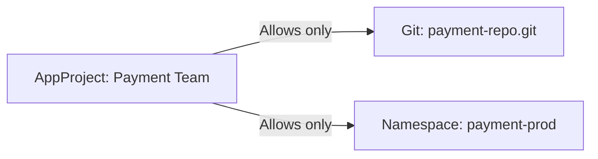
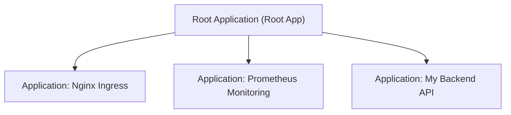

# 03 - Key Objects: Application & AppProject

In ArgoCD, you do not create deployments manually in the graphical interface: you describe them in Kubernetes YAML files using Custom Resources (CRDs). The fundamental resource you must be able to read and write with your eyes closed is **`Application`**.

---

## 1. The Essential `Application` Manifest

An `Application` bridges a **source** (a folder in Git) and a **destination** (a namespace on a Kubernetes cluster).

```yaml
apiVersion: argoproj.io/v1alpha1
kind: Application
metadata:
  name: mon-api-backend
  namespace: argocd
spec:
  # 1. Le projet auquel appartient l'application (default si non précisé)
  project: default

  # 2. La Source (Où se trouvent les fichiers dans Git)
  source:
    repoURL: 'https://github.com/mon-organisation/mon-repo-gitops.git'
    targetRevision: main      # Branche, tag ou commit
    path: overlays/production # Dossier contenant les YAML ou Kustomize

  # 3. La Destination (Où déployer dans Kubernetes)
  destination:
    server: 'https://kubernetes.default.svc' # Le cluster local
    namespace: production                    # Le namespace cible

  # 4. Politique de Synchronisation Automatique
  syncPolicy:
    automated:
      prune: true    # Supprime du cluster les objets retirés de Git
      selfHeal: true # Annule les modifications manuelles faites avec kubectl
    syncOptions:
      - CreateNamespace=true # Crée le namespace cible s'il n'existe pas déjà
```

### The 2 Critical Options to Know:
1. **`prune: true`:** If you delete `redis.yaml` from Git, ArgoCD deletes the Redis pod from the cluster. Without this option, resources removed from Git remain orphaned on the cluster!
2. **`selfHeal: true`:** If an administrator modifies a deployment with `kubectl edit`, ArgoCD immediately restores the version described in Git.

---

## 2. Special Case: HPA (`ignoreDifferences`)

A very frequent junior interview question:
> *"I configured an HPA (Horizontal Pod Autoscaler) that scales my pods from 2 to 8 during the day. Will ArgoCD constantly force them back to 2 pods?"*

**Answer:** Yes by default, because Git says `replicas: 2` while the cluster has 8.

**Solution:** Tell ArgoCD to ignore the `replicas` field in the diff:

```yaml
spec:
  ignoreDifferences:
    - group: apps
      kind: Deployment
      jsonPointers:
        - /spec/replicas # Laisse le HPA gérer le nombre de pods sans lever d'alerte
```

---

## 3. What Is an `AppProject`? (Governance)

By default, all applications are attached to the `default` project. In a company with multiple teams, you create **`AppProject`** resources to restrict access:



An `AppProject` lets you define:
- Which Git repositories the team is allowed to use (`sourceRepos`).
- In which clusters and namespaces the team is allowed to deploy (`destinations`).
- Prevent a team from deploying sensitive resources (such as `ClusterRole` that grants full privileges).

---

## 4. The "App of Apps" Pattern

How to deploy 10 applications without running `kubectl apply` 10 times manually?

The **App of Apps** pattern consists of creating a **Root Application** in ArgoCD that itself contains only a list of other `Application` manifests.



By deploying the root application, ArgoCD automatically deploys all sub-applications.

---

## 5. Frequent Interview Questions (Entry-Level)

!!! question "Q: What is the `prune: true` field used for in an ArgoCD Application?"
    It enables automatic deletion of resources on the Kubernetes cluster that have been removed from the Git repository. If you do not enable it, deleting a YAML file in Git will not delete the pod on the cluster.

!!! question "Q: What is Self-Healing?"
    It is ArgoCD's ability to detect configuration drift if someone manually modifies a resource directly on the cluster via `kubectl`, and to immediately force restoration of the state described in Git.

!!! question "Q: What is the App of Apps pattern?"
    It is an architectural method where a parent ArgoCD `Application` watches a folder containing YAML manifests of other `Application` resources. This makes it possible to deploy and synchronize an entire software suite or an entire cluster with a single command.
