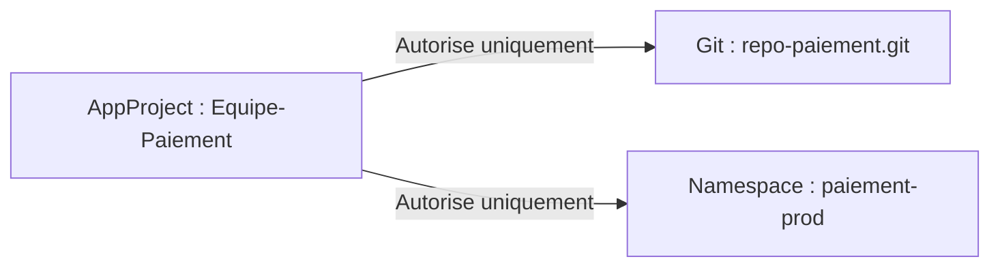
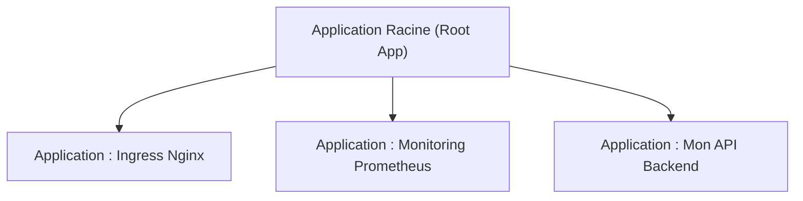

# 03 - Les Objets Clés : Application & AppProject

Dans ArgoCD, on ne crée pas les déploiements à la main dans l'interface graphique : on les décrit dans des fichiers YAML Kubernetes grâce à des ressources personnalisées (CRD). La ressource fondamentale que vous devez savoir lire et écrire les yeux fermés est **`Application`**.

---

## 1. Le Manifeste `Application` Essentiel

Une `Application` fait le pont entre une **source** (un dossier dans Git) et une **destination** (un namespace sur un cluster Kubernetes).

```yaml
apiVersion: argoproj.io/v1alpha1
kind: Application
metadata:
  name: mon-api-backend
  namespace: argocd
spec:
  # 1. Le projet auquel appartient l'application (default si non précisé)
  project: default

  # 2. La Source (Où se trouvent les fichiers dans Git)
  source:
    repoURL: 'https://github.com/mon-organisation/mon-repo-gitops.git'
    targetRevision: main      # Branche, tag ou commit
    path: overlays/production # Dossier contenant les YAML ou Kustomize

  # 3. La Destination (Où déployer dans Kubernetes)
  destination:
    server: 'https://kubernetes.default.svc' # Le cluster local
    namespace: production                    # Le namespace cible

  # 4. Politique de Synchronisation Automatique
  syncPolicy:
    automated:
      prune: true    # Supprime du cluster les objets retirés de Git
      selfHeal: true # Annule les modifications manuelles faites avec kubectl
    syncOptions:
      - CreateNamespace=true # Crée le namespace cible s'il n'existe pas déjà
```

### Les 2 options capitales à connaître :
1. **`prune: true` :** Si vous supprimez `redis.yaml` de Git, ArgoCD supprime le pod Redis du cluster. Sans cette option, les ressources supprimées de Git restent orphelines sur le cluster !
2. **`selfHeal: true` :** Si un administrateur modifie un déploiement avec `kubectl edit`, ArgoCD rétablit immédiatement la version décrite dans Git.

---

## 2. Le Cas Particulier du HPA (`ignoreDifferences`)

Une question d'entretien très fréquente pour les juniors :
> *"J'ai configuré un HPA (Horizontal Pod Autoscaler) qui augmente mes pods de 2 à 8 en journée. ArgoCD va-t-il constamment forcer le retour à 2 pods ?"*

**Réponse :** Oui par défaut, car Git indique `replicas: 2` alors que le cluster en a 8.

**Solution :** On indique à ArgoCD d'ignorer le champ `replicas` dans le diff :

```yaml
spec:
  ignoreDifferences:
    - group: apps
      kind: Deployment
      jsonPointers:
        - /spec/replicas # Laisse le HPA gérer le nombre de pods sans lever d'alerte
```

---

## 3. Qu'est-ce qu'un `AppProject` ? (Gouvernance)

Par défaut, toutes les applications sont rattachées au projet `default`. En entreprise avec plusieurs équipes, on crée des **`AppProject`** pour limiter les accès :



Un `AppProject` permet de définir :
- Quels dépôts Git l'équipe a le droit d'utiliser (`sourceRepos`).
- Dans quels clusters et namespaces l'équipe a le droit de déployer (`destinations`).
- Empêcher une équipe de déployer des ressources sensibles (comme des `ClusterRole` qui donnent les pleins pouvoirs).

---

## 4. Le Pattern "App of Apps"

Comment déployer 10 applications sans exécuter 10 fois `kubectl apply` manuellement ?

Le pattern **App of Apps** consiste à créer une **Application Racine (Root Application)** dans ArgoCD qui ne contient elle-même qu'une liste d'autres manifestes `Application`.



En déployant l'application racine, ArgoCD déploie automatiquement toutes les sous-applications.

---

## 5. Questions d'Entretien Fréquentes (Niveau Entry-Level)

!!! question "Q: À quoi sert le champ `prune: true` dans une Application ArgoCD ?"
    Il permet la suppression automatique des ressources sur le cluster Kubernetes qui ont été supprimées du dépôt Git. Si on ne l'active pas, supprimer un fichier YAML dans Git ne supprimera pas le pod sur le cluster.

!!! question "Q: Qu'est-ce que le Self-Healing ?"
    C'est la capacité d'ArgoCD à détecter une dérive de configuration (*drift*) si quelqu'un modifie manuellement une ressource directement sur le cluster via `kubectl`, et à forcer immédiatement le rétablissement de l'état décrit dans Git.

!!! question "Q: Qu'est-ce que le pattern App of Apps ?"
    C'est une méthode d'architecture où une `Application` ArgoCD parente surveille un dossier contenant les manifestes YAML d'autres ressources `Application`. Cela permet de déployer et synchroniser toute une suite logicielle ou tout un cluster en une seule commande.
