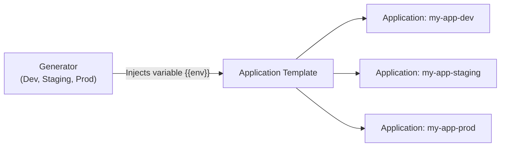
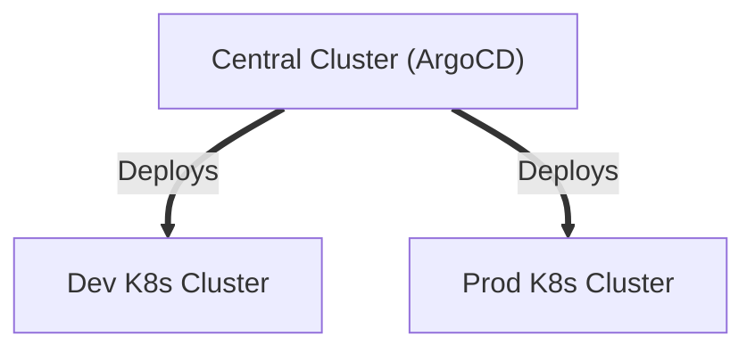

# 04 - ApplicationSet Discovery & Multi-Cluster

When your company manages several environments (Dev, Staging, Prod) or several Kubernetes clusters, copy-pasting the same `Application.yaml` file 30 times becomes error-prone. This is why **`ApplicationSet`** was created — to automate it.

---

## 1. Why Use `ApplicationSet`?

An `ApplicationSet` is an **Application generator**. Instead of manually writing one `Application` for Dev, one for Staging, and one for Prod, you define:
1. **A generator:** A list of parameters (e.g., the list of environments).
2. **A template:** The application model that uses these parameters.



---

## 2. Simple Example: The `List Generator`

Here is the most common use case: deploying the same application across multiple environments with different overlay configurations:

```yaml
apiVersion: argoproj.io/v1alpha1
kind: ApplicationSet
metadata:
  name: mon-api-fleet
  namespace: argocd
spec:
  # 1. Le générateur fournit les variables
  generators:
    - list:
        elements:
          - env: dev
            namespace: development
          - env: staging
            namespace: staging
          - env: prod
            namespace: production

  # 2. Le template consomme les variables avec {{nom_variable}}
  template:
    metadata:
      name: 'mon-api-{{env}}'
    spec:
      project: default
      source:
        repoURL: 'https://github.com/mon-organisation/mon-repo-gitops.git'
        targetRevision: main
        path: 'overlays/{{env}}'
      destination:
        server: 'https://kubernetes.default.svc'
        namespace: '{{namespace}}'
      syncPolicy:
        automated:
          prune: true
          selfHeal: true
```

With this single file, ArgoCD automatically creates 3 applications (`mon-api-dev`, `mon-api-staging`, `mon-api-prod`). If tomorrow you add a `qa` environment, just add one line to the list!

---

## 3. The `Git Generator` (Automatic Discovery)

You have 20 microservices in a `services/` folder? The `Git Generator` watches your Git repository: each time a developer creates a new subfolder, ArgoCD automatically generates the corresponding application with no manual intervention.

```yaml
spec:
  generators:
    - git:
        repoURL: 'https://github.com/mon-organisation/apps.git'
        revision: main
        directories:
          - path: 'services/*' # Découvre services/auth, services/panier, etc.
```

---

## 4. Managing Multiple Clusters (Multi-Cluster)

A major strength of ArgoCD is that it is not limited to the cluster on which it is installed. A single ArgoCD instance can drive dozens of remote Kubernetes clusters (the **Hub & Spoke** architecture).



### How Does ArgoCD Connect to a Remote Cluster?
1. Add the remote cluster to ArgoCD via the command line:
   ```bash
   argocd cluster add <nom-du-contexte-kubeconfig>
   ```
2. ArgoCD creates a `Secret` in the `argocd` namespace containing the remote cluster's API Server address and an authentication token (`ServiceAccount`).
3. In your `Application` manifest, simply specify that cluster's URL in `spec.destination.server`.

---

## 5. Frequent Interview Questions (Entry-Level)

!!! question "Q: What is the difference between an `Application` and an `ApplicationSet` in ArgoCD?"
    An `Application` represents a single deployment between a Git folder and a Kubernetes namespace. An `ApplicationSet` is a controller that automatically generates multiple `Application` resources from a template and a parameter generator (e.g., list of environments or Git folders).

!!! question "Q: Why use ApplicationSet instead of duplicating Application files?"
    To follow the DRY principle (*Don't Repeat Yourself*), avoid copy-paste errors, and automate deployment across multiple environments (dev, staging, prod) or multiple clusters from a single centralized file.

!!! question "Q: Can ArgoCD deploy to clusters where it is not installed?"
    Yes. ArgoCD natively supports multi-cluster. A central ArgoCD instance can connect to external clusters via their API Servers using credentials stored securely as Kubernetes Secrets.
