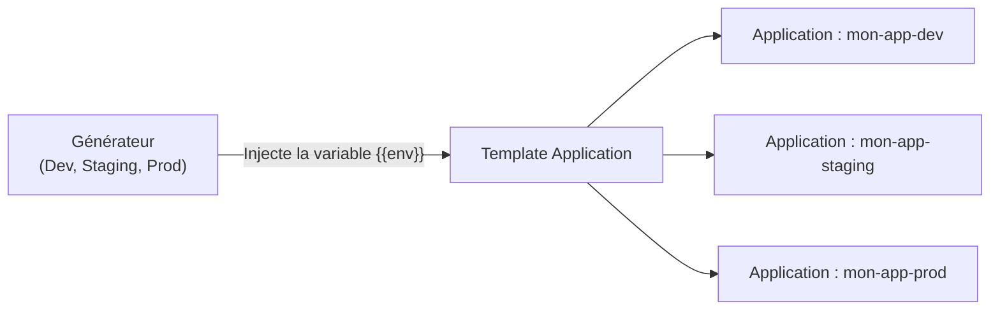
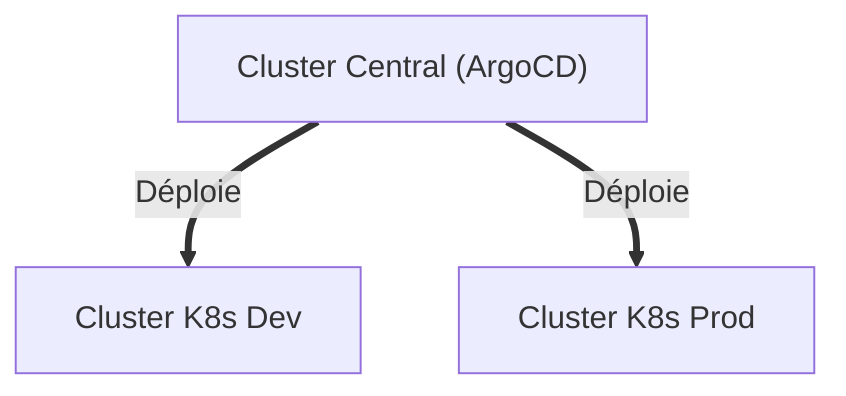

# 04 - Découverte d'ApplicationSet & Multi-Cluster

Lorsque votre entreprise gère plusieurs environnements (Dev, Staging, Prod) ou plusieurs clusters Kubernetes, copier-coller 30 fois le même fichier `Application.yaml` devient source d'erreurs. C'est pour automatiser cela qu'**`ApplicationSet`** a été créé.

---

## 1. Pourquoi utiliser `ApplicationSet` ?

Un `ApplicationSet` est un **générateur d'Applications**. Au lieu d'écrire manuellement une `Application` pour le Dev, une pour le Staging et une pour la Prod, vous définissez :
1. **Un générateur :** Une liste de paramètres (ex: la liste des environnements).
2. **Un template :** Le modèle d'application qui utilise ces paramètres.



---

## 2. Exemple Simple : Le `List Generator`

Voici le cas d'usage le plus fréquent : déployer la même application sur plusieurs environnements avec des configurations d'overlays différentes :

```yaml
apiVersion: argoproj.io/v1alpha1
kind: ApplicationSet
metadata:
  name: mon-api-fleet
  namespace: argocd
spec:
  # 1. Le générateur fournit les variables
  generators:
    - list:
        elements:
          - env: dev
            namespace: development
          - env: staging
            namespace: staging
          - env: prod
            namespace: production

  # 2. Le template consomme les variables avec {{nom_variable}}
  template:
    metadata:
      name: 'mon-api-{{env}}'
    spec:
      project: default
      source:
        repoURL: 'https://github.com/mon-organisation/mon-repo-gitops.git'
        targetRevision: main
        path: 'overlays/{{env}}'
      destination:
        server: 'https://kubernetes.default.svc'
        namespace: '{{namespace}}'
      syncPolicy:
        automated:
          prune: true
          selfHeal: true
```

Avec ce seul fichier, ArgoCD crée automatiquement 3 applications (`mon-api-dev`, `mon-api-staging`, `mon-api-prod`). Si demain vous ajoutez un environnement `qa`, il suffit d'ajouter une ligne dans la liste !

---

## 3. Le `Git Generator` (Découverte Automatique)

Vous avez 20 microservices dans un dossier `services/` ? Le `Git Generator` regarde votre dépôt Git : chaque fois qu'un développeur crée un nouveau sous-dossier, ArgoCD génère l'application correspondante automatiquement, sans aucune intervention manuelle.

```yaml
spec:
  generators:
    - git:
        repoURL: 'https://github.com/mon-organisation/apps.git'
        revision: main
        directories:
          - path: 'services/*' # Découvre services/auth, services/panier, etc.
```

---

## 4. Gérer Plusieurs Clusters (Multi-Cluster)

Une grande force d'ArgoCD est qu'il n'est pas limité au cluster sur lequel il est installé. Une seule instance d'ArgoCD peut piloter des dizaines de clusters Kubernetes distants (architecture **Hub & Spoke**).



### Comment ArgoCD se connecte-t-il à un cluster distant ?
1. On ajoute le cluster distant dans ArgoCD via la ligne de commande :
   ```bash
   argocd cluster add <nom-du-contexte-kubeconfig>
   ```
2. ArgoCD crée un `Secret` dans le namespace `argocd` contenant l'adresse IP de l'API Server du cluster distant et un jeton d'authentification (`ServiceAccount`).
3. Dans votre manifeste `Application`, il suffit de renseigner l'URL de ce cluster dans `spec.destination.server`.

---

## 5. Questions d'Entretien Fréquentes (Niveau Entry-Level)

!!! question "Q: Quelle est la différence entre une `Application` et un `ApplicationSet` dans ArgoCD ?"
    Une `Application` représente un déploiement unique entre un dossier Git et un namespace Kubernetes. Un `ApplicationSet` est un contrôleur qui génère automatiquement plusieurs ressources `Application` à partir d'un modèle (template) et d'un générateur de paramètres (ex: liste d'environnements ou dossiers Git).

!!! question "Q: Pourquoi utilise-t-on ApplicationSet plutôt que de dupliquer les fichiers Application ?"
    Pour respecter le principe DRY (*Don't Repeat Yourself*), éviter les erreurs de copier-coller et automatiser le déploiement sur plusieurs environnements (dev, staging, prod) ou plusieurs clusters à partir d'un seul fichier centralisé.

!!! question "Q: ArgoCD peut-il déployer sur des clusters où il n'est pas installé ?"
    Oui. ArgoCD supporte nativement le multi-cluster. Une instance centrale d'ArgoCD peut se connecter à des clusters externes via leurs API Servers en utilisant des identifiants stockés de manière sécurisée sous forme de Secrets Kubernetes.
