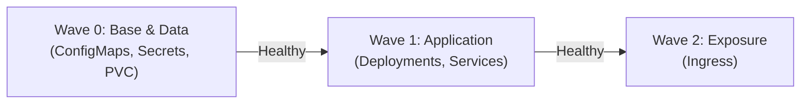

# 05 - Sync Waves & Resource Hooks

In a real application, you cannot deploy everything all at once. For example:
- You must run a **database migration** script *before* the new API pods start (otherwise the API will crash because the new SQL columns do not yet exist).
- You want to create **Secrets and ConfigMaps** *before* the Deployments that consume them.

ArgoCD provides two simple features to manage this ordering: **Sync Waves** and **Resource Hooks**.

---

## 1. Sync Waves

A **Sync Wave** is simply an annotation with an order number (e.g., 0, 1, 2...) placed on your YAML files.

> **Golden rule:** ArgoCD deploys wave **1** only when all resources in wave **0** have been created AND have become **green (`Healthy`)**.



### Example Setup:

On your `ConfigMap` (Wave 0):
```yaml
apiVersion: v1
kind: ConfigMap
metadata:
  name: app-config
  annotations:
    argocd.argoproj.io/sync-wave: "0" # Déployé en premier
```

On your `Deployment` (Wave 1):
```yaml
apiVersion: apps/v1
kind: Deployment
metadata:
  name: mon-api
  annotations:
    argocd.argoproj.io/sync-wave: "1" # Déployé après la vague 0
```

On your `Ingress` (Wave 2):
```yaml
apiVersion: networking.k8s.io/v1
kind: Ingress
metadata:
  name: app-ingress
  annotations:
    argocd.argoproj.io/sync-wave: "2" # Activé seulement une fois les pods prêts
```

!!! tip "Why Put the Ingress in the Last Wave?"
    To prevent the Load Balancer from sending user traffic to pods that are not yet ready (avoids HTTP 502/503 errors).

---

## 2. Resource Hooks (The Migration Job Case)

A **Hook** is a one-off task (usually a Kubernetes `Job`) that runs at a specific moment in the deployment:
- **`PreSync`:** Before applying the application manifests.
- **`PostSync`:** After all pods are ready (e.g., run smoke tests or send a Slack alert).
- **`SyncFail`:** Triggered if the deployment fails.

### Concrete Example: Database Migration (`PreSync`)

```yaml
apiVersion: batch/v1
kind: Job
metadata:
  name: db-migration
  annotations:
    # 1. Dit à ArgoCD d'exécuter ce Job AVANT le déploiement des pods
    argocd.argoproj.io/hook: PreSync
    # 2. Supprime l'ancien Job avant d'en créer un nouveau
    argocd.argoproj.io/hook-delete-policy: BeforeHookCreation,HookSucceeded
spec:
  template:
    spec:
      restartPolicy: Never
      containers:
        - name: migrator
          image: mon-registry/db-migrator:v1.2
          command: ["./migrate-database.sh"]
```

### What Happens If the Migration Fails?
If the migration script returns an error (exit code 1), **ArgoCD immediately stops the deployment**. The new application pods are **never deployed**, and your production stays on the last healthy version!

---

## 3. Frequent Interview Questions (Entry-Level)

!!! question "Q: How do you ensure a database migration completes before updating pods with ArgoCD?"
    You use a Kubernetes `Job` annotated with `argocd.argoproj.io/hook: PreSync`. ArgoCD runs the Job first and waits for it to complete successfully before starting the deployment of the new application pods.

!!! question "Q: How do Sync Waves work in ArgoCD?"
    Sync Waves let you order deployments using a numeric annotation (`argocd.argoproj.io/sync-wave`). ArgoCD applies resources wave by wave in ascending order, and only proceeds to the next wave when the current wave is fully healthy (`Healthy`).

!!! question "Q: If a `PreSync` hook fails, what does ArgoCD do?"
    ArgoCD interrupts the deployment. It does not proceed to the application synchronization phase and marks the deployment as failed. This protects production from deploying an unstable version.
