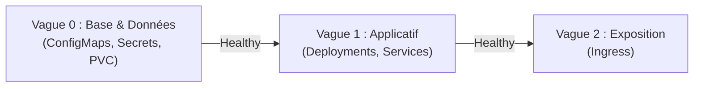

# 05 - Sync Waves & Resource Hooks

Dans une application réelle, on ne peut pas tout déployer en vrac en même temps. Par exemple :
- Vous devez exécuter un script de **migration de base de données** *avant* que les nouveaux pods de l'API ne démarrent (sinon l'API va crasher car les nouvelles colonnes SQL n'existent pas encore).
- Vous voulez créer les **Secrets et ConfigMaps** *avant* les Deployments qui les consomment.

ArgoCD fournit deux fonctionnalités simples pour gérer cet ordre : les **Sync Waves** et les **Resource Hooks**.

---

## 1. Les Sync Waves (Vagues de Synchronisation)

Une **Sync Wave** est simplement une annotation avec un numéro d'ordre (ex: 0, 1, 2...) placée sur vos fichiers YAML.

> **Règle d'or :** ArgoCD déploie la vague **1** uniquement quand toutes les ressources de la vague **0** sont créées ET sont devenues **vertes (`Healthy`)**.



### Exemple de mise en place :

Sur votre `ConfigMap` (Vague 0) :
```yaml
apiVersion: v1
kind: ConfigMap
metadata:
  name: app-config
  annotations:
    argocd.argoproj.io/sync-wave: "0" # Déployé en premier
```

Sur votre `Deployment` (Vague 1) :
```yaml
apiVersion: apps/v1
kind: Deployment
metadata:
  name: mon-api
  annotations:
    argocd.argoproj.io/sync-wave: "1" # Déployé après la vague 0
```

Sur votre `Ingress` (Vague 2) :
```yaml
apiVersion: networking.k8s.io/v1
kind: Ingress
metadata:
  name: app-ingress
  annotations:
    argocd.argoproj.io/sync-wave: "2" # Activé seulement une fois les pods prêts
```

!!! tip "Pourquoi mettre l'Ingress en dernière vague ?"
    Pour éviter que le Load Balancer n'envoie du trafic utilisateur vers des pods qui ne sont pas encore prêts (évite les erreurs HTTP 502/503).

---

## 2. Les Resource Hooks (Le cas du Job de Migration)

Un **Hook** est une tâche ponctuelle (généralement un `Job` Kubernetes) qui s'exécute à un moment précis du déploiement :
- **`PreSync` :** Avant d'appliquer les manifestes applicatifs.
- **`PostSync` :** Après que tous les pods sont prêts (ex: lancer des smoke tests ou envoyer une alerte Slack).
- **`SyncFail` :** Déclenché si le déploiement échoue.

### Exemple concret : Migration de base de données (`PreSync`)

```yaml
apiVersion: batch/v1
kind: Job
metadata:
  name: db-migration
  annotations:
    # 1. Dit à ArgoCD d'exécuter ce Job AVANT le déploiement des pods
    argocd.argoproj.io/hook: PreSync
    # 2. Supprime l'ancien Job avant d'en créer un nouveau
    argocd.argoproj.io/hook-delete-policy: BeforeHookCreation,HookSucceeded
spec:
  template:
    spec:
      restartPolicy: Never
      containers:
        - name: migrator
          image: mon-registry/db-migrator:v1.2
          command: ["./migrate-database.sh"]
```

### Que se passe-t-il si la migration échoue ?
Si le script de migration renvoie une erreur (code de sortie 1), **ArgoCD stoppe immédiatement le déploiement**. Les nouveaux pods applicatifs ne sont **jamais déployés**, et votre production reste sur l'ancienne version saine !

---

## 3. Questions d'Entretien Fréquentes (Niveau Entry-Level)

!!! question "Q: Comment s'assurer qu'une migration de base de données est terminée avant de mettre à jour les pods avec ArgoCD ?"
    On utilise un `Job` Kubernetes annoté avec `argocd.argoproj.io/hook: PreSync`. ArgoCD exécute le Job en premier et attend qu'il se termine avec succès avant de démarrer le déploiement des nouveaux pods applicatifs.

!!! question "Q: Comment fonctionnent les Sync Waves dans ArgoCD ?"
    Les Sync Waves permettent d'ordonner le déploiement grâce à une annotation numérique (`argocd.argoproj.io/sync-wave`). ArgoCD applique les ressources vague par vague par ordre croissant, et n'attaque la vague suivante que lorsque la vague en cours est totalement saine (`Healthy`).

!!! question "Q: Si un hook `PreSync` échoue, que fait ArgoCD ?"
    ArgoCD interrompt le déploiement. Il ne passe pas à la phase de synchronisation des applications et marque le déploiement en échec. Cela protège la production contre le déploiement d'une version instable.
