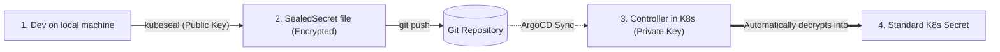
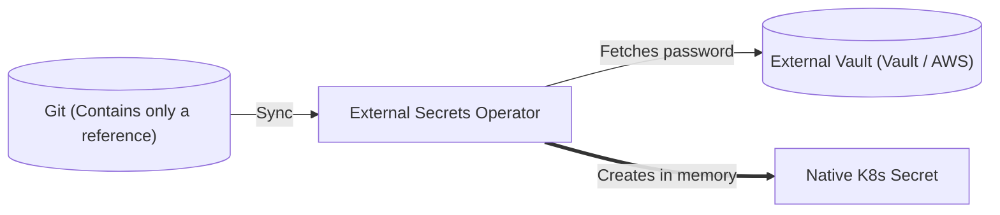

# 06 - Secret Management in GitOps

This is one of the most asked interview questions for DevOps:
> *"If everything must be in Git with GitOps, how do you handle passwords and API keys without exposing them publicly?"*

Critical reminder: a standard Kubernetes `Secret` uses **Base64** encoding. **Base64 is not encryption**, it is just a reversible display format that can be decoded in a fraction of a second with `base64 -d`. You **NEVER** commit a plain Secret to Git!

To solve this problem, two main approaches dominate the market.

---

## 1. Solution 1: Bitnami Sealed Secrets (Encryption in Git)

This is the simplest solution to understand for a beginner. It relies on **asymmetric encryption** (public key / private key):



### How It Works in 3 Steps:
1. On your machine, you create a standard Secret and encrypt it with the `kubeseal` command (using the cluster's **public key**):
   ```bash
   kubectl create secret generic db-pass --from-literal=password=MonMotDePasse123 --dry-run=client -o yaml \
     | kubeseal --format yaml > sealed-secret.yaml
   ```
2. The generated file is a **`SealedSecret`**: the password is unreadable (e.g., `AgBy8472x...`). You can push it to Git safely.
3. ArgoCD applies the `SealedSecret` to the cluster. The Sealed Secrets controller (which holds the **private key**) automatically decrypts it to create the real Kubernetes `Secret` in memory.

---

## 2. Solution 2: External Secrets Operator (ESO - The Enterprise Standard)

In large companies (banks, cloud providers like OCI, AWS, GCP), the preference is to store **no encrypted secret in Git**. All passwords are centralized in a secure vault (**AWS Secrets Manager**, **HashiCorp Vault**, **OCI Vault**).

The **External Secrets Operator (ESO)** is then installed in Kubernetes:



### What Is Stored in Git (`ExternalSecret`):
Git contains no password, only a pointer that says: *"Fetch the key 'prod/database/password' from our Vault"*:

```yaml
apiVersion: external-secrets.io/v1beta1
kind: ExternalSecret
metadata:
  name: db-credentials
spec:
  refreshInterval: "1h" # Met à jour automatiquement le secret si le mot de passe change dans Vault
  secretStoreRef:
    name: mon-vault-entreprise
    kind: SecretStore
  target:
    name: db-credentials # Le vrai Secret K8s créé sur le cluster
  data:
    - secretKey: DB_PASSWORD
      remoteRef:
        key: prod/database
        property: password
```

!!! success "Decisive Advantage of External Secrets in an Interview"
    If you change the password in the AWS or Vault store, Kubernetes updates automatically after 1 hour, **without needing a Git commit**.

---

## 3. Decision Matrix for the Interview

| Criterion | Bitnami Sealed Secrets | External Secrets Operator (ESO) |
| :--- | :--- | :--- |
| **Where is the secret?** | Encrypted directly in the Git file. | In an external vault (Vault / Cloud). |
| **Complexity** | Very simple (ideal for small teams). | Requires an external vault service. |
| **Password rotation** | Manual (you must re-encrypt and commit again). | **Automatic** (continuously updated from the Vault). |
| **Recommended use** | Small projects, isolated clusters, POCs. | **Enterprise standard in production.** |

---

## 4. Frequent Interview Questions (Entry-Level)

!!! question "Q: Why can't you store Kubernetes Secrets directly in Git?"
    Because Kubernetes Secrets are not encrypted; they are simply Base64-encoded. Anyone with access to the Git repository can decode the secret immediately with the `base64 -d` command.

!!! question "Q: How does Bitnami Sealed Secrets work in a nutshell?"
    It uses asymmetric encryption: the developer encrypts the secret locally with the cluster's public key via `kubeseal` and commits the encrypted file to Git. A controller installed in the cluster holds the private key and is the only one capable of decrypting the value to create the Kubernetes Secret.

!!! question "Q: What is the major advantage of External Secrets Operator (ESO) over Sealed Secrets?"
    With ESO, no secret (even encrypted) is present in Git. Git contains only a reference to an external vault (like AWS Secrets Manager or Vault). This enables automatic password rotation without needing to modify or commit code in Git.
