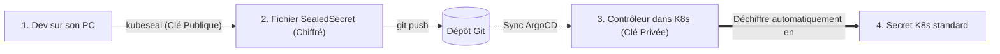
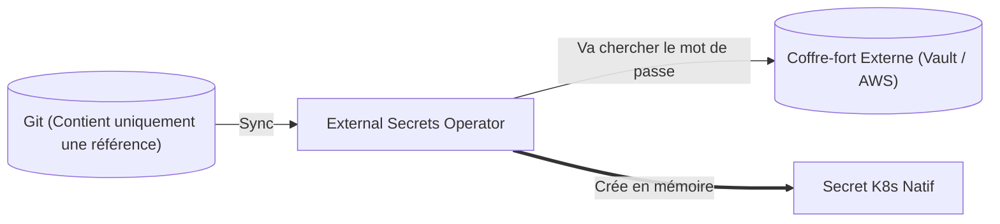

# 06 - La Gestion des Secrets en GitOps

C'est l'une des questions les plus posées en entretien DevOps :
> *"Si tout doit être dans Git en GitOps, comment gérez-vous les mots de passe et clés API sans les exposer publiquement ?"*

Rappel capital : un `Secret` Kubernetes standard utilise un encodage en **Base64**. **Base64 n'est pas un chiffrement**, c'est juste un format d'affichage réversible en une fraction de seconde avec `base64 -d`. On ne commit **JAMAIS** un Secret standard dans Git !

Pour résoudre ce problème, deux grandes approches dominent le marché.

---

## 1. Solution 1 : Bitnami Sealed Secrets (Le Chiffrement dans Git)

C'est la solution la plus simple à comprendre pour un débutant. Elle repose sur le **chiffrement asymétrique** (clé publique / clé privée) :



### Comment ça marche en 3 étapes :
1. Sur votre poste, vous créez un Secret standard et vous le chiffrez avec la commande `kubeseal` (en utilisant la **clé publique** du cluster) :
   ```bash
   kubectl create secret generic db-pass --from-literal=password=MonMotDePasse123 --dry-run=client -o yaml \
     | kubeseal --format yaml > sealed-secret.yaml
   ```
2. Le fichier généré est un **`SealedSecret`** : le mot de passe est illisible (ex: `AgBy8472x...`). Vous pouvez le pousser dans Git sans risque.
3. ArgoCD applique le `SealedSecret` sur le cluster. Le contrôleur Sealed Secrets (qui possède la **clé privée**) le déchiffre automatiquement pour créer le vrai `Secret` Kubernetes en mémoire.

---

## 2. Solution 2 : External Secrets Operator (ESO - Le Standard Entreprise)

Dans les grandes entreprises (banques, cloud providers comme OCI, AWS, GCP), on préfère ne stocker **aucun secret chiffré dans Git**. Tous les mots de passe sont centralisés dans un coffre-fort sécurisé (**AWS Secrets Manager**, **HashiCorp Vault**, **OCI Vault**).

On installe alors l'opérateur **External Secrets Operator (ESO)** dans Kubernetes :



### Ce qui est stocké dans Git (`ExternalSecret`) :
Git ne contient aucun mot de passe, seulement un pointeur qui dit : *"Va chercher la clé 'prod/database/password' dans notre Vault"* :

```yaml
apiVersion: external-secrets.io/v1beta1
kind: ExternalSecret
metadata:
  name: db-credentials
spec:
  refreshInterval: "1h" # Met à jour automatiquement le secret si le mot de passe change dans Vault
  secretStoreRef:
    name: mon-vault-entreprise
    kind: SecretStore
  target:
    name: db-credentials # Le vrai Secret K8s créé sur le cluster
  data:
    - secretKey: DB_PASSWORD
      remoteRef:
        key: prod/database
        property: password
```

!!! success "Avantage décisif d'External Secrets en entretien"
    Si vous changez le mot de passe dans le coffre-fort AWS ou Vault, Kubernetes se met à jour automatiquement après 1 heure, **sans avoir besoin de faire un commit Git**.

---

## 3. Matrice de Choix pour l'Entretien

| Critère | Bitnami Sealed Secrets | External Secrets Operator (ESO) |
| :--- | :--- | :--- |
| **Où est le secret ?** | Chiffré directement dans le fichier Git. | Dans un coffre-fort externe (Vault / Cloud). |
| **Complexité** | Très simple (idéal pour petites équipes). | Nécessite un service de coffre-fort externe. |
| **Rotation de mot de passe** | Manuelle (il faut re-chiffrer et refaire un commit). | **Automatique** (mise à jour en continu depuis le Vault). |
| **Usage recommandé** | Petits projets, clusters isolés, POCs. | **Standard d'entreprise en production.** |

---

## 4. Questions d'Entretien Fréquentes (Niveau Entry-Level)

!!! question "Q: Pourquoi ne peut-on pas stocker des Secrets Kubernetes directement dans Git ?"
    Parce que les Secrets Kubernetes ne sont pas chiffrés, ils sont simplement encodés en Base64. N'importe quelle personne ayant accès au dépôt Git peut décoder le secret immédiatement avec la commande `base64 -d`.

!!! question "Q: Comment fonctionne Bitnami Sealed Secrets en résumé ?"
    Il utilise un chiffrement asymétrique : le développeur chiffre son secret en local avec la clé publique du cluster via `kubeseal` et commite le fichier chiffré dans Git. Un contrôleur installé dans le cluster possède la clé privée et est le seul capable de déchiffrer la valeur pour créer le Secret Kubernetes.

!!! question "Q: Quel est le grand avantage d'External Secrets Operator (ESO) par rapport à Sealed Secrets ?"
    Avec ESO, aucun secret (même chiffré) n'est présent dans Git. Git ne contient qu'une référence vers un coffre-fort externe (comme AWS Secrets Manager ou Vault). Cela permet la rotation automatique des mots de passe sans devoir modifier ou commiter du code dans Git.
