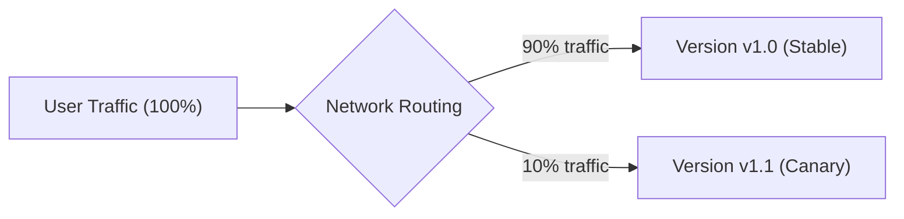
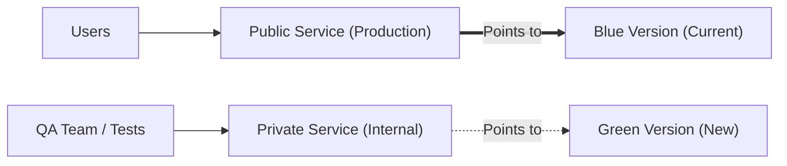

# 07 - Progressive Deployments (Argo Rollouts)

By default, Kubernetes uses the **RollingUpdate** strategy to update an application: it replaces old pods with new ones gradually.

But what happens if the new version contains a critical bug that only triggers when real users click "Pay"? Kubernetes will not know: it will keep replacing all pods, and your production will be down.

That is why **Argo Rollouts** exists (the *Progressive Delivery* controller).

---

## 1. RollingUpdate vs Argo Rollouts at a Glance

| Feature | Native Kubernetes (`Deployment`) | Argo Rollouts (`Rollout`) |
| :--- | :--- | :--- |
| **Default strategy** | RollingUpdate (gradual pod replacement). | **Canary** or **Blue/Green**. |
| **Traffic control** | Random based on number of pods. | **Precise**: send exactly 5% or 10% of traffic to the new version. |
| **Error detection** | Basic (does the container respond to a ping?). | **Advanced** (analyzes HTTP 5xx errors via Prometheus). |
| **Rollback** | Manual (`kubectl rollout undo`). | **Automatic** as soon as an error spike is detected. |

---

## 2. Canary Deployment (The Canary in the Coal Mine)

The **Canary** principle is to expose the new version to a small fraction of user traffic (e.g., 10%), while 90% of users stay on the old stable version.



### Configuration Example for a `Rollout`:

The `Rollout` resource is written exactly like a regular `Deployment`, but you replace `kind: Deployment` with `kind: Rollout` and add progression steps:

```yaml
apiVersion: argoproj.io/v1alpha1
kind: Rollout
metadata:
  name: mon-api
spec:
  replicas: 5
  strategy:
    canary:
      steps:
        - setWeight: 10          # 1. Envoie 10% du trafic vers la nouvelle version
        - pause: {duration: 15m} # 2. Attend 15 minutes pour observer la stabilité
        - setWeight: 50          # 3. Passe à 50% du trafic
        - pause: {duration: 10m} # 4. Si tout va bien, bascule à 100% automatiquement
  template:
    # La spec habituelle des Pods (containers, image, ports...)
    spec:
      containers:
        - name: api
          image: mon-registry/mon-api:v2.0
```

If monitoring (Prometheus) detects errors during the observation phase, **Argo Rollouts immediately cuts the 10% Canary traffic** and puts 100% of users back on the old version. This is the **automatic rollback**.

---

## 3. Blue / Green Deployment

In the **Blue/Green** strategy, two complete environments coexist:
- **Blue (Active):** The current production version.
- **Green (Preview):** The new version, deployed but receiving no public traffic.



1. The new version (Green) is deployed.
2. The QA team or automated tests verify it works correctly via a private URL.
3. If everything is perfect, someone clicks a button (or ArgoCD does it): the public service switches instantly to Green.
4. The old Blue version is kept for a few minutes in reserve in case an emergency rollback is needed.

---

## 4. Frequent Interview Questions (Entry-Level)

!!! question "Q: What is a Canary deployment?"
    It is a strategy where you deploy a new version and route only a small portion of real traffic to it (e.g., 5% or 10%). If no errors appear in metrics after an observation period, traffic is gradually increased to 100%.

!!! question "Q: Why use Argo Rollouts instead of a standard Kubernetes Deployment?"
    A standard `Deployment` cannot precisely route 5% of traffic and cannot analyze application metrics (such as HTTP error rates). Argo Rollouts provides advanced strategies (Canary, Blue/Green) with the ability to perform an automatic rollback without human action when an anomaly is detected.

!!! question "Q: How does a Blue/Green deployment work?"
    You run the old version (Blue) and the new version (Green) in parallel. Users stay on Blue while Green is tested internally. Once validated, the router switches 100% of traffic to Green instantly.
