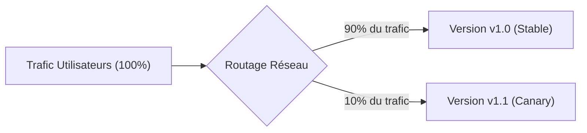
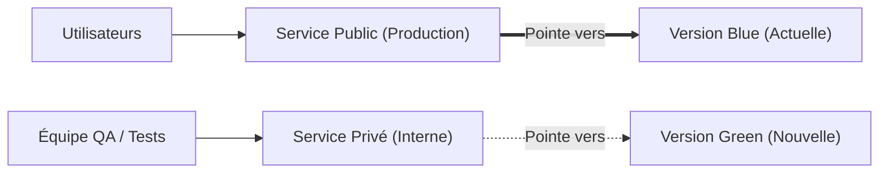

# 07 - Déploiements Progressifs (Argo Rollouts)

Par défaut, Kubernetes utilise la stratégie **RollingUpdate** pour mettre à jour une application : il remplace les anciens pods par les nouveaux au fur et à mesure. 

Mais que se passe-t-il si la nouvelle version contient un bug critique qui ne se déclenche que lorsque de vrais utilisateurs cliquent sur "Payer" ? Kubernetes ne le saura pas : il continuera de remplacer tous les pods, et votre production sera en panne.

C'est pour cela qu'existe **Argo Rollouts** (le contrôleur de *Progressive Delivery*).

---

## 1. RollingUpdate vs Argo Rollouts en Bref

| Fonctionnalité | Kubernetes Natif (`Deployment`) | Argo Rollouts (`Rollout`) |
| :--- | :--- | :--- |
| **Stratégie par défaut** | RollingUpdate (remplacement graduel des pods). | **Canary** ou **Blue/Green**. |
| **Contrôle du trafic** | Aléatoire selon le nombre de pods. | **Précis** : envoyer exactement 5% ou 10% du trafic vers la nouvelle version. |
| **Détection d'erreurs** | Basique (le conteneur répond-il au ping ?). | **Avancée** (analyse des erreurs HTTP 5xx via Prometheus). |
| **Rollback** | Manuel (`kubectl rollout undo`). | **Automatique** dès qu'une hausse d'erreurs est détectée. |

---

## 2. Déploiement Canary (Le Canari dans la Mine)

Le principe du **Canary** consiste à exposer la nouvelle version à une petite fraction du trafic utilisateur (ex: 10%), pendant que 90% des utilisateurs restent sur l'ancienne version stable.



### Exemple de configuration d'un `Rollout` :

La ressource `Rollout` s'écrit exactement comme un `Deployment` habituel, mais on remplace `kind: Deployment` par `kind: Rollout` et on ajoute des étapes de progression :

```yaml
apiVersion: argoproj.io/v1alpha1
kind: Rollout
metadata:
  name: mon-api
spec:
  replicas: 5
  strategy:
    canary:
      steps:
        - setWeight: 10          # 1. Envoie 10% du trafic vers la nouvelle version
        - pause: {duration: 15m} # 2. Attend 15 minutes pour observer la stabilité
        - setWeight: 50          # 3. Passe à 50% du trafic
        - pause: {duration: 10m} # 4. Si tout va bien, bascule à 100% automatiquement
  template:
    # La spec habituelle des Pods (containers, image, ports...)
    spec:
      containers:
        - name: api
          image: mon-registry/mon-api:v2.0
```

Si le monitoring (Prometheus) détecte des erreurs pendant la phase d'observation, **Argo Rollouts coupe immédiatement les 10% de trafic Canary** et remet 100% des utilisateurs sur l'ancienne version. C'est le **rollback automatique**.

---

## 3. Déploiement Blue / Green

Dans la stratégie **Blue/Green**, deux environnements complets coexistent :
- **Blue (Active) :** La version actuelle en production.
- **Green (Preview) :** La nouvelle version, déployée mais qui ne reçoit aucun trafic public.



1. La nouvelle version (Green) est déployée.
2. L'équipe QA ou des tests automatisés vérifient son bon fonctionnement via une URL privée.
3. Si tout est parfait, on clique sur un bouton (ou ArgoCD le fait) : le service public bascule instantanément vers Green.
4. L'ancienne version Blue est conservée quelques minutes en réserve au cas où un rollback d'urgence serait nécessaire.

---

## 4. Questions d'Entretien Fréquentes (Niveau Entry-Level)

!!! question "Q: Qu'est-ce qu'un déploiement Canary ?"
    C'est une stratégie où l'on déploie une nouvelle version en ne lui envoyant qu'une petite portion du trafic réel (ex: 5% ou 10%). Si aucune erreur n'apparaît dans les métriques après un temps d'observation, le trafic est progressivement augmenté jusqu'à 100%.

!!! question "Q: Pourquoi utiliser Argo Rollouts plutôt qu'un Deployment Kubernetes classique ?"
    Un `Deployment` standard ne permet pas de router précisément 5% du trafic et ne sait pas analyser les métriques applicatives (comme le taux d'erreurs HTTP). Argo Rollouts apporte des stratégies avancées (Canary, Blue/Green) avec la capacité d'effectuer un rollback automatique sans action humaine en cas d'anomalie.

!!! question "Q: Comment fonctionne un déploiement Blue/Green ?"
    On fait tourner en parallèle l'ancienne version (Blue) et la nouvelle (Green). Les utilisateurs sont sur Blue pendant que Green est testée en interne. Une fois validée, le routeur bascule 100% du trafic vers Green instantanément.
