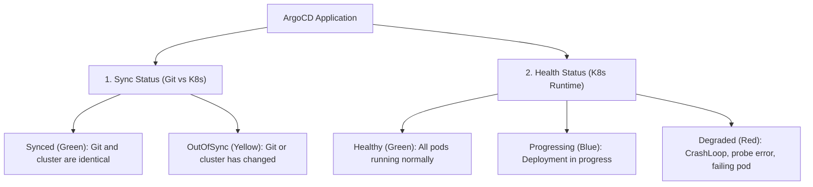

# 09 - Day-to-Day Troubleshooting

As a junior DevOps, a large part of your daily work will be diagnosing why an application is not green in ArgoCD. This chapter gives you the step-by-step methodology and the essential commands.

---

## 1. Understanding ArgoCD Statuses

ArgoCD displays two distinct statuses for each application. You must **never** confuse them in an interview:



!!! danger "Classic Interview Trap"
    An application can be **`Synced` (Green)** AND **`Degraded` (Red)** at the same time!
    - `Synced` only means ArgoCD successfully submitted the YAML file to Kubernetes.
    - `Degraded` means your application crashes on startup (`CrashLoopBackOff`, wrong environment variable, unreachable database).

---

## 2. Essential CLI Toolbox

Here are the 6 `argocd` commands to know by heart:

```bash
# 1. Lister l'état de toutes les applications
argocd app list

# 2. Inspecter en détail une application (pods, services, erreurs)
argocd app get mon-app

# 3. Voir la différence exacte entre Git et le cluster (très utile pour débugger !)
argocd app diff mon-app

# 4. Forcer la synchronisation manuelle
argocd app sync mon-app

# 5. Consulter l'historique des déploiements passés
argocd app history mon-app

# 6. Faire un rollback d'urgence vers le déploiement n°3
argocd app rollback mon-app 3
```

---

## 3. The 3 Most Frequent Incidents

### Case 1: Application `Degraded` with Pod in `CrashLoopBackOff`
- **What happens:** ArgoCD deployed the YAML correctly, but the container starts and crashes in a loop.
- **How to diagnose:**
  ```bash
  # Lire les logs du pod qui crashe
  kubectl logs -n mon-namespace deploy/mon-app --previous
  ```
- **Common causes:** Wrong environment variable, incorrect database password, port already in use.

### Case 2: Application Stuck `Progressing` with `ImagePullBackOff`
- **What happens:** Kubernetes cannot download the Docker image.
- **How to diagnose:**
  ```bash
  kubectl describe pod <nom-du-pod> -n mon-namespace
  # Regarder la section "Events" tout en bas !
  ```
- **Common causes:** Image tag does not exist on Docker Hub/Registry, or Docker authentication secret (`imagePullSecrets`) is missing.

### Case 3: Application Permanently `OutOfSync`
- **What happens:** Even after clicking `Sync`, the application turns yellow again after a few seconds.
- **Common cause:** A resource is dynamically modified on the cluster (for example `replicas` by an HPA or an annotation automatically added by a Service Mesh like Istio).
- **Solution:** Use `spec.ignoreDifferences` in the Application to ignore that specific field.

---

## 4. Frequent Interview Questions (Entry-Level)

!!! question "Q: What is the difference between an `OutOfSync` and a `Degraded` application?"
    `OutOfSync` means there is a textual difference between what is declared in Git and what is on the cluster. `Degraded` means pods are running poorly in Kubernetes (health probe error, CrashLoopBackOff, pod unable to start).

!!! question "Q: How do you debug an application that does not become `Healthy` in ArgoCD?"
    1. Check the resource tree in the ArgoCD UI to spot which pod is red.
    2. Use `kubectl describe pod <name>` to look at Kubernetes `Events` (e.g., ImagePullBackOff, Out of Memory).
    3. Use `kubectl logs <name>` to read application errors.

!!! question "Q: How do you perform an immediate rollback with the ArgoCD command?"
    First check previous versions with `argocd app history <app-name>`, then run `argocd app rollback <app-name> <revision-number>` to immediately restore the last stable version.
