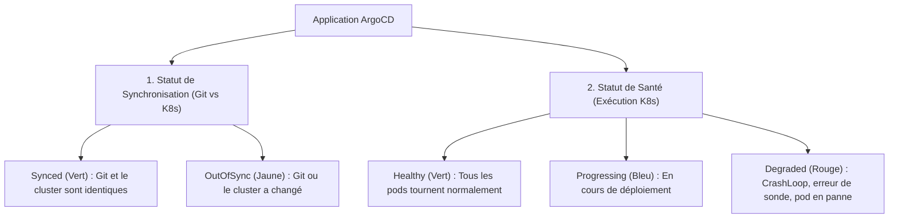

# 09 - Troubleshooting au Quotidien

En tant que DevOps junior, une grande partie de votre quotidien sera de diagnostiquer pourquoi une application n'est pas verte dans ArgoCD. Ce chapitre vous donne la méthodologie étape par étape et les commandes indispensables.

---

## 1. Comprendre les Statuts d'ArgoCD

ArgoCD affiche deux statuts distincts pour chaque application. Il ne faut **jamais** les confondre en entretien :



!!! danger "Le Piège classique d'entretien"
    Une application peut être **`Synced` (Vert)** ET **`Degraded` (Rouge)** en même temps !
    - `Synced` signifie seulement qu'ArgoCD a réussi à soumettre le fichier YAML à Kubernetes.
    - `Degraded` signifie que votre application plante au démarrage (`CrashLoopBackOff`, mauvaise variable d'environnement, base de données injoignable).

---

## 2. Boîte à Outils CLI Indispensable

Voici les 6 commandes `argocd` à connaître par cœur :

```bash
# 1. Lister l'état de toutes les applications
argocd app list

# 2. Inspecter en détail une application (pods, services, erreurs)
argocd app get mon-app

# 3. Voir la différence exacte entre Git et le cluster (très utile pour débugger !)
argocd app diff mon-app

# 4. Forcer la synchronisation manuelle
argocd app sync mon-app

# 5. Consulter l'historique des déploiements passés
argocd app history mon-app

# 6. Faire un rollback d'urgence vers le déploiement n°3
argocd app rollback mon-app 3
```

---

## 3. Les 3 Incidents les Plus Fréquents

### Cas 1 : L'application est `Degraded` avec un pod en `CrashLoopBackOff`
- **Ce qui se passe :** ArgoCD a bien déployé le YAML, mais le conteneur démarre et se crashe immédiatement en boucle.
- **Comment diagnostiquer :**
  ```bash
  # Lire les logs du pod qui crashe
  kubectl logs -n mon-namespace deploy/mon-app --previous
  ```
- **Causes habituelles :** Mauvaise variable d'environnement, mot de passe de base de données erroné, port déjà utilisé.

### Cas 2 : L'application reste en `Progressing` avec `ImagePullBackOff`
- **Ce qui se passe :** Kubernetes n'arrive pas à télécharger l'image Docker.
- **Comment diagnostiquer :**
  ```bash
  kubectl describe pod <nom-du-pod> -n mon-namespace
  # Regarder la section "Events" tout en bas !
  ```
- **Causes habituelles :** Le tag d'image n'existe pas sur Docker Hub/Registry, ou le secret d'authentification Docker (`imagePullSecrets`) est manquant.

### Cas 3 : L'application reste en `OutOfSync` en permanence
- **Ce qui se passe :** Même après avoir cliqué sur `Sync`, l'application redevient jaune après quelques secondes.
- **Cause habituelle :** Une ressource est modifiée dynamiquement sur le cluster (par exemple le `replicas` par un HPA ou une annotation ajoutée automatiquement par un Service Mesh comme Istio).
- **Solution :** Utiliser `spec.ignoreDifferences` dans l'Application pour ignorer ce champ précis.

---

## 4. Questions d'Entretien Fréquentes (Niveau Entry-Level)

!!! question "Q: Quelle est la différence entre une application `OutOfSync` et une application `Degraded` ?"
    `OutOfSync` signifie qu'il y a une différence textuelle entre ce qui est déclaré dans Git et ce qui est sur le cluster. `Degraded` signifie que les pods tournent mal dans Kubernetes (erreur de sonde de santé, CrashLoopBackOff, pod incapable de démarrer).

!!! question "Q: Comment débugger une application qui ne passe pas `Healthy` dans ArgoCD ?"
    1. Je consulte l'arbre des ressources dans l'interface ArgoCD pour repérer quel pod est en rouge.
    2. J'utilise `kubectl describe pod <nom>` pour regarder les événements (`Events`) Kubernetes (ex: ImagePullBackOff, Out of Memory).
    3. J'utilise `kubectl logs <nom>` pour lire les erreurs de l'application.

!!! question "Q: Comment fait-on un rollback immédiat avec la commande ArgoCD ?"
    On consulte d'abord les versions précédentes avec `argocd app history <nom-app>`, puis on exécute `argocd app rollback <nom-app> <numéro-de-révision>` pour rétablir immédiatement l'ancienne version stable.
