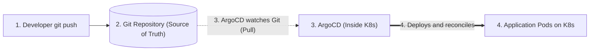

# Overview: GitOps & ArgoCD (Beginner / Junior Level)

**GitOps** has become an essential skill for any DevOps role. For an *entry-level* position, recruiters do not expect you to have configured giant 10,000-node clusters, but rather to **fully understand the philosophy**, how **ArgoCD** works, and to know how to operate and debug an application day-to-day.

---

## 1. GitOps in One Simple Sentence

> **GitOps is a practice where a Git repository is the single source of truth for the desired state of your infrastructure and applications.**

Instead of typing `kubectl apply -f deployment.yaml` from your terminal or giving your Kubernetes cluster's admin credentials to a CI tool (like Jenkins or GitHub Actions), an agent installed **inside the cluster** (like **ArgoCD**) watches Git and applies changes automatically.

---

## 2. The 4 Key Principles to Mention in an Interview

If a recruiter asks: *"What characterizes GitOps?"*, mention these 4 simple points:

1. **Declarative:** All configuration is written in YAML (Kubernetes, Helm, Kustomize). You describe *what you want*, not *how to do it*.
2. **Versioned in Git:** Everything goes through Git (`git commit`, Pull Request). Git history is the complete history of your production.
3. **Automatically Applied (Pull):** As soon as a commit is merged, the operator (ArgoCD) pulls the configuration without human intervention.
4. **Continuously Reconciled (Self-Healing):** If someone manually modifies the cluster under the hood, ArgoCD detects the drift and restores the state defined in Git.

---

## 3. Why Companies Adopt It (Beginner Benefits)

| Benefit | Concrete explanation for the interview |
| :--- | :--- |
| **Stronger security** | You do not put the cluster admin password in GitHub Actions or Jenkins. |
| **Ultra-fast rollback** | A bug in prod? A simple `git revert` of the last commit instantly restores the previous healthy version. |
| **Audit & Visibility** | You know exactly **who** deployed **what**, **when**, and **why** thanks to commits and Pull Requests. |
| **Fewer human errors** | Nobody touches the cluster directly with `kubectl` in production. |

---

## 4. Roadmap for This Module

This course is specifically calibrated to prepare you 100% for a junior DevOps interview:

1. [**01 - Fundamentals & Principles**](01-fondamentaux-principes.md): Why the Pull model replaces Push, and how self-healing works.
2. [**02 - ArgoCD Internal Architecture**](02-architecture-argocd.md): The 3 key components to know (Server, Repo-server, Controller).
3. [**03 - The Application & AppProject Objects**](03-manifestes-core.md): Writing an `Application.yaml` file, understanding `prune` and `selfHeal`.
4. [**04 - ApplicationSet Discovery**](04-applicationset-multi-cluster.md): Automatically deploying to Dev and Prod without copy-pasting.
5. [**05 - Sync Waves & Hooks**](05-synchronisation-hooks-waves.md): Running a database migration before starting pods.
6. [**06 - Secret Management**](06-gestion-secrets-gitops.md): How to handle passwords (Bitnami Sealed Secrets and External Secrets).
7. [**07 - Introduction to Argo Rollouts**](07-deploiements-avances-argo-rollouts.md): Understanding Canary and Blue-Green deployments.
8. [**08 - Security & RBAC Essentials**](08-securite-rbac-multi-tenancy.md): Managing developer permissions (Read-only vs Admin).
9. [**09 - Day-to-Day Troubleshooting**](09-troubleshooting-production.md): Resolving `OutOfSync` and `Degraded` statuses, survival commands.
10. [**10 - Junior Interview Cheatsheet**](10-cheatsheet-entretien.md): The 10 most frequent trick questions and their perfect answers.
