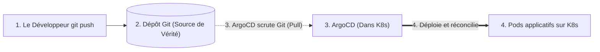

# Vue d'ensemble : GitOps & ArgoCD (Niveau Débutant / Junior)

Le **GitOps** est devenu une compétence incontournable pour tout poste DevOps. Pour un rôle *entry-level*, les recruteurs ne cherchent pas à ce que vous ayez configuré des clusters géants de 10 000 nœuds, mais que vous compreniez **parfaitement la philosophie**, le fonctionnement d'**ArgoCD**, et que vous sachiez manipuler et déboguer une application au quotidien.

---

## 1. GitOps en une phrase simple

> **GitOps est une pratique où un dépôt Git est l'unique source de vérité pour l'état désiré de votre infrastructure et de vos applications.**

Au lieu de taper `kubectl apply -f deployment.yaml` depuis votre terminal ou de donner les clés administrateur de votre cluster Kubernetes à un outil de CI (comme Jenkins ou GitHub Actions), c'est un agent installé **à l'intérieur du cluster** (comme **ArgoCD**) qui surveille Git et applique les changements automatiquement.

---

## 2. Les 4 Principes Clés à Citer en Entretien

Si un recruteur vous demande : *"Qu'est-ce qui caractérise le GitOps ?"*, citez ces 4 points simples :

1. **Déclaratif :** Toute la configuration est écrite en YAML (Kubernetes, Helm, Kustomize). On décrit *ce qu'on veut*, pas *comment le faire*.
2. **Versionné dans Git :** Tout passe par Git (`git commit`, Pull Request). L'historique Git est l'historique complet de votre production.
3. **Appliqué automatiquement (Pull) :** Dès qu'un commit est mergé, l'opérateur (ArgoCD) tire la configuration sans intervention humaine.
4. **Réconcilié en continu (Self-Healing) :** Si quelqu'un modifie manuellement le cluster en douce, ArgoCD détecte l'écart et remet l'état défini dans Git.

---

## 3. Pourquoi les Entreprises l'Adoptent (Les Bénéfices Débutant)

| Bénéfice | Explication concrète pour l'entretien |
| :--- | :--- |
| **Sécurité renforcée** | On ne met pas de mot de passe administrateur du cluster dans GitHub Actions ou Jenkins. |
| **Rollback ultra-rapide** | Un bug en prod ? Un simple `git revert` du dernier commit remet instantanément l'ancienne version saine. |
| **Audit & Visibilité** | On sait exactement **qui** a déployé **quoi**, **quand**, et **pourquoi** grâce aux commits et aux Pull Requests. |
| **Moins d'erreurs humaines** | Personne ne touche directement au cluster avec `kubectl` en production. |

---

## 4. Feuille de Route de ce Module

Ce cours est spécialement calibré pour vous préparer à 100% pour un entretien DevOps junior :

1. [**01 - Fondamentaux & Principes**](01-fondamentaux-principes.md) : Pourquoi le modèle Pull remplace le Push, et comment fonctionne l'auto-réparation (*self-healing*).
2. [**02 - Architecture Interne ArgoCD**](02-architecture-argocd.md) : Les 3 composants clés à connaître (Server, Repo-server, Controller).
3. [**03 - L'Objet Application & AppProject**](03-manifestes-core.md) : Écrire un fichier `Application.yaml`, comprendre `prune` et `selfHeal`.
4. [**04 - Découverte d'ApplicationSet**](04-applicationset-multi-cluster.md) : Déployer automatiquement sur Dev et Prod sans copier-coller.
5. [**05 - Sync Waves & Hooks**](05-synchronisation-hooks-waves.md) : Exécuter une migration de base de données avant de démarrer les pods.
6. [**06 - Gestion des Secrets**](06-gestion-secrets-gitops.md) : Comment gérer les mots de passe (Bitnami Sealed Secrets et External Secrets).
7. [**07 - Introduction à Argo Rollouts**](07-deploiements-avances-argo-rollouts.md) : Comprendre les déploiements Canary et Blue-Green.
8. [**08 - Sécurité & RBAC Essentiel**](08-securite-rbac-multi-tenancy.md) : Gérer les droits développeurs (Readonly vs Admin).
9. [**09 - Troubleshooting au Quotidien**](09-troubleshooting-production.md) : Résoudre les statuts `OutOfSync` et `Degraded`, commandes de survie.
10. [**10 - Cheatsheet Entretien Junior**](10-cheatsheet-entretien.md) : Les 10 questions pièges les plus fréquentes et leurs réponses parfaites.
