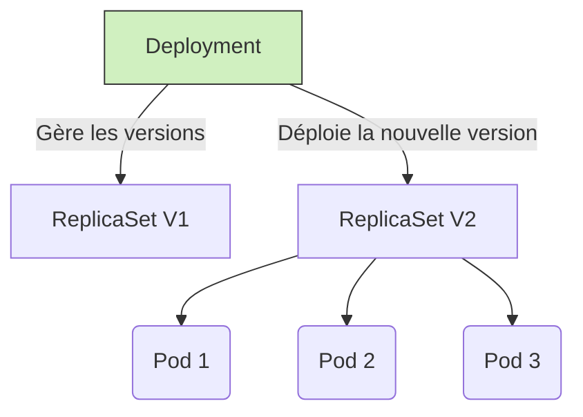

# 01 - Workloads & Lifecycle

Managing applications on Kubernetes requires choosing the right object (Workload) depending on the nature of the application (Stateless, Stateful, Daemon, Batch).

## 1. Basic Objects (Stateless)

*   **Pod:** The smallest deployable unit. Hosts one or more containers that share the same network (localhost) and the same volumes. **Pods are ephemeral**: if it dies, a new one replaces it with a **new IP**.
*   **ReplicaSet:** Ensures that a precise number of replicas of a Pod is running at all times.
*   **Deployment:** The standard object for web/API apps. Manages ReplicaSets and enables zero-downtime updates (Rolling Updates) and Rollbacks.



!!! warning "Anti-pattern: Bare Pod (Naked Pod)"
    In production, you **never** deploy a Pod directly (`kind: Pod`). If the node crashes, the Pod is lost forever. Always use a controller (Deployment, StatefulSet, etc.) for high availability.

## 2. Workloads for Special Cases

*   **StatefulSet:** For stateful applications (databases, Kafka). Guarantees:
    - stable names (`kafka-0`, `kafka-1`, etc.) even after a restart,
    - a strict startup/shutdown order,
    - a dedicated persistent storage volume for each Pod (even after Pod deletion, the volume remains).
*   **DaemonSet:** Runs a copy of a Pod on **every** node. *Use cases: monitoring (Node Exporter), logs (Fluentd), network agents.*
*   **Job / CronJob:** For one-off tasks (batch, DB migration). A CronJob schedules Jobs over time (like a Linux cron).

!!! info "Key Difference to Remember"
    **Deployment** = stateless app, interchangeable, IP/name not important.
    **StatefulSet** = stateful app, stable identity required (name, storage).

## 3. Probes (Health Checks)

How does the Kubelet know if your application is healthy? Via Probes. A concept **very frequently** asked in interviews.

| Probe Type | Question Asked | Action on Failure |
| :--- | :--- | :--- |
| **Startup Probe** | Has the app finished starting? | Kubelet restarts the container (gives time for slow-starting apps). |
| **Liveness Probe** | Is the app crashed/stuck? | Kubelet **restarts** the container. |
| **Readiness Probe** | Is the app ready to receive traffic? | The Pod is **removed from the Service** (no more requests sent), but not restarted. |

!!! danger "Classic Trap: Liveness vs Readiness"
    A misconfigured Liveness Probe (too strict) can cause an infinite restart loop (`CrashLoopBackOff`) on an app that is just a bit slow, whereas a Readiness Probe would have been enough to temporarily remove it from traffic without killing it.

## 4. Minimal YAML Manifest to Know

```yaml
apiVersion: apps/v1
kind: Deployment
metadata:
  name: payment-api
spec:
  replicas: 3
  selector:
    matchLabels:
      app: payment-api
  template:
    metadata:
      labels:
        app: payment-api
    spec:
      containers:
      - name: api
        image: my-registry/payment-api:v1.0
        ports:
        - containerPort: 8080
        readinessProbe:
          httpGet:
            path: /health/ready
            port: 8080
          initialDelaySeconds: 5
          periodSeconds: 5
        livenessProbe:
          httpGet:
            path: /health/live
            port: 8080
          periodSeconds: 10
        resources:
          requests:
            cpu: "250m"
            memory: "256Mi"
          limits:
            cpu: "500m"
            memory: "512Mi"
```

## 5. Essential Commands to Know

```bash
kubectl get deployments                          # Liste les Deployments
kubectl scale deployment payment-api --replicas=5 # Scale manuellement
kubectl rollout status deployment/payment-api     # Suivre une mise à jour
kubectl rollout undo deployment/payment-api       # Rollback à la version précédente
kubectl logs <pod-name>                           # Voir les logs d'un Pod
kubectl describe pod <pod-name>                   # Voir les events (utile pour debug CrashLoopBackOff)
```

## 6. Interview Questions to Prepare

!!! question "Q: What is the difference between a Pod and a Deployment?"
    A Pod is a single, ephemeral instance. A Deployment manages multiple replicas of a Pod, ensures their automatic replacement in case of a crash, and enables progressive zero-downtime updates.

!!! question "Q: What is the difference between Deployment and StatefulSet?"
    Deployment is for stateless apps (interchangeable, IP/name not important). StatefulSet is for stateful apps (databases) that need a stable identity and dedicated persistent storage.

!!! question "Q: What is a DaemonSet used for?"
    To run a Pod on every node of the cluster (e.g., monitoring or logging agent), rather than a fixed number of replicas.

!!! question "Q: What is the difference between Liveness and Readiness Probe?"
    The Liveness Probe detects a crash/blockage and **restarts** the container. The Readiness Probe detects that the app is not ready to receive traffic and **temporarily removes** the Pod from the Service, without restarting it.

!!! question "Q: Why should you never deploy a bare Pod in production?"
    Because it is not managed by any controller: if the node or Pod crashes, nothing recreates it automatically. You lose high availability.
