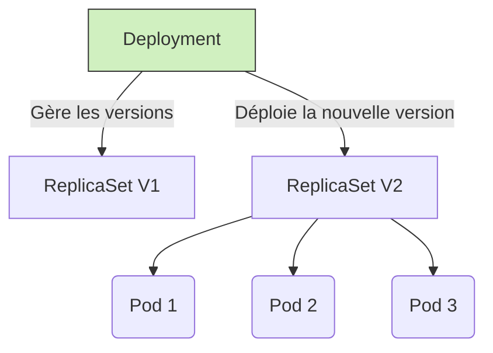

# 01 - Workloads & Cycle de vie

Gérer des applications sur Kubernetes nécessite de choisir le bon objet (Workload) selon la nature de l'application (Stateless, Stateful, Daemon, Batch).

## 1. Les objets de base (Stateless)

*   **Pod :** La plus petite unité déployable. Héberge un ou plusieurs conteneurs qui partagent le même réseau (localhost) et les mêmes volumes. **Les Pods sont éphémères** : s'il meurt, un nouveau le remplace avec une **nouvelle IP**.
*   **ReplicaSet :** Garantit qu'un nombre précis de réplicas d'un Pod tourne en permanence.
*   **Deployment :** L'objet standard pour les apps web/API. Gère les ReplicaSets et permet les mises à jour sans interruption (Rolling Updates) et les Rollbacks.



!!! warning "Anti-pattern : le Pod Nu (Naked Pod)"
    En production, on ne déploie **jamais** un Pod directement (`kind: Pod`). Si le nœud crash, le Pod est perdu à jamais. Toujours utiliser un contrôleur (Deployment, StatefulSet...) pour la haute disponibilité.

## 2. Workloads pour cas particuliers

*   **StatefulSet :** Pour les applications avec état (bases de données, Kafka). Garantit :
    - des noms stables (`kafka-0`, `kafka-1`...) même après un redémarrage,
    - un ordre de démarrage/arrêt strict,
    - un volume de stockage persistant dédié à chaque Pod (même après suppression du Pod, le volume reste).
*   **DaemonSet :** Fait tourner une copie d'un Pod sur **tous** les nœuds. *Cas d'usage : monitoring (Node Exporter), logs (Fluentd), agents réseau.*
*   **Job / CronJob :** Pour les tâches ponctuelles (batch, migration DB). Le CronJob planifie des Jobs dans le temps (comme un cron Linux).

!!! info "Différence clé à retenir"
    **Deployment** = app stateless, interchangeable, IP/nom pas importants.
    **StatefulSet** = app avec état, identité stable requise (nom, stockage).

## 3. Les Probes (Sondes de santé)

Comment le Kubelet sait-il si votre application va bien ? Via les Probes. Concept **très fréquent** en entretien.

| Type de Sonde | Question posée | Action si échec |
| :--- | :--- | :--- |
| **Startup Probe** | L'app a-t-elle fini de démarrer ? | Kubelet redémarre le conteneur (laisse le temps aux apps lentes à démarrer). |
| **Liveness Probe** | L'app est-elle plantée/bloquée ? | Kubelet **redémarre** le conteneur. |
| **Readiness Probe** | L'app est-elle prête à recevoir du trafic ? | Le Pod est **retiré du Service** (plus aucune requête envoyée), mais pas redémarré. |

!!! danger "Piège classique : Liveness vs Readiness"
    Une Liveness Probe mal réglée (trop stricte) peut provoquer une boucle de redémarrage infinie (`CrashLoopBackOff`) sur une app juste un peu lente, alors qu'une Readiness Probe aurait suffi à la retirer temporairement du trafic sans la tuer.

## 4. Manifeste YAML minimal à connaître

```yaml
apiVersion: apps/v1
kind: Deployment
metadata:
  name: payment-api
spec:
  replicas: 3
  selector:
    matchLabels:
      app: payment-api
  template:
    metadata:
      labels:
        app: payment-api
    spec:
      containers:
      - name: api
        image: my-registry/payment-api:v1.0
        ports:
        - containerPort: 8080
        readinessProbe:
          httpGet:
            path: /health/ready
            port: 8080
          initialDelaySeconds: 5
          periodSeconds: 5
        livenessProbe:
          httpGet:
            path: /health/live
            port: 8080
          periodSeconds: 10
        resources:
          requests:
            cpu: "250m"
            memory: "256Mi"
          limits:
            cpu: "500m"
            memory: "512Mi"
```

## 5. Commandes de base à connaître

```bash
kubectl get deployments                          # Liste les Deployments
kubectl scale deployment payment-api --replicas=5 # Scale manuellement
kubectl rollout status deployment/payment-api     # Suivre une mise à jour
kubectl rollout undo deployment/payment-api       # Rollback à la version précédente
kubectl logs <pod-name>                           # Voir les logs d'un Pod
kubectl describe pod <pod-name>                   # Voir les events (utile pour debug CrashLoopBackOff)
```

## 6. Questions d'entretien à préparer

!!! question "Q: Quelle est la différence entre un Pod et un Deployment ?"
    Un Pod est une instance unique et éphémère. Un Deployment gère plusieurs réplicas d'un Pod, assure leur remplacement automatique en cas de crash, et permet des mises à jour progressives sans interruption.

!!! question "Q: Quelle est la différence entre Deployment et StatefulSet ?"
    Le Deployment convient aux apps stateless (interchangeables, IP/nom sans importance). Le StatefulSet convient aux apps avec état (bases de données) qui ont besoin d'une identité stable et d'un stockage persistant dédié.

!!! question "Q: À quoi sert un DaemonSet ?"
    À faire tourner un Pod sur chaque nœud du cluster (ex: agent de monitoring ou de logs), plutôt qu'un nombre fixe de réplicas.

!!! question "Q: Quelle est la différence entre Liveness et Readiness Probe ?"
    La Liveness Probe détecte un crash/blocage et **redémarre** le conteneur. La Readiness Probe détecte que l'app n'est pas prête à recevoir du trafic et **retire temporairement** le Pod du Service, sans le redémarrer.

!!! question "Q: Pourquoi ne faut-il jamais déployer un Pod nu en production ?"
    Parce qu'il n'est géré par aucun contrôleur : si le nœud ou le Pod crash, rien ne le recrée automatiquement. On perd la haute disponibilité.